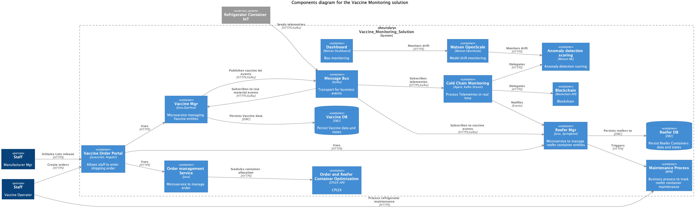

# Solution component view

From a design point of view it is intersting to apply the top 2 or 3 diagrams from the C4 models. We use the container as components view for the level of elements that are deployable as a standalone service / docker container.

The components we want to consider for the MVP:

* Vaccine manager: responsibles of managing the vaccine as an entity.
* Refrigerator container IoT as a simulator
* Kafka event backbone and event store using IBM Event Streams
* Cold chain monitoring.
* Anomaly detection, Watson ML service.
* Reefer manager
* BPM maintenance process

Future component for MVP:
* Portal app