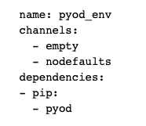
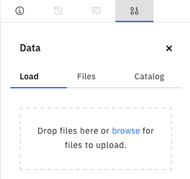
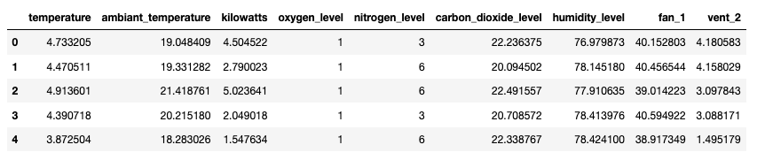
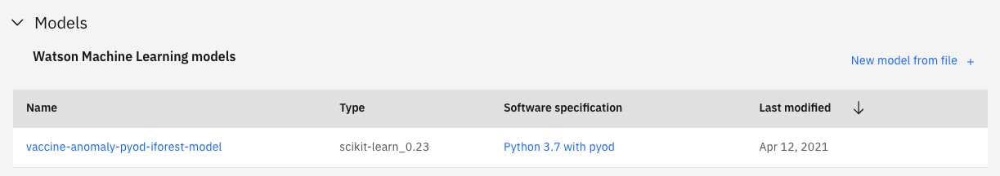
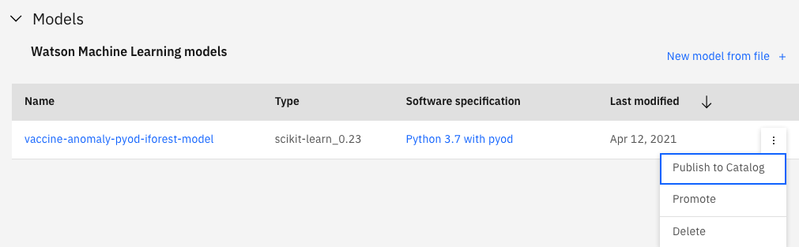
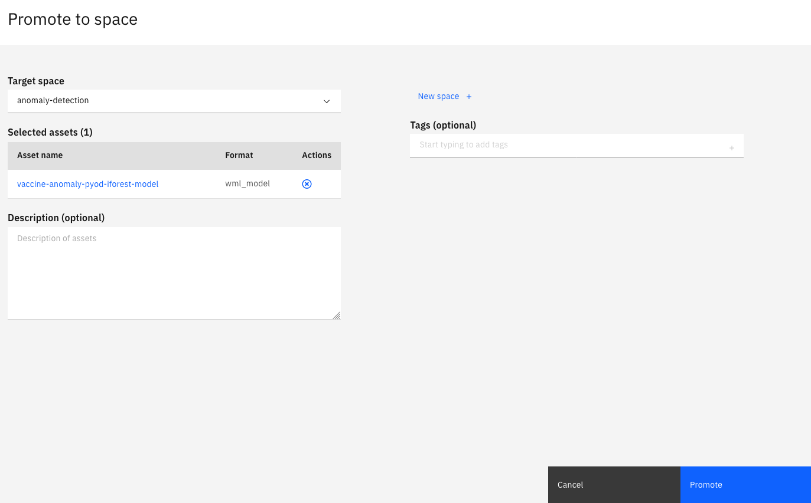

Cloud Pak for data integrates [Watson Studio](https://www.ibm.com/cloud/watson-studio) to develop machine learning models and do feature engineering. In this chapter develop a model using python in a [notebook](#notebook) using a custom library.

## Custom Libraries and Software Specifications

[Watson Machine Learning](https://www.ibm.com/cloud/machine-learning) allows users to deploy machine learning models and interact with them via a REST API.

There are many software specifications available to users, containing appropriate libraries such as scikit-learn, TensorFlow or PyTorch. However, if you wish to use a library that isn't available in one of the default specifications, you must create a package extension and a new software specification.

The notebook [Saving Custom Software Specification to a Project](https://github.com/ibm-cloud-architecture/vaccine-solution-main/blob/master/docs/src/pages/solution/cp4d/notebook/Saving%20Custom%20Software%20Specification%20to%20a%20Project.ipynb) provides an example of how to do this for an anomaly detection library, Python Outlier Detection [PyOD](https://github.com/yzhao062/pyod).

https://github.com/ibm-cloud-architecture/vaccine-solution-main/blob/master/docs/src/pages/solution/cp4d/notebook/Saving%20Custom%20Software%20Specification%20to%20a%20Project.ipynb

This notebook requires a YAML file that specifies the custom software specification requires PyOD to be installed using pip.

[This YAML file](../solution/cp4d/notebook/customlibrary.yaml) should be uploaded to the project by clicking on the data icon and either dragging the file to the upload box, or browsing for it on your computer.

Please walk through the steps of this notebook, running each cell, to ensure a custom software specification is available within the project ready to store the machine learning model.

## Data

[The vaccine data](../solution/cp4d/notebook/vaccine_anomaly_data.csv) contains information about the conditions surrounding the vaccine, e.g. the temperature, oxygen level and humidity.

We will be using unsupervised machine learning for anomaly detection. Consequently, you will notice there is no label indicating if the datapoint is an anomaly or not.

## Isolation Forest Model

The notebook [Build Isolation Forest Anomaly Detection Model](../solution/cp4d/notebook/Build\ Isolation\ Forest\ Anomaly\ Detection\ Model.ipynb) provides an example of how preprocess the data and build an anomaly detection model with PyOD's implementation of an Isolation Forest.

The preprocessing steps and model are created as a [scikit-learn Pipeline](https://scikit-learn.org/stable/modules/generated/sklearn.pipeline.Pipeline.html) which can then be stored in the project ready to be promoted to a deployment space. 

Please walk through the steps of this notebook, running each cell. The first cell will install the PyOD library within the python environment for the notebook. The remaining code builds a model before storing it in the project as a model with the custom software specification.

If you return to the Project screen, you will see the model in the Models section. Note that the Software Specification is the custom one we created previously.

Now the model can be promoted for deployment. To do this, hover over the model on the right hand side and click the three verticle dots that appear. Select "Promote".

This will take you to a page where you specify the deployment space, selecting from the drop down arrow, or guides you to create a new deployment space.

The asset will be populated with the model we wish to promote and you can provide optional tags and a description. The click Promote.

### Model Deployment and OpenScale Deployment

How to deploy a model and configure with OpenScale is covered in the previous chapter [Developing the Anomaly Detection Model with AutoAI in Watson Studio](../ws-ml-dev).
