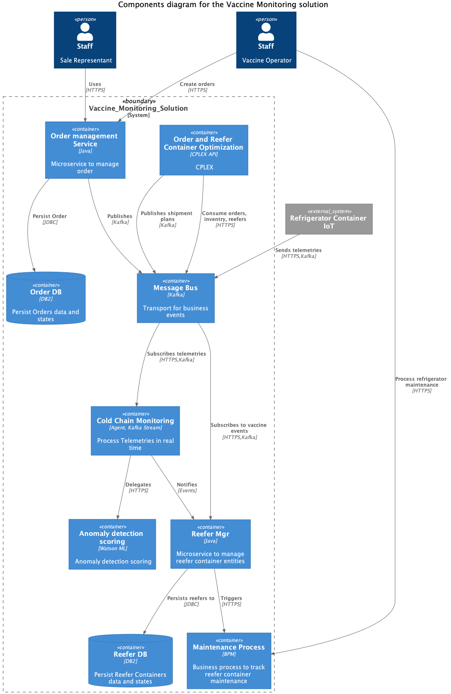

 
From a design point of view it is intersting to apply the top 2 or 3 diagrams from the C4 models. We use the container as components view for the level of elements that are deployable as a standalone service / docker container.

 

* Vaccine manager service: responsibles of managing the vaccine as an entity, and support CRUD operations on the vaccine lots.
* [Order management service](../../solution/orderms/): support the operations to manage a Vaccine Shipping Order
* Reefer manager service: to manage the refrigerator container life cycle.
* [Vaccine Order & Reefer Optimization](../voro/): to manage an optimized delivery plan for each vaccine order
* Refrigerator container [IoT as a simulator](../../solution/reefer-iot/) to help for the demonstration
* Kafka event backbone and event store using IBM Event Streams as part of Cloud Pak for Integration
* [Reefer monitoring agent](../../solution/cold-monitoring/): subscribe to telemetry events to assess cold chain violation and detect refrigerator anomalies
* Anomaly detection scoring: Deployed as a Watson ML service, this is the scoring for predicting a reefer failure.
* [Reefer maintenance process](../../solution/bpm/) to dispatch field engineers to do the maintenance of the reefer when anomaly was detected.
* Watson OpenScale to monitor model bias in real time.

The components we want to consider for the MVP:

 

* [Order management service](../../solution/orderms/)
* [Reefer monitoring agent](../../solution/cold-monitoring/)
* Refrigerator container [IoT as a simulator](../../solution/reefer-iot/)
* [Reefer maintenance process](../../solution/bpm/)
* [Anomaly detection scoring](../../solution/cp4d/)
* [Vaccine Order & Reefer Optimization](../voro/)
* [Reefer manager service]()

Future component for MVP:

* Vaccine Portal app: user interface to enter an order, view the reefer assignment...
* Blockchain