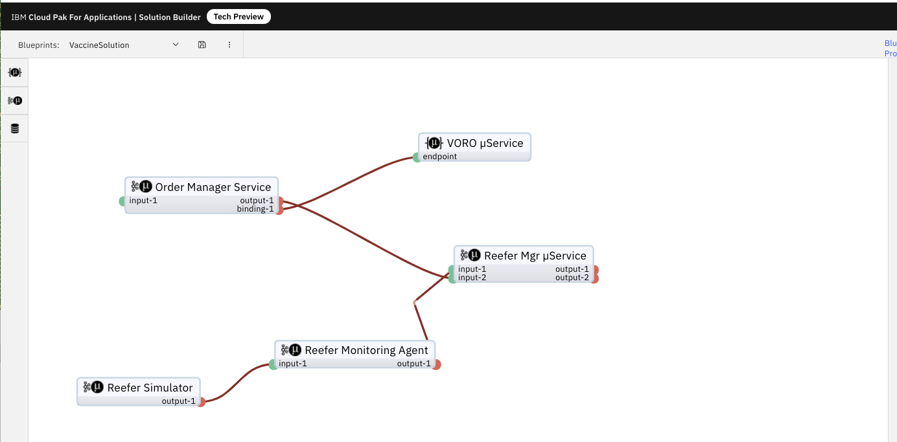
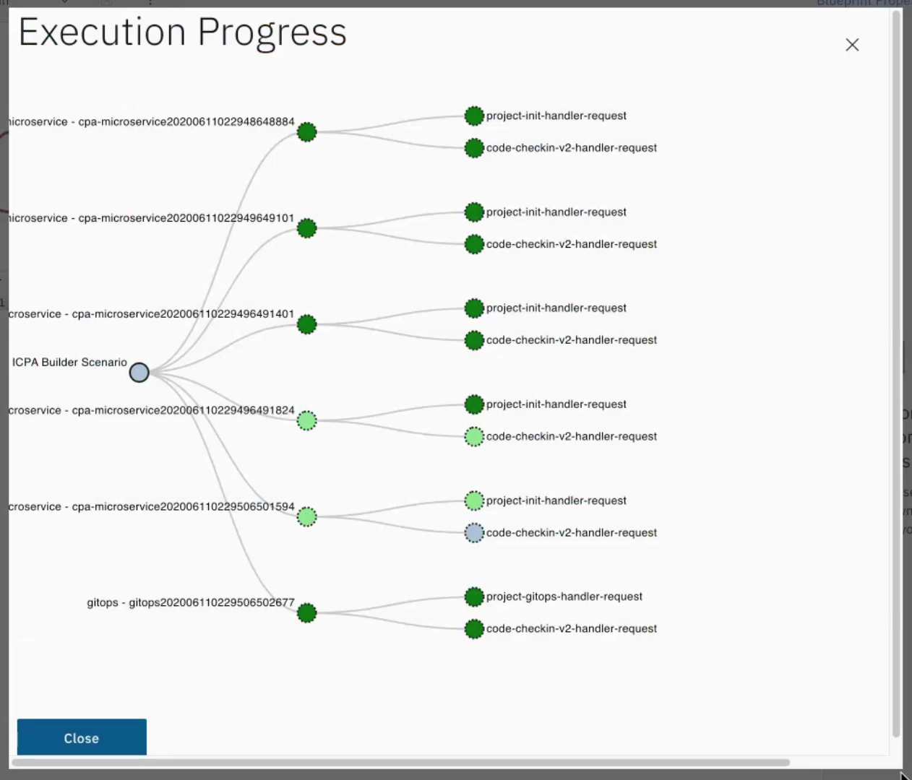

Using Cloud Pak for Application [Solution Designer](https://www.ibm.com/support/knowledgecenter/en/SSCSJL_4.2.x/techpreview/welcome-techpreview.html) collaborative tooling, analysts and architects can define their own solution blueprint from a palette of components and connectors and automatically provision GitHub repositories for the specified application components.

Using the tooling, a solution blueprint can be generated, creating Git repositories with prepopulated application stacks and fit-for-purpose starter templates.

A Git workflow for developers provides a consistent pipeline for building each component and delivering updates.

These processes are coordinated by using a GitOps workflow to help give operations teams complete control over the deployment process.

## Designing the solution

Using the Solution Builder tool we can quickly [design](https://www.ibm.com/support/knowledgecenter/en/SSCSJL_4.2.x/techpreview/designing.html) the Vaccine Cold Chain Monitoring solution, including microservices, databases, and Kafka pub/sub. Here is a screen shot of a solution using event based microservices and REST api ones.

## Iteration Zero

Once the solution has been designed and GitHub credentials supplied, the Solution Builder will [generate microservices](https://www.ibm.com/support/knowledgecenter/en/SSCSJL_4.2.x/techpreview/generating.html) and GitOps repositories representing the solution inside a Git organization.

## Develop and Deploy

Once the Git repositories have been generated, they are ready for developers to start adding business logic according to the requirements of the overall solution.

Solution Builder has accelerated the development of the complete cloud native solution. A process which previously may have taken days has been achieved in just a few minutes.

One GitHub repository is created for every microservice in your application design and pre-populated with the chosen runtime application stack and templates. Each repository contains an `app-deploy.yaml` file, which is the configuration file that is used by the Appsody Operator to deploy a project.

One or more GitOps repositories are also set up by the Accelerator, depending on the properties you configured on the canvas. Each GitOps repository describes the desired state of a deployment environment, which allows you to define development, staging, or production environments for your application.

The solution is ready to be deployed onto the OpenShift platform. The deployment steps are defined in this [product documentation](https://www.ibm.com/support/knowledgecenter/en/SSCSJL_4.2.x/techpreview/deploying.html).
