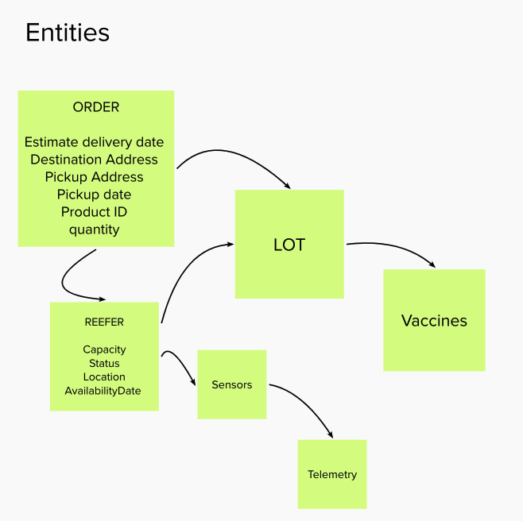
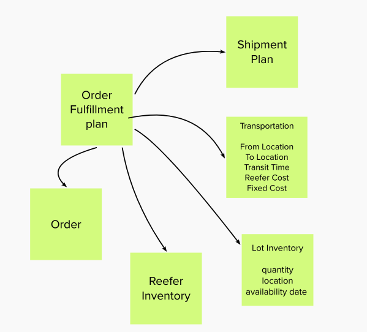
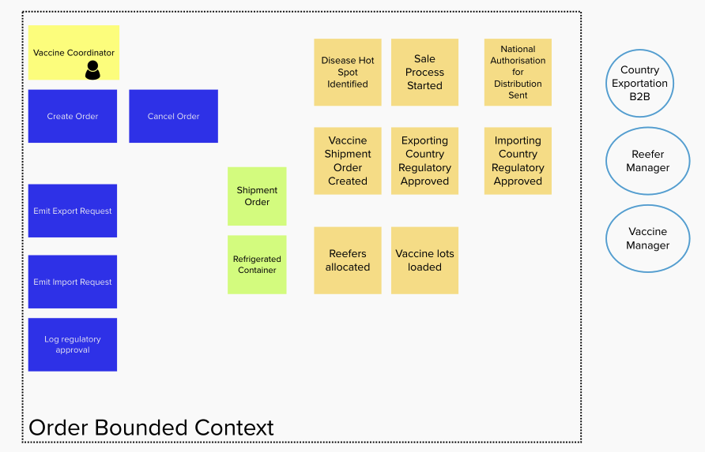
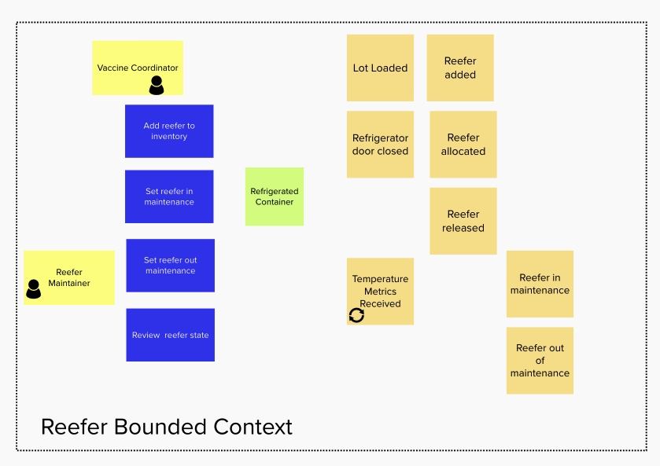
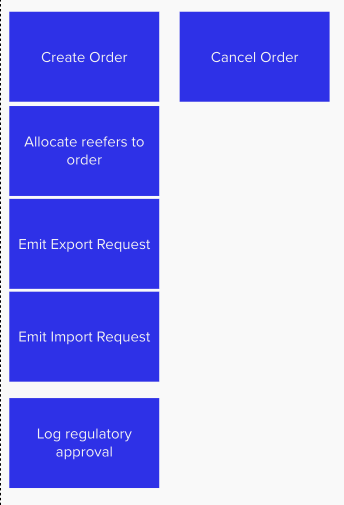

In this section we go over how to apply [Domain Driven Design](https://ibm-cloud-architecture.github.io/refarch-eda/methodology/domain-driven-design/) for the vaccine solution...

## From event storming to microservice

After the event discovery we have events organized over time as a process flow. We have events grouped into domain, with commands, data and business rules. The next step is to start designing the solution and apply domain driven design. 

### Domain - sub domains

We could spend more time to do analysis of the relationship between domain. Starting from this diagram:

 

We can focus on the domain we want to address during a MVP: order, reefer, cold chain monitoring.

The marketing to order relation represents leads generation.

The order needs reefers that are allocaded via an optimum scheduling to maximize refrigerator container usage,  and reduce shipping cost.

The vaccine lots produced by the different manufacturers are allocated to an order.

Domains help to address contexts. But we also need to look at data via the entities and value objects.

### Entities

Looking from an order domain point of view we can derive the following entity diagram. Order will ship lots that includes vaccines. The container to ship lots is one to many Reefers. A reefer includes one to many lots. 

 

From a reefer monitoring point of view we are interested by sensors and telemetries and lots inside the refrigerator.

When doing the order fulfillment planning, we are interested by transportation characteristics, lot inventory, order and reefer inventory.

 

### Bounded context

We have done just enough entity modeling, to start considering the order entity, as part of the *order domain*, to become an aggregate which is an important concept to define bounded context.

Defining bounded context within a domain is not an easy exercise, using aggregate is a good approach and apply a good separation of concern practice.

 

Doing the same from a reefer domain, we get:

 

Those two things mean we want to have two separate services to manage order and reefer.

Now the vision statement and the deeper analysis of the order domain, have lead the architect to think about an optimization component to compute the  **Order fulfillment plan** taking into consideration lot inventory, order, reefer inventory, transportation constraints... Now the bounded context is becoming functional and team oriented. We need to engage Operational Research specialist, and bundle the developed mathematical model as a function or service exposed via APIs and consumable by the order management service. We can see from the second entity diagram that the aggregage is becoming the  **Order fulfillment plan**, so a new service for that makes a lot of sense.

### Commands to APIs

For the order bounded context we have identified a set of commands that can lead to a development of an open APIs specifications. 

 

### Event Driven?

Well, event storming helps to focus on events. Also a lot of the processing is asynchronous and some of the operation could be long running. Adopting an event driven implementation of the above services (order and reefer) will make a lot of sense. Also using the event sourcing pattern may help to have an audit trail of what happen to an order, a reefer and the vaccine lots. 

So now the [system context](/design/syst-ctx/) may look as described in this note, and the [component view as here.](/design/comp-view/)

<InlineNotification kind="warning">
 Once again we do not pretend to cover the full coverage of a domain driven design approach. We focused on a very minimal viable product to get us started.
</InlineNotification>