This section outlines how we applied our [design thinking methodology](https://www.ibm.com/garage/method/practices/think/enterprise-design-thinking/) combined with [event storming](https://ibm-cloud-architecture.github.io/refarch-eda/methodology/event-storming/) to work with the business subject matter experts to ...

## Problem statement

How do we involve business users, subject matter experts, and developers to put in place an innovative solution to improve shipping vaccine at scale?

How to quickly start an implementation without doing three months of requirements gathering and design up-front? 

This is where IBM Garage helps the enterprise to innovate and implement cloud native solution with best practices. We start our jounrey with the design thinking workshop as illustrated in the following agenda:

 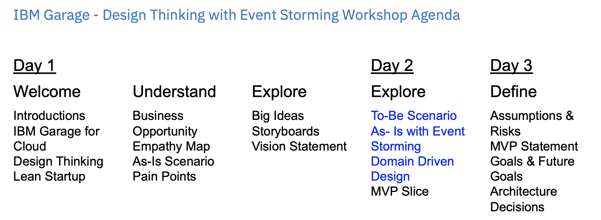

### Lab exercise

* Define the three [personas](https://www.ibm.com/garage/method/practices/think/practice_personas/) you think are relevant for the process of delivering vaccine worldwide
* Select one main persona for which the new solution will bring more value
* For that persona, define the [empathy maps](https://www.ibm.com/garage/method/practices/think/practice_empathy_maps/).
* You'll also probably have a few ideas about how to solve the persona's problems, so try using [ideation](https://www.ibm.com/garage/method/practices/think/practice_ideation/) to generate as many ideas as possible. Then, organize those ideas into clusters and decide which clusters have the greatest promise.

*See next sessions for possible approach*

## Design Thinking applied

Enterprise Design Thinking starts by bringing together a series of traditional design techniques, such as personas, empathy maps, as-is scenarios, design ideation, to-be scenarios, wireframe sketches, hypothesis-driven design, and minimum viable product (MVP) definition. 

## Empathy maps

The following three personas were identified:

* **Julia** is the vaccine delivery coordinator, who addres vaccine orders and ensure the end to end delivery runs well
* **Ganesh** is the in country minister of health official, focusing to get vaccines for his population
* **Maria** the medical coordinator to administer the vaccine to patiens.  

 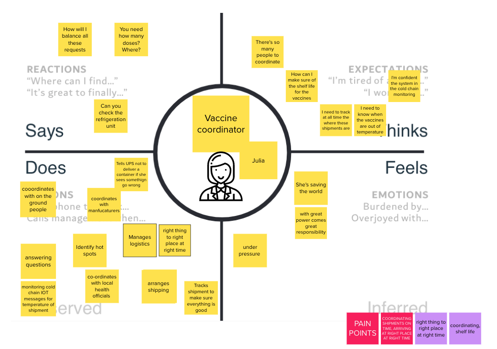

 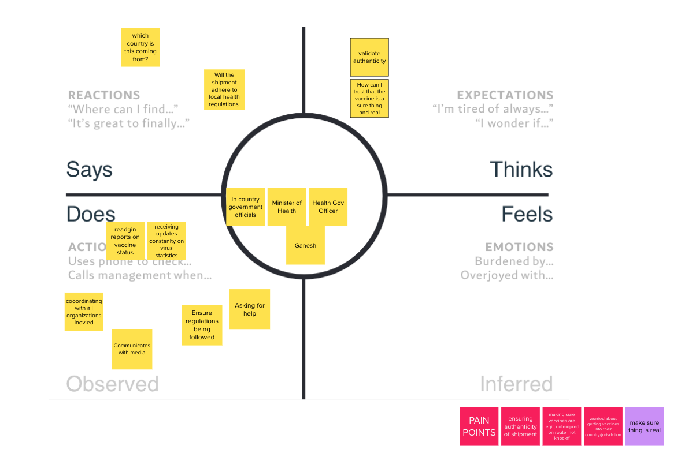

 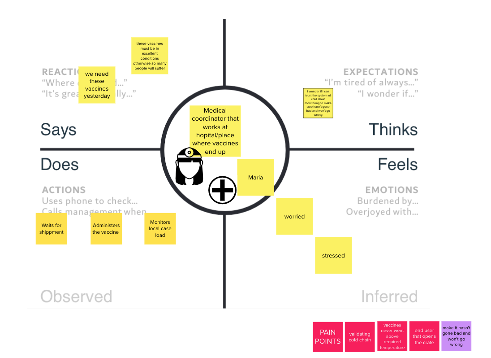

## Pain points

The following figure illustrates potential pain points discovered during the design thinking workshop:

 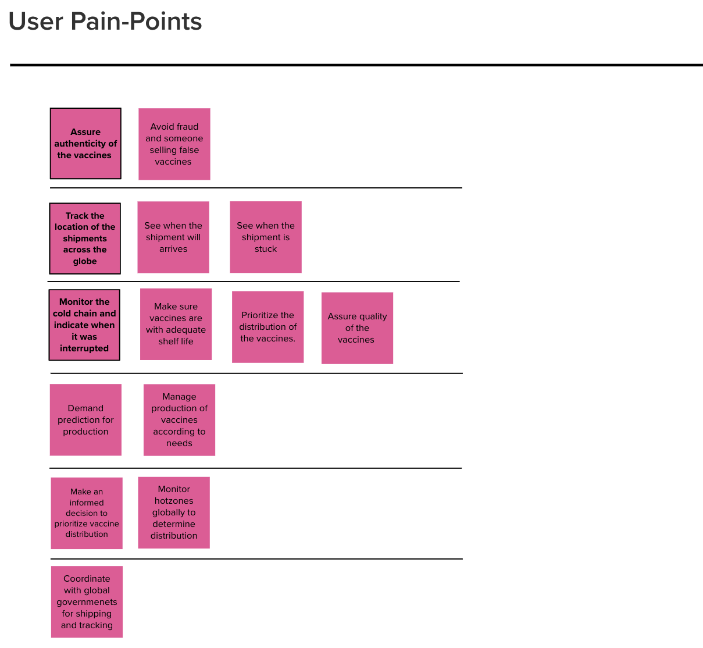

## Vision statement

The team arrives to some vision for two personas:

  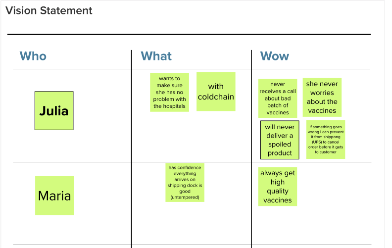

<InlineNotification kind="warning">
    It is important to note in the context of this simple exercise, we did not document a full blend design thinking workshop and all the artifacts we develop during such real workshop. The current diagrams illustrate just enough content to give you context for the implementation of the solution.
</InlineNotification>

## Event Storming applied

From the design thinking workshop we want to model the `to be` scenario for the vaccine delivery. We use the event storming approach as presented in [the IBM Event Driven reference architecture article](https://ibm-cloud-architecture.github.io/refarch-eda/methodology/event-storming/). 

Starting from the high level process outlined in the [problem statement introduction](../index), we have work with the subject matter expert to discover the end to end process from an event point of view. Recalls that **events** are fact of what happen within the process, and we organize them over a time line running from left to right. Orange stickers represent Events.

When doing remote workshop we can use collaborating tool, like Mural. 

### Lab exercice

1. Focusing on the delivery part, start by a hot spot is identified and an order to ship vaccine is created in the ordering system.
1. Brainstorm and put orange stickers on a time line from left to right
1. Add commands to the 'order events'
1. Add Data sticker around some of the data element 

*Recall: the elements of the event storming sementic are described below. Domain events and actor are the primary elements to consider during the first phase of the workshop* 

 

## Vaccine solution event storming applied

The first three figures below, represent the start of this business process:

* Process start, with raw material and bulk antigen steps

 

* formulation and filling

 

* Vaccine packaging and lot release and order intiation:

 

While the last part of the process, shipment and cold chain monitoring, is addressing the the lot delivery up to the target hospital or medical institution: 

 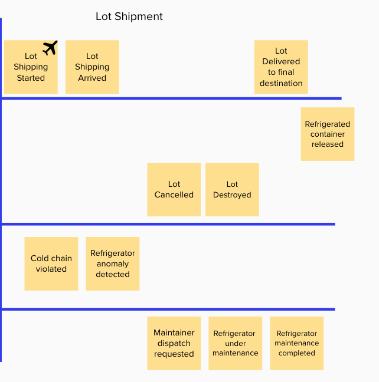

Adding blue lines to separate transition between teams or organizartions, help to define the different domains of the process. In the packaging and lot release we can see the following sub-domains:

* The vaccine manufacturing domain
* The Order management domain
* The regulatory domain
* Reefer monitoring domain

 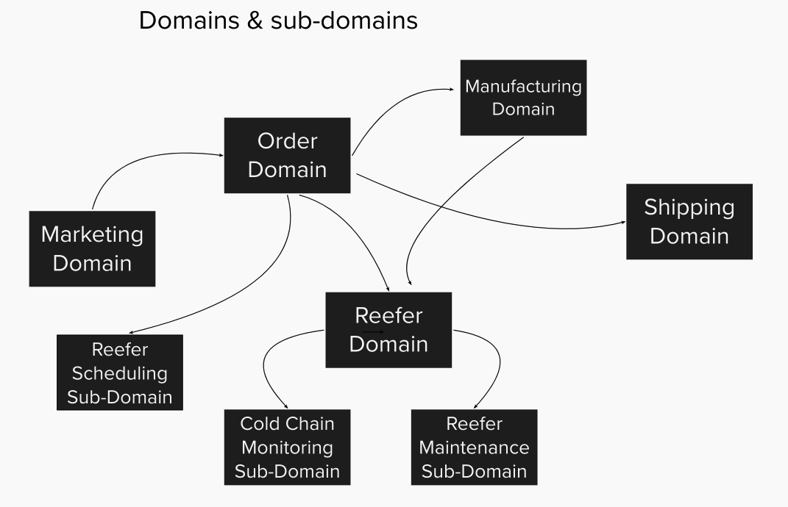

While for the shipment we have:

* The transportation logistic domain, airplane and truck being different domains
* The order management domain
* The cold chain monitoring and anomaly detection domain
* The refrigerator container maintenance

For the minimum viable product we will support part of the order and cold chain monitoring.

For the discovered events, we follow the methodology by adding commands, actors and business entities for the lot release and cold chain monitoring domains.

## Adding commands, actors, entities

### Order domain

The blue stickers represent commands, which may be mapped to API verb, or batch job, or user interface widget...

The Yellow stickers are for actors.

 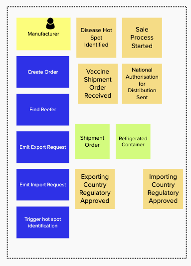

The green stickers represent data, or business entities.

### Reefer domain

 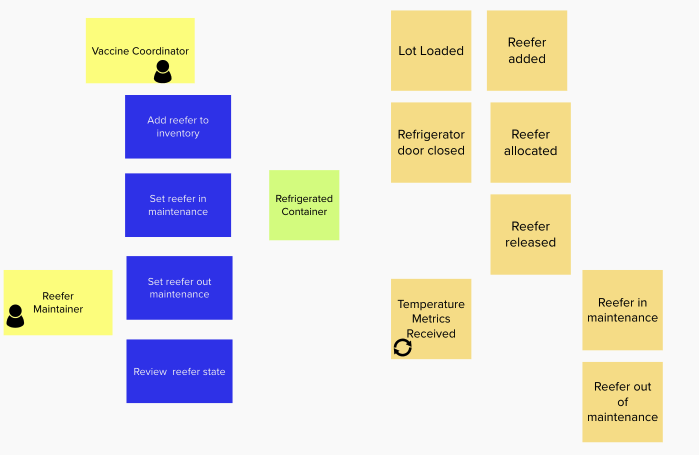

### Cold chain monitoring sub domain

 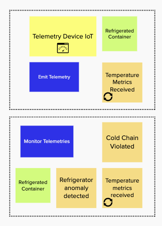

## Supporting material

* [Introduction to Design Thinking]()
* [Event storming quick video]()
* [Introduction to Mural - Video](https://support.mural.co/en/articles/2113687-introduction-to-mural-live-demo)
