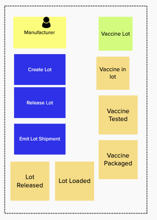

This section outlines how we applied our [design thinking methodology](https://www.ibm.com/garage/method/practices/think/enterprise-design-thinking/) combined with [event storming](https://ibm-cloud-architecture.github.io/refarch-eda/methodology/event-storming/) to work with the business subject matter experts to ...

## Design Thinking applied

* empathy maps
* pain points
* user need statements
* vision statement

## Event Storming applied

To model the `to be` scenario for the vaccine delivery, we have used the event storming approach as presented in [the IBM Event Driven reference architecture article](https://ibm-cloud-architecture.github.io/refarch-eda/methodology/event-storming/). 

Starting from the high level process outlined in the [problem statement introduction](../index), we have work with the subject matter expert to discover the end to end process from an event point of view. Recalls that events are fact of what happen within the process, and we organize them over a time line running from left to right. Orange stickers represent Events.

The first three figures below, represent the start of this business process:

* Process start, with raw material and bulk antigen steps

 

* formulation and filling

 

* Vaccine packaging and lot release:

 

While the last part of the process, shipment and cold chain monitoring, is addressing the the lot delivery up to the target hospital or medical institution: 

 

Adding blue lines to separate transition between entities help to define the different domains of the process. In the packaging and lot release we can see the following sub-domains:

* The vaccine manufacturing domain
* The Order management domain
* The opportunity management domain
* The regulatory domain

While for the shipment we have:

* The transportation logitic
* The order management
* The cold chain monitoring and anomaly detection 
* The refrigerato container maintenance

For the minimum viable product we will support part of the lot release and shipment steps.

For the discovered events, we follow the methodology by adding commands, actors and business entities for the lot release and cold chain monitoring domains.

### Lot release analysis

The blue stikkers represent commands, which may be mapped to API verb, or batch job, or user interface widget...

The Yellow stikkers are for actors.

The green stickers represent data, or business entities.

### Order management

 

### Cold chain monitoring

