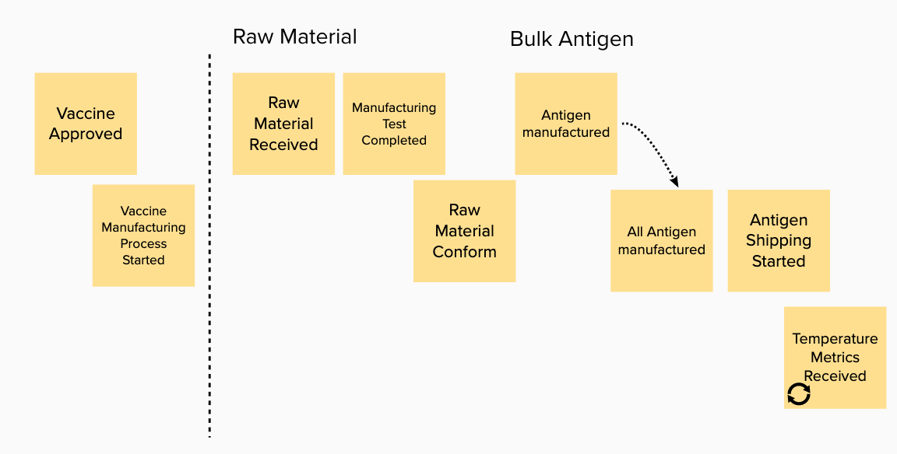
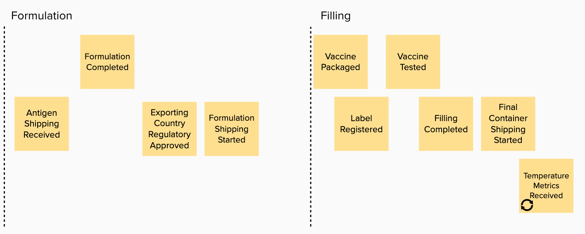
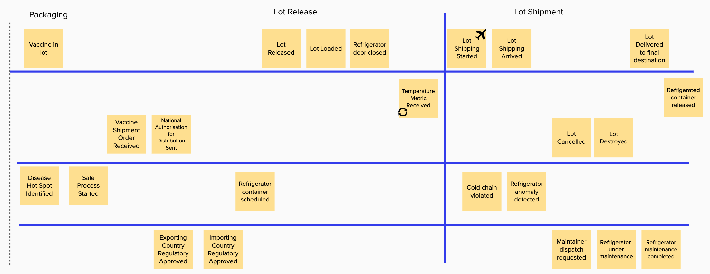

This section outlines how we applied our [design thinking methodology](https://www.ibm.com/garage/method/practices/think/enterprise-design-thinking/) combined with [event storming](https://ibm-cloud-architecture.github.io/refarch-eda/methodology/event-storming/) to work with the business subject matter experts to ...

## Design Thinking applied

* empathy maps
* pain points
* user need statements
* vision statement

## Event Storming applied

To model the `to be` scenario, we have used the event storming approach as presented in [this article](https://ibm-cloud-architecture.github.io/refarch-eda/methodology/event-storming/). 

Starting from the high level process outlined in the [problem statement introduction](), we have work with the subject matter expert to discover the end to end process from an event point of view. Recalls that events are fact of what happen within the process, and we organize them over a time line running from left to right. Orange stickers represent Events.

The first three figures below, represent the start of this business process:

* Process start, with raw material and bulk antigen steps

* formulation and filling

* Vaccine packaging, release and shipment. 

For a mininum viable product we are interested by the last main two phases of this process: lot release and lot shipment.

Adding blue lines to separate transition between entities help to define the different domains of the process:

* The vaccine manufacturing domain