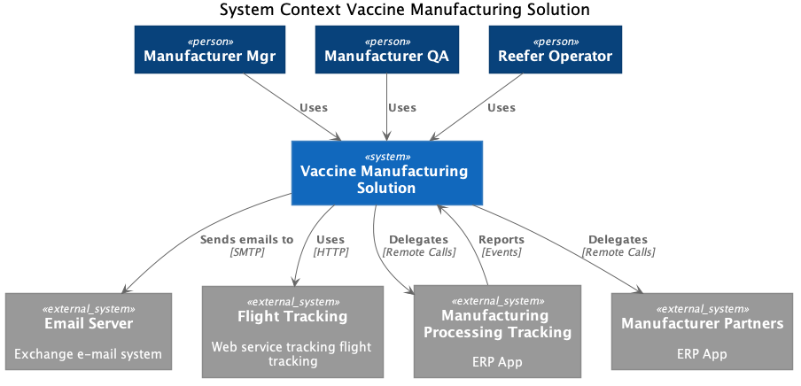

The application system context looks like in the following diagram.

The actors are the same as discovered during the design thinking session:

* Manufacturing manager
* Manufacturing QA engineer
* Refrigerator manager

The external systems to integrate are:

* Email server: for the MVP we will not use this integration
* Flight Tracking: for the MVP we will not use this integration, but it could be to integrate with flightstats.com
* Manufacturing processing: an ERP based platform, for the MVP we will not use this integration.
* Other Manufacturer partners