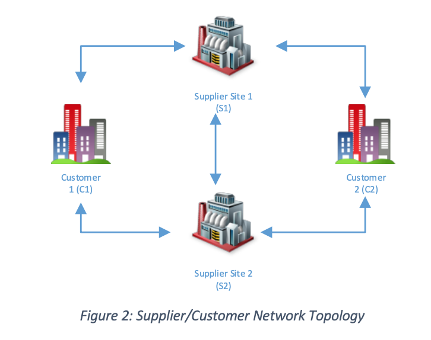
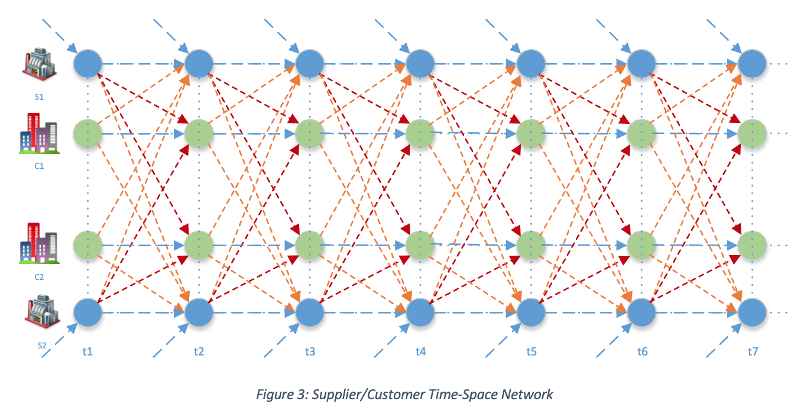
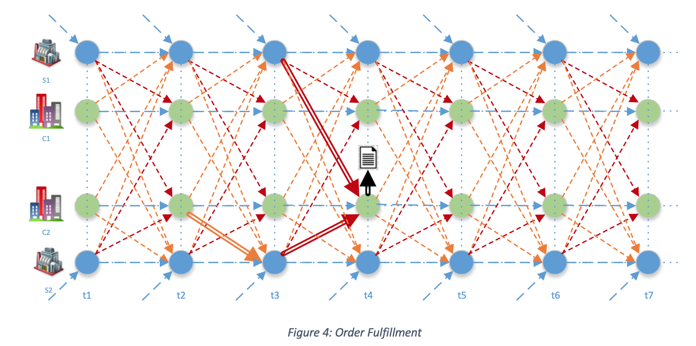
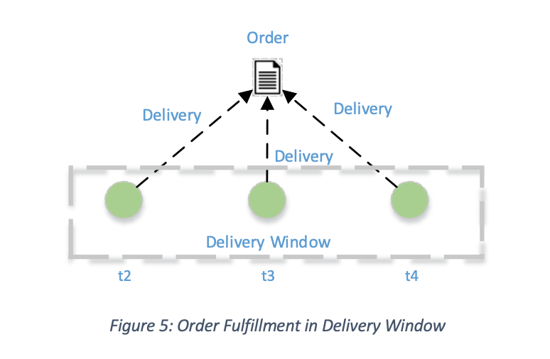
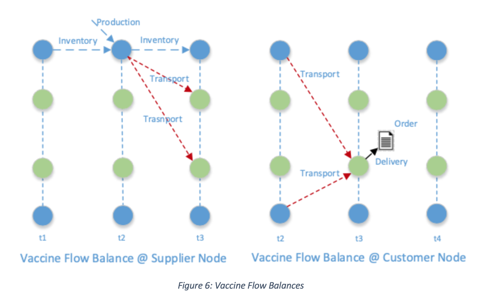
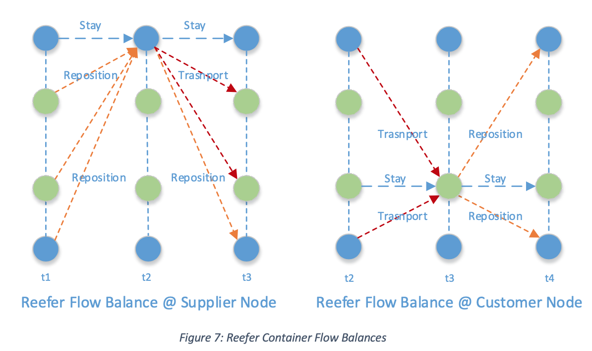

Special vaccine refrigerator containers (reefers) are needed to ensure cold chain throughout the vaccine delivery. Given the limited number of vaccine refrigerator containers available in the supply chain, and limited available lots at manufacturing sites or warehouses, the Vaccine Order & Reefer Optimizer seeks to create an optimized fulfillment plan for each vaccine order in real time and continue to improve or repair the delivery plans as new information become available. 

## Use Case 1: Delivery Plan Optimization 

1.	Trigger: a new vaccine order is received
1.	The optimizer generates an optimized delivery plan for the order, including decisions on:
    a.	Vaccine lots allocated to the order
    b.	Refrigerator containers to carry out the delivery
    c.	Reposition of reefers to the site of the lot

## Use Case 2 (Future): Delivery Plan Improvement and Repair

1.	Trigger: deviations from the plans (a. container availability, b. inventory replenishment, c. delivery plan execution)
1.	The optimizer optimizes all existing delivery and reposition plans to improve the order fulfillment without sacrificing other orders. 

## Time Space Network Transformation

The orders are fulfilled over time to account for the timing of the delivery needs and the time of reefer container repositioning movement and vaccine transport. The vaccines at the supplier sites are also becoming available over time following production or replenishment schedule, and vaccine transports are restricted by the reefer container availability. To more effectively model this complex distribution problem, the supply and customer network (Figure 2) needs to be transformed into a time-space network (Figure 3). The distribution optimization problem can then be modeled as a network flow problem. 

 

 

Each note in the time-space network represents an entity (supplier or customer) at a certain time, and the arcs represent material flows. There are four types of arcs: 

1. Production arcs, for new vaccines to become available at supplier sites
1. Stay arc, let time progress without moving geographically
1. Transport arc, for delivery of vaccine with reefer containers
1. Reposition arc, for repositioning available reefers to supplier locations
Within the construction of the time-space network, an order can then ben modeled as an order node. Vaccines flow from customer node to the order node to indicate the fulfillment of orders, and reefer containers may need to be repositioned to support the vaccine transport (Figure 4). An order node may be fulfilled by multiple customer node to indicate a delivery window for the order (Figure 5) 

 

 

## Vaccine and Reefer Flow Balances

In the time-space network, vaccines and reefers movements observe flow balances, indicating what goes into a node equal to what comes out of the node. Each node is a transient point thus observing certain balancing property (Figure 6 & Figure 7) 

 

 

## Model Description

The optimization model seeks to minimize the logistics costs of vaccines and reefer containers to fulfill the vaccine orders within the delivery windows. The logistics cost may include the shipping costs, both fixed costs per shipment, and variable costs per reefer containers, as well as the storage costs of reefers at the supplier cites and customer sites. The fulfillments are subjected to the availability of both vaccines and reefer containers. The orders may have a different priority levels so that when the resources are limited, the more critical orders will be given priority to fulfill. 
The problem is formulated as a mixed-integer programming model and solved by IBM CPLEX optimization solver through Watson Machine Learning service. 
After optimization, we will process the results to construct the optimized plans for both the vaccines and reefer containers. The vaccine plan will specify which supplier site will provide how much quantity of vaccines for the order to be delivered at what time. The reefer plan is supporting the vaccine plan so that then vaccine moves, there will be enough reefer to transport. 

## Data Model

To support the optimization model development we want to define the following data elements:

* Reefer: 
    * Reefer ID: Unique identifier
    * Capacity: how many vials can the container hold 
    * Status: (ready or in transit or in maintenance) 
    * Location: if in transit status, the transit-to location
    * Available Date: if in transit status, future availability date

* Order: 
    * Order ID: Unique identifier
    * Destination: location to be delivered
    * Priority: higher priority order may displace lower priority order plans
    * Quantity: # of vials ordered
    * Requested Delivery Date (RDD): customer requested delivery date for the order. If not provided, indicating ASAP

* Lot Inventory: 
    * Lot ID: unique identifier for vaccine lot
    * Quantity: # of vials available in the lot
    * Location: supplier site where the lot is available
    * Availability Date: the date when the lot is available for transport, NULL if it is currently in the inventory 

* Transportation
    * Lane ID: unique identifier of the transportation lane
    * From Location: beginning location of the lane
    * To Location: destination location of the lane
    * Transit Time: time of transportation for the lane
    * Reefer Cost: cost charged per reefer
    * Fixed Cost: cost charged if there is at least one reefer transported in the lane

* Business Rules/Parameters: 
    * Capacity of a reefer container
    * Delivery window start: days prior to RDD 
    * Delivery window end: days after RDD   
    * Penalty for unmet demand
    * Penalty for deviation from RDD

* Shipment Plan: 
    * Shipment Type: either Delivery or Reposition 
    * From Location: beginning location of the lane
    * To Location: destination location of the lane To Location
    * Departure Date: departure date 
    * Arrival Date: arrival date
    * Quantity: # of vials shipped
    * Reefer: # of reefer shipped
    * Cost: logistics cost associated with the shipment
*	Order Fulfillment Plan
    * Order ID: unique identifier of the order
    * Destination: location to be delivered
    * Quantity: # of vials ordered
    * Requested Delivery Date (RDD): customer requested delivery date for the order
    * Priority: higher priority order may displace lower priority order plans
    * First Delivery Date: date of the first delivery
    * Last Delivery Date: date of the last delivery
    * Number of Deliveries: # of deliveries associated to the order
    * Delivered Quantity: fulfilled quantity of the order
    * Remaining Quantity: unfulfilled quantity of the order
*	Order Detailed Fulfillment Plan
    * Order ID: unique identifier of the order
    * Supplier: supplier of the order 
    * Departure Date: departure date 
    * Arrival Date: arrival date
    * Quantity: # of vials supplied
    * Cost: logistic cost associated with the fulfillment

