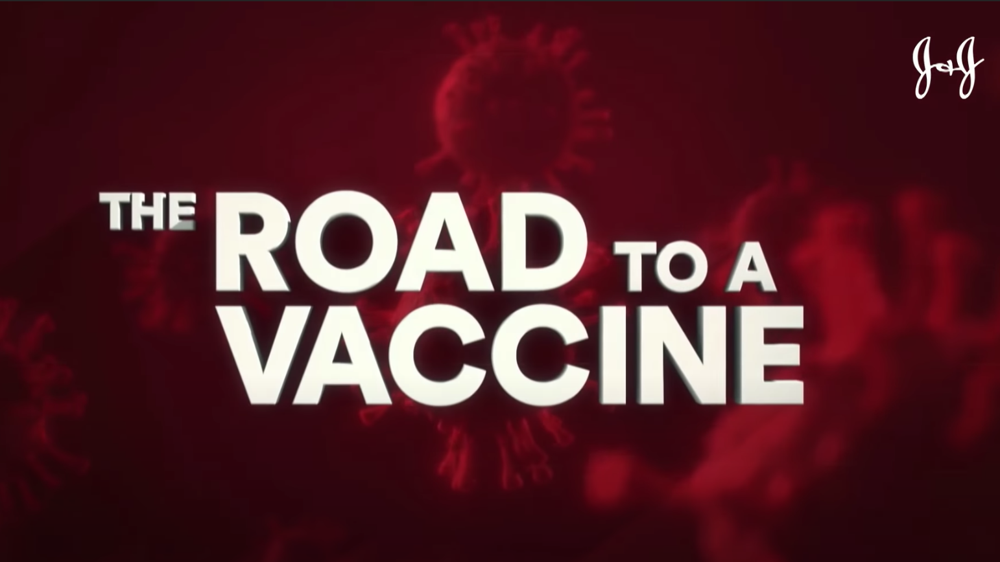

## Business problem

Inspired by J&J’s Road to Vaccine,  that educated the world through its leadership in science and innovation, we invite you on an experiential Vaccine’s Journey with IBM through the lens of technology and open innovations.

As the world awaits the release of the COVID-19 vaccines; we’ve learnt three things about the vaccines themselves:

1. The vaccine once manufactured needs to be in a stable cold state up until inoculation
2. The vaccine travels through various sites across the globe from manufacturing sites to remote clinical trial sites to actual distribution sites to citizens
3. The vaccines when the get release will rise to be the #1 counterfeit product in the world

Exiting the clinical trial phase; the challenge ahead for vaccine manufacturers along with their manufacturing partners lies in effectively delivering the billion vaccines to the most needed areas of the world under uncertain conditions, constrained supplies for vaccine vials, refrigerator container for transportation and fragmented supply chains. 

It may be possible to use machine learning models to identify potential hotspots with granular location precision to inform the supply chain decisions. This requires trust and transparency in AI before triggering any changes to their supply chain execution. 

A vaccine typically travels through multiple sites before being ready for shipment. Multiple companies are involved to manufacture the vaccines. Vaccines need to be handled at an optimal cool temperature (36-46 degrees F) and managed through the cold chain process. For high-value items like vaccines, clinical trial samples and lifesaving medications,  a fluctuation as minor as 2 degrees Celsius can reduce or even eliminate effectiveness, the stakes couldn't be higher. 

Variability in events both internally through the business processes and external events impacting the supply chain across multiple business entities coupled with data residing in multiple clouds presents challenges around anomaly detection that ultimately the vaccin developer is responsible to decision and act on by modifying business processes.

A traditional architecture requires creating new interfaces, integration into systems,  federation and organization of data into a data lake to be ready for any derivation of insights.

Our demonstration today, showcases a developer ready modern architecture comprising of integrated middleware that are used as building blocks to deliver the end to end solution. Use of DevOps tooling and practices accelerates the solution by x factor.

## What we cover

* Speed to innovate and shorten time to deploy to production
design thinking, even storming, microservices, small team, devops, MLops...
* Focus end to end solution running in container on Openshift platform on any cloud provider.
* Using blockchain as multiple business partners are involved, we need to have trusted in data, single source of truth to keep records about the manufactured vaccine lots.
* How to monitor cold chain for refrigerated vaccine during the packaging and transportation using IoT, events, reactive microservices, rules, predictive scoring and blockchain.
* How to develop the solution using Java based microprofile apps, with CI/CD practices using Openshift and kubernetes tooling.
* Scale the solution locally but also at the worldwide level using multi cloud management.

## The IFMA process

The high level vaccine manufacturing process is presented in the figure below.

The important points we want to consider in this Minimum Viable Solution are:

* Multiple partners are engaged in this process.
* Intermediate steps of manufacturing the vaccine used transportation between manufacturers in same or different countries.
* We want to consider the vaccine lot to be released and transported to target destination via airplane.
* We assume the lots are within refrigerated containers.

## Solution development process

### How to start this innovative journey

#### Problem

The IT solution needs to be operational within three months.

#### Analysis and design modern approach 

When developing innovative solution we are using the [IBM Garage Methodology](https://www.ibm.com/garage/method) to better understand the requirements, push for innovation and lean solution. We have applied this method to deevelop the current Minimum Viable Product for this solution. You can follow the steps as below:

From the IFMA process introduced in previous section, we can work with the subject matter experts to understand the vaccine manufacturing process using [design thinking and event storming workshops](./design/dtw/) so we can understand events, domain and subdomains. 

As part of the lean startup approach, we do not want to spend months discussing on architecture and development practices, we want to establish a minimum viable architecture, that can evolve over time and during the implementation to adapt to new user stories or pivot.
So too model the solution and its components, architects and lead developers apply a [Domain Driven Design](design/ddd/) approach to discover bounded context and future microservice landscape. From there they can build the traditional [system context view](/design/syst-ctx/) and [component view](/design/comp-view/) necessary to present a minimum viable architecture.

### Start the development 

#### Problem

Is it possible to start as early as the design thinking and architecture workshops are done?

#### The how 

This is where are methodology includes the iteration 0, and this is where Cloud Pak for Application helps dramatically to get code template, git repositories and devops pipeline ready.

Concretly from the decomposition in components, we can jump start the development using [Solution Designer](design/cp4a-sol-builder/) and [Appsody](https://appsody.dev/) Java microprofile stacks ([OpenLiberty](https://openliberty.io/) or [Quarkus](https://quarkus.io/)), combined with the CI/CD capabilities of [gitops](https://www.weave.works/technologies/gitops/) and [Tekton](https://github.com/tektoncd). 

### Event driven microservice best practices

#### Problem

The solution established during the architecture workshop, involves different business partners, different systems, and is asynchronous and event based. So what will be the best approach to develop those new components as microservices.

#### The how

The asynchronous nature of the process and the need for loosely coupled integration between services,  we are mixing API calls and event driven solution. We will use some of the event driven patterns like [event sourcing](https://ibm-cloud-architecture.github.io/refarch-eda/patterns/event-sourcing/), [Command Query Responsability Seggregation](https://ibm-cloud-architecture.github.io/refarch-eda/patterns/cqrs/), [Saga](https://ibm-cloud-architecture.github.io/refarch-eda/patterns/saga/) and applying [real time analytics](https://ibm-cloud-architecture.github.io/refarch-eda/patterns/realtime-analytics/) on the IoT device metrics.  Modern cloud native architecture uses event backbone for microservice communication, and [Apache Kafka]()https://kafka.apche.org) is one of the main technology of choice. [IBM Event Streams](https://www.ibm.com/cloud/event-streams) as part of the [Cloud Pak for Integration](https://www.ibm.com/cloud/cloud-pak-for-integration) deliver an enhanced supported version of Kafka. We are [detailing how the components](/solution/environment/#integration)of the solution work together using event driven reactive messaging approach. 

### Supply chain challenge

The vaccine order stipulates the amount of vaccines to be delivered to any place in the world, with varying level of criticality and delivery timeframe. This invokes a series of complex optimization planning:

* To optimize the vaccine sourcing and shipping routes, most cost effective to meet the demand subjected to the availability of both vaccines and refrigerator containers.
* To optimize the flow of vaccine refrigerator containers including repositioning the empty containers to support the optimal fulfillment plans
 
Furthermore, given the dynamic nature of the situation, the plans need to be continuous optimized with the latest information.

#### The how

Given the limited number of vaccine refrigerator containers available in the supply chain, and limited available lots at manufacturing sites or warehouses, the [Vaccine Order & Reefer Optimizer](design/voro/) seeks to create an optimized fulfillment plan for each vaccine order in real time and continue to improve or repair the delivery plans as new information become available. 

The application deployed on OpenShift lives as a side by side extension to ERP allowing independent updates separate from the core supply chain system and keeping the core clean.

This service is combined is the order management system. As part of a very simple solution we have implemented a Java Quarkus based [order management service](/solution/orderms/) to expose REST APIs to be able to demonstrate the solution end to end. 

### Monitor the cold chain. 

Once vaccine is manufactured its digital fingerprint is tracked through shipping to delivery transparently via blockchain. The solution involves monitoring the temperature of the refrigerated containers through cold-chain monitoring. A model to detect the anomaly in the temperatures identifies the faulty containers crossing temperature thresholds which triggers a process to remove the faulty containers from the shipment and informing the supply chain.

#### The how

The solution includes a Kafka Stream and reactive messaging component that gets telemetry data every 5 minutes for each of the refrigerator containers, and applies stateful logic with time windows.  The component is described in this  [Kafka Streams application section](/solution/cold-monitoring/). This cold chain monitoring agent is enhanced to call a predictive scoring service to detect reefer container anomaly from the same telemetries.

### Anomaly detection model 

As we do anomaly detection with a machine learned model, we need to develop the model and manage the data about the product, the telemetries,...

#### The how 

The predictive scoring service to detect reefer container anomaly is developed using a [machine learning approach using Watson Studio](/analyze/ws-ml-dev) and Data governance capabilities from the [Cloud Pak for Data](https://www.ibm.com/products/cloud-pak-for-data).

### End to end traceability and trustability

Traceability is key to avoid fraud, and ensure quality of the end to end delivery. As the vaccine vials travel by air and then shipping companies with last mile contactless delivery enabled via drones; the blockchain ledger is used to ensure continuous transparency.  By this time many counterfeit vaccines exist in the market. The physician at the point of inoculation uses IBM’s Research led innovation - IBM’s Crypto Anchor Verifier. After scanning the vaccine, the Verifier records its unique wavelength and microscopic details on the blockchain; verifying its authenticity against the original digital fingerprint captured at source; all in a matter of sub seconds.

The vaccine developer, the heathcare agency in the importing country, the physician inoculating the vaccine and the citizen receiving the vaccine are all rest assured on the authenticity of the vaccine and the vaccine developer moves to solve bigger problems through science and innovation.

#### The how 
So the core solution needs to adopt [Blockchain hyperledger](https://www.ibm.com/blockchain) to track the life cycle of the vaccine lots: lot manufacturing events, cold chain violation events, and shipment events are logged into the hyperledger.

### Fix reefer anomaly

To make the anomaly detection actionable, we can integrate a [human centric business process](https://www.ibm.com/cloud/cloud-pak-for-automation) to support the [refrigerator container maintenance](/solution/bpm/), triggered from the AI scoring service, to avoid bigger and costly failure and optimize the maintenance cost.

### Multi cloud providers

While the vaccine development companies uses one cloud provider, its business partners may use different one, like IBM Cloud as the preferred cloud provider for their technology stack have independent security stacks with limited flexibility to engineer the solution to a common cloud provider API. 

#### The how

Powered by OpenShift the solution was built once and deployed anywhere. Policy driven orchestration ensures resiliency given the ephemeral nature of cloud. The solution and the dependent products used needs to be easily deployed to different cloud providers. [Multi Cloud management](/mcm/problem/) provides visibility and governance control across multi-cloud targets. J&J ultimately has the gov contracts and needs to deliver on the promise

### Cybersecurity to ensure integrity and safety

The solution is secured across multi-cloud targets federating queries across the varied SIEM data sources.

## Final Warming

<InlineNotification kind="warning">The implemented code does not represent any best practices in term of software development and production delivery. Consider to be a "hello world ++" for most of the components. Those components are exposing basic REST end points and a simple data model to support the main concepts of the business problem with adhoc persistence layer.</InlineNotification>
