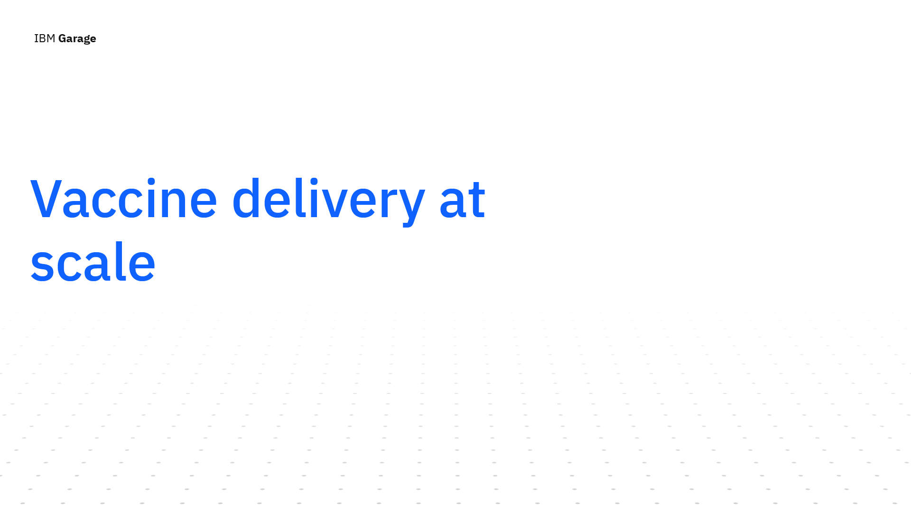
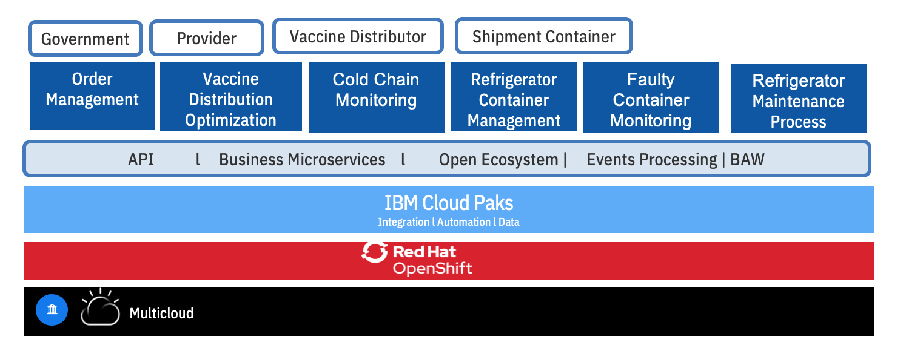
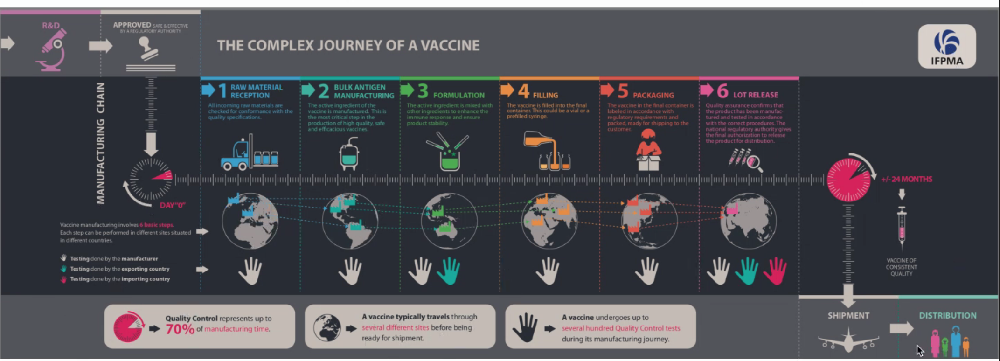
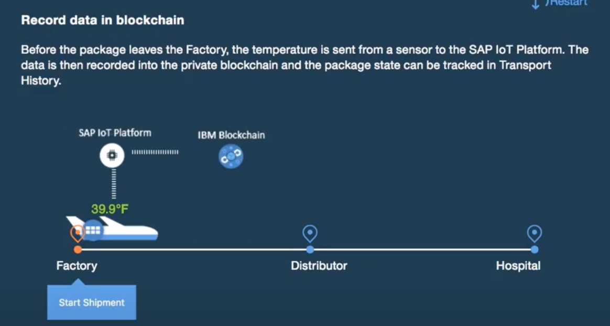

 

In this simple overview of a proposed solution, we invite you on a simulated scenario of a vaccine’s delivery-at-scale journey with IBM through the lens of technology and open innovations. Vaccinating billions of people on the planet requires scale. IBM’s platform along with its services has the potential to provide the capabilities to help optimize, analyze and remove the obstacles in the path to delivering authentic vaccines to aid efforts to protect the population of the world from Covid-19.

This simulated scenario was created end of spring 2020 for a customer to illustrate the potential of IBM’s technology to help address challenges presented by mass-scale vaccine delivery.  This proposed solution is at an early stage, and does not represent a full-fledged solution to address this complex problem. The solution demonstration illustrates how the IBM Garage methodology, combined with different IBM Cloud Pak products are supporting agile development and defining sustainable architecture in an innovative way.

<AnchorLinks>
  <AnchorLink>Business scenario</AnchorLink>
  <AnchorLink>Executive Overview</AnchorLink>
  <AnchorLink>What we cover</AnchorLink>
  <AnchorLink>Solution development process</AnchorLink>
</AnchorLinks>

## Business scenario

As the world awaits the release of the COVID-19 vaccines; we’ve learned four things about the vaccines themselves:

1.	The vaccine once manufactured needs to be in a stable very cold state up until inoculation
2.	The vaccine travels through various sites across the globe from manufacturing sites to remote clinical trial sites to actual distribution sites to clinical settings and other points of administration to the population
3.	The vaccines when ready for release may rise to be the #1 counterfeit product in the world
4.	There will be a need for billions of vaccine doses, so the vaccines will be manufactured in multiple locations and delivered worldwide

Exiting the clinical trial phase, the challenge ahead for vaccine manufacturers along with their manufacturing partners lies in effectively delivering the billions of vaccine doses to the most needed areas of the world under uncertain conditions, constrained supplies for vaccine vials, refrigerator container for transportation and fragmented supply chains.  

 

## Executive Overview

The industry is coming together as an open source project under the Linux foundation to ensure that the authenticity of the vaccine is maintained, and a platform is created that is compliant with the industry and is approved by the different healthcare authorities like the U.S. FDA. The implementation of the proposed solution and platform as shown in the diagram above leverages open hybrid cloud capabilities using IBM Red Hat Openshift on a pharmaceutical industry compliant cloud provider. The platform leverages IBM Cloud Paks and brings together advanced analytics and AI capabilities coupled with events processing to rapidly build and deploy cognitive solutions and intelligent workflows for vaccine distribution optimization, faulty container management and detection, vaccine program success monitoring [?], order management and fraud and crime prevention.  The objective of the proposed platform is to allow users to get vaccines safely into the hands of doctors and helping to ensure the authenticity of the vaccine through blockchain, along with facilitating the removal of bad batches of vaccines through machine learning models and blockchain verification. IBM’s Cloud Paks are built on top of IBM Red Hat Open Shift.

In this proposed solution we use: 

1. IBM’s Cloud Pak for Applications which allows you to build, deploy and run applications and can reduce development time by up to 84%. 
2. IBM’s Cloud Pak for Data which allows you to collect, organize, analyze data and infuse insights in processes. It can reduce the time to get the data ready for AI to days. 
3. IBM’s Cloud Pak for Integration which allows you to integrate apps, data , cloud services and APIs and can eliminate integration cost by up to 33%
4. IBM’s Cloud Pak for Automation which transforms business processes, decisions and content and can reduce manual processes up to 80%
5. IBM’s Cloud Pak for Multicloud Management which provides multicloud visibility, governance and automation and can reduces the IPop expense by up to 75%

Variability in events both internally through the business processes and external events impacting the supply chain across multiple business entities coupled with data residing in multiple clouds presents challenges around anomaly detection; vaccine developers will need to address these variables by modifying business processes.

A traditional architecture requires creating new interfaces, integration into systems,  federation and organization of data into a data lake to be ready for any derivation of insights.
Our demonstration today showcases a developer-ready modern architecture comprised of integrated middleware that are used as building blocks to deliver the end-to-end solution. Use of DevOps tooling and practices accelerates the solution by three factors.

## What we cover

* Speed to innovate and shorten time to deploy to production using IBM Garage design thinking, event storming, microservices, small team, devops, MLops…
* Focus on an end-to-end solution running in container on OpenShift platform on any cloud provider.
* Using blockchain as multiple business partners are involved, and therefore we need to have trust in data, and a single source of truth to keep records about the manufactured vaccine lots.
* How to monitor cold chain for refrigerated vaccine during the packaging and transportation using IoT, events, reactive microservices, rules, predictive scoring and blockchain.
* How to develop the solution using Java-based microprofile apps, with CI/CD practices using Openshift and source to image tooling.
* Scale the solution locally but also at the worldwide level using multicloud management.

## The IFPMA process

The high-level vaccine manufacturing process is presented in the figure below.

The important points we want to consider in this Minimum Viable Solution are:

* Multiple partners are engaged in this process.
* Intermediate steps of manufacturing the vaccine used transportation between manufacturers in same or different countries.
* We want to consider the vaccine lot to be released and transported to target destination via airplane.
* We assume the lots are within refrigerated containers.

## Solution development process

IBM Research, MIT Data Science Lab and pharmaceutical companies use machine learning models to identify potential hotspots with granular location precision for making informed the supply chain decisions. This requires trust and transparency in AI before triggering any changes to their supply chain execution. 

The diagram below is a minimum viable product solution design

 

We will now highlight features and functions of the proposed solution:

As shown in the component view above, a potential hotspot is detected in Miami.   This triggers the creation of orders in the Vaccine Order Portal. The vaccine order stipulates the amount of vaccines to be delivered, with varying level of criticality and delivery timeframe. This triggers the Order and Reefer optimization service that invokes a series of complex optimization planning steps:

* Optimizing the most cost-effective vaccine sourcing and shipping routes to meet the demand, subject to the availability of both vaccines and refrigerator containers. 
* Optimizing the flow of vaccine refrigerator containers, including repositioning of the empty containers to support the optimal fulfillment plans.
Furthermore, given the dynamic nature of the situation, the plans need to be continuously optimized with the latest information. 

A vaccine typically travels through multiple sites before being ready for shipment. Multiple companies are involved to manufacture the vaccines. Vaccines need to be handled at an optimal cool temperature (-50 degrees C) and managed through the cold chain process. For high-value items like vaccines, clinical trial samples and lifesaving medications, a fluctuation as minor as 2 degrees Celsius can reduce or even eliminate effectiveness, which means the stakes couldn’t be higher. 

As the shipment of vaccines is underway, the cold chain monitoring service monitors the performance of the cold chain in real time. This is supported by two components: 

* A real-time stateful operator connected to the event streams coming as refrigerator telemetries.  The refrigerated containers used to ship the vaccines to the medical facilities need monitoring  to ensure that all sensors within the containers are working properly so that its internal control system maintains the necessary temperature and the concentration of cryogenic fluids.  Otherwise, the vaccines would be spoiled and cannot be used for the treatment of patients. The data of various sensors from the containers (while they are on job to fulfill a shipment) can be continuously captured as event data and kept in any kind of datastore. 
* An anomaly detection scoring model developed, deployed and monitored using IBM Watson capabilities within IBM Cloud Pak for Data. Like any other IBM Cloud Pak, Cloud Pak for Data can also run in any Cloud infrastructure - IBM Cloud, Azure, Google or Amazon or even in an on-premises infrastructure.

The telemetry can be used to build an AI model to continuously check for any [temperature?] irregularity in the containers while in transit which can jeopardize the vaccines.
Once we have detected the anomaly, a process is triggered in conjunction with blockchain ledger to remove the bad batch of vaccines from the supply chain. The maintenance business process uses IBM Cloud Pak for Automation. 

The blockchain component is key in this solution, helping to ensure continuous transparency between the different business partners involved in this end-to-end manufacturing and delivery of the vaccine lots. By this time many counterfeit vaccines exist in the market. Here is a small video to present of an existing cold chain process with blockchain.

  
 

The physician at the point of inoculation uses IBM’s Research led innovation - IBM’s Crypto Anchor Verifier. After scanning the vaccine, the Verifier records its unique wavelength and microscopic details on the blockchain; verifying its authenticity against the original digital fingerprint captured at source; all in a matter of sub seconds.

### How to start this innovative journey

#### Problem

The IT solution needs to be operational within three months.

#### Analysis and design modern approach 

When developing this  innovative prototype solution we use  the [IBM Garage Methodology](https://www.ibm.com/garage/method) to better understand the requirements, push for innovation and  provide a lean solution. We have applied this method to develop the current Minimum Viable Product for this solution. You can follow the steps as below:

From the IFPMA process introduced in previous section, we can work with the subject matter experts to understand the vaccine manufacturing process using [design thinking and event storming workshops](./design/dtw/) so we can understand events, domains and subdomains. 

As part of the lean startup approach, we do not want to spend months discussing on architecture and development practices, we want to establish a minimum viable architecture, that can evolve over time and during the implementation to adapt to new user stories or pivot. 

To model the solution and its components, architects and lead developers apply a [Domain Driven Design](design/ddd/) approach to discover bounded context and future microservice landscape. From there, they can build the traditional [system context view](/design/syst-ctx/) and [component view](/design/comp-view/) necessary to present a minimum viable architecture.

### Start the development 

#### Problem

Is it possible to start as early as the design thinking and architecture workshops are done?

#### The how 

This is where are methodology includes the iteration 0, and this is where IBM Cloud Pak for Applications helps dramatically to get code templates, git repositories and the dev ops pipeline ready.

From the decomposition in components, we can jump start the development using Java microprofile stacks ([OpenLiberty](https://openliberty.io/) or [Quarkus](https://quarkus.io/)), combined with the CI/CD capabilities of [gitops](https://www.weave.works/technologies/gitops/) and [Tekton](https://github.com/tektoncd). 

### Event driven microservice best practices

#### Problem

The solution established during the architecture workshop involves different business partners, different systems, and is asynchronous and event based. So what will be the best approach to develop those new components as microservices?

#### The how

The asynchronous nature of the process and the need for loosely coupled integration between services requires mixing API calls and event driven solutions. We will use some of the event-driven patterns like [event sourcing](https://ibm-cloud-architecture.github.io/refarch-eda/patterns/event-sourcing/), [Command Query Responsability Seggregation](https://ibm-cloud-architecture.github.io/refarch-eda/patterns/cqrs/), [Saga](https://ibm-cloud-architecture.github.io/refarch-eda/patterns/saga/) and applying [real time analytics](https://ibm-cloud-architecture.github.io/refarch-eda/patterns/realtime-analytics/) on the IoT device metrics. Modern cloud native architecture uses event backbone for microservice communication, and [Apache Kafka](https://kafka.apche.org) is one of the main technologies of choice. Kafka as part of the [Cloud Pak for Integration](https://www.ibm.com/cloud/cloud-pak-for-integration), deliver an enhanced supported version of Kafka. We are detailing [how the components](/solution/environment/#integration) of the solution work together using event driven reactive messaging approach. 

### Supply chain challenge

The vaccine order stipulates the amount of vaccines to be delivered to any place in the world, with varying level of criticality and delivery timeframe. This invokes a series of complex optimization planning, to optimize the vaccine sourcing and shipping routes, using the most cost effective means to meet the demand, subject to the availability of both vaccines and refrigerator containers.
 
Furthermore, given the dynamic nature of the situation, the plans need to be continuous optimized with the latest information.

#### The how

Given the limited number of refrigerator containers for vaccines available in the supply chain, and limited available lots at manufacturing sites or warehouses, the [Vaccine Order & Reefer Optimizer](design/voro/) seeks to create an optimized fulfillment plan for each vaccine order in real time and continue to improve or repair the delivery plans as new information become available. 

The application deployed on OpenShift lives as a side-by-side extension to ERP, allowing independent updates separate from the core supply chain system and keeping the core clean.

This service is combined with the order management system. As part of a very simple solution we have implemented a Java Quarkus based [order management service](/solution/orderms/) to expose REST APIs to be able to demonstrate the solution end-to-end. 

### Monitor the cold chain. 

Once vaccine is manufactured, its digital fingerprint is tracked through shipping to delivery transparently via blockchain. The solution involves monitoring the temperature of the refrigerated containers through cold-chain monitoring which can lead to register a new record in the hyper ledger. 

#### The how

The solution includes a Kafka Stream and reactive messaging component that gets telemetry data every 5 minutes for each of the refrigerator containers, and applies stateful logic with time windows.  The component is described in this  [Kafka Streams application section](/solution/cold-monitoring/). This cold chain monitoring agent is enhanced to call a predictive scoring service to detect reefer container anomaly from the same telemetries.

### Anomaly detection model 

As we do anomaly detection with a machine learned model, we need to develop the model and manage the data about the product, and the IoT sensor telemetries.

#### The how 

The predictive scoring service to detect reefer container anomaly is developed using a [machine learning approach using Watson Studio](/analyze/ws-ml-dev) and data governance capabilities from the [Cloud Pak for Data](https://www.ibm.com/products/cloud-pak-for-data).

### End to end traceability and trustability

Traceability is key to helping avoid fraud,and ensuring quality of the end-to-end delivery. As the vaccine vials travel by air and then shipping companies with last mile contactless delivery enabled via drones; the blockchain ledger is used to help ensure continuous transparency. By this time many counterfeit vaccines exist in the market. The physician at the point of inoculation uses IBM’s Research led innovation - IBM’s Crypto Anchor Verifier. After scanning the vaccine, the Verifier records its unique wavelength and microscopic details on the blockchain; verifying its authenticity against the original digital fingerprint captured at source; all in a matter of sub seconds.

The vaccine developer, the heathcare agency in the importing country, the physician inoculating the vaccine and the citizen receiving the vaccine are all rest assured on the authenticity of the vaccine and the vaccine developer moves to solve bigger problems through science and innovation.

#### The how 

So the core solution needs to adopt [Blockchain hyperledger](https://www.ibm.com/blockchain) to track the life cycle of the vaccine lots: lot manufacturing events, cold chain violation events, and shipment events are logged into the hyperledger.

### Fix reefer anomaly

To make the anomaly detection actionable, we can integrate a [human centric business process](https://www.ibm.com/cloud/cloud-pak-for-automation) to support the [refrigerator container maintenance](/solution/bpm/), triggered from the AI scoring service, to avoid bigger and costly failure and optimize the maintenance cost.

### Multicloud providers

While the vaccine development companies may use one cloud provider, its business partners may use different one, like IBM Cloud. Their technology stacks may  have independent security stacks with limited flexibility to engineer the solution to a common cloud provider API. 

#### The how

Powered by OpenShift,  the prototype solution was built once and can be deployed anywhere. Policy-driven orchestration helps to ensure resiliency given the ephemeral nature of cloud. The solution and the dependent products used need to be easily deployed to different cloud providers. 

[Multi Cloud management](/mcm/problem/) provides visibility and governance control across multi-cloud targets. The vaccine manufacturer ultimately has the gov contracts and needs to deliver on the commitments.

### Cybersecurity to ensure integrity and safety

The solution is secured across multi-cloud targets federating queries across the varied SIEM data sources.

## Final Statement

<InlineNotification kind="warning">The proposed solution will be complex to implement, and IBM is working with different industry partners to propose an open solution. The prototype solution described is not intended to be a “real” implementation or represent a currently available IBM offering solution, rather it is simply a demonstration of some basic principles and potential product capabilities. The implemented code does not represent any best practices in term of software development and production delivery. It should be considered to be a "hello world ++" for most of the components. Those components are exposing basic REST end points and a simple data model to support the main concepts of the business problem with adhoc persistence layer.

Statements regarding IBM's future direction and intent are subject to change or withdrawal without notice, and represent goals and objectives only.
The client is responsible for ensuring compliance with laws and regulations applicable to it. IBM does not provide legal advice or represent or warrant that its services or products will ensure that the client is in compliance with any law or regulation.
</InlineNotification>
