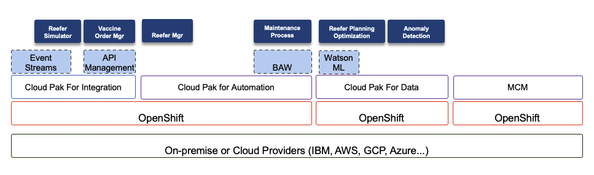

## Overview

The IBM Cloud Pak® for Multicloud Management, running on Red Hat® OpenShift®, is an open, hybrid cloud management platform. This platform helps organizations break down IT silos and move operations to start to codify tasks and processes and manage them as code artifacts.

With IBM Cloud Pak® for Multicloud Management, you get more application and cluster visibility across the enterprise to any public or private cloud. You can improve automation by simplifying your IT and application operations management with increased flexibility and cost savings, and intelligent data analysis driven by predictive signals.

You can also take advantage of the governance with IBM Cloud Pak® for Multicloud Management. You can manage your multicloud environments with a consistent and automated set of configuration and security policies across all applications and clusters.

### Learn more about IBM Cloud Pak® for Multicloud Management

## Problem Statement

As introduced in [the environment article](/solution/environment/), we need to develop a solution in which we are able to have consistent automation to manage, secure and optimize applications and cloud resources.

 
 
The solution needs security, automated operations & visibility. As the IT team modernizes and deploys more clusters,
new challenges are introduced:

* Disparate monitoring tools
* Slow delivery & management processes
* Security and quality an afterthought

With CloudPak for multicloud managment (MCM) the team will be able to reduce IT operations expenses by up to 75% and 

* Dynamically monitor and ensure compliance
* Create visibility across hybrid environments
* Optimize applications, modernization and IT ops
* Manage hybrid environments

Those capabilities add agility to select the target cloud provider, to continously reduce the cost.  

