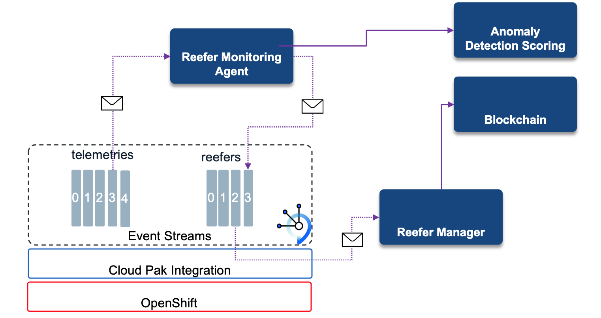

<PageDescription>
This microservice aims to monitor the cold-chain over time and to assess if the refrigerator is still running according to specifications.
</PageDescription>

<AnchorLinks>
  <AnchorLink>Overview</AnchorLink>
  <AnchorLink>Build</AnchorLink>
   <AnchorLink>Usage Details</AnchorLink>
</AnchorLinks>

## Overview

The reefer monitoring agent gets telemetry events from the `telemetries` Kafka topic and processes them using stateful operation on time window, and then creates reefer-cold-chain-violation event to the `reefer` Kafka topic in case the temperature goes over a define threshold over a specific time period. For each received metrics it can, optionally, call an anomaly detection service to compute the risk of failure. 



In case of cold chain violation the impacted vaccine lots needs to be reported as spoiled via new records logged to the blockchain hyperledger. This is the responsability of the reefer manager microservice has it has visibility of the loaded vaccine lots for each container. Telemetry events have information on the sensors and the geolocation of the reefer.

**Github repository:** [vaccine-monitoring-agent](https://github.com/ibm-cloud-architecture/vaccine-monitoring-agent)

**Kafka topics consumed from:** telemetries as defined by:

```yaml
apiVersion: kafka.strimzi.io/v1beta1
  kind: KafkaTopic
  metadata:
    name: telemetries
    labels:
      strimzi.io/cluster: event-streams
  spec:
    partitions: 10
    replicas: 3
    config:
      retention.ms: 14400000
      segment.bytes: 1073741824
```

**Kafka topics produced to:** reefers in case of anomaly detection or cold chain violation

**Events reacted to:** telemetry events like:

```java
public class TelemetryEvent {

    public String containerID;
    public Telemetry payload;
    public String timestamp;
    public String type;
```

and the payload:

```java
 public String container_id;
    public String measurement_time;
    public String product_id;
    public double temperature;
    public double target_temperature; 
    public double ambiant_temperature; 
    public double kilowatts; 
    public double time_door_open;
    public int content_type; 
    public int defrost_cycle;
    public double oxygen_level; 
    public double nitrogen_level; 
    public double humidity_level;
    public double target_humidity_level;
    public double carbon_dioxide_level; 
    public boolean fan_1; 
    public boolean fan_2; 
    public boolean fan_3;
    public double latitude;
    public double longitude;
  
```
**Events produced:** reefer anomaly detected and reefer cold chain violated

### Code structure

The API is supported by the [ContainerResource](https://github.com/ibm-cloud-architecture/vaccine-monitoring-agent/blob/master/src/main/java/ibm/gse/eda/vaccine/coldchainagent/api/ContainerResource.java) class which exposes interactive query on the container id.

The core of the process is a Kafka Streams topology in the class [TelemetryAssessor](https://github.com/ibm-cloud-architecture/vaccine-monitoring-agent/blob/master/src/main/java/ibm/gse/eda/vaccine/coldchainagent/domain/TelemetryAssessor.java).

The [topology](https://github.com/ibm-cloud-architecture/vaccine-monitoring-agent/blob/b591e6e338cb8e9a5a8da5dde44d299f669d2309/src/main/java/ibm/gse/eda/vaccine/coldchainagent/domain/TelemetryAssessor.java#L86-L133) processes telemetry records and build a new streams with the containerID as key, and the telemetry payload as value. Then it builds a Ktable to keep aggregate per container. The aggregate is defined in [this ReeferAggregate class](https://github.com/ibm-cloud-architecture/vaccine-monitoring-agent/blob/master/src/main/java/ibm/gse/eda/vaccine/coldchainagent/domain/ReeferAggregate.java) and aims to keep max Temperature read so far, the number of time the maximum temperature is violated.
Finally when a container reaches the maximum number of temperature violation, a new message is sent to a 'reefer' topic for down stream processing.

If you need to learn more on Kafka streams read [this introduction](https://ibm-cloud-architecture.github.io/refarch-eda/technology/kafka-streams/) and do [those labs](https://ibm-cloud-architecture.github.io/refarch-eda/use-cases/kafka-streams/) to learn more on how to program with Kafka Streams.

The nice capability of Quarkus app, is most of the work is in the [application.properties](https://github.com/ibm-cloud-architecture/vaccine-monitoring-agent/blob/master/src/main/resources/application.properties) configuration. The highlights of this configuration is the fact that once deploy to OpenShift the environment variables are defined in config map and secret:

```
quarkus.openshift.env.configmaps=agent-cm
quarkus.openshift.env.secrets=agent-secrets
```

The SSL certificate for the server and the user are coming from secrets:

```
quarkus.openshift.env.vars.KAFKA_CERT_PATH=/deployments/certs/server/ca.p12
quarkus.openshift.env.mapping.KAFKA_CERT_PWD.from-secret=kafka-cluster-ca-cert
quarkus.openshift.env.mapping.KAFKA_CERT_PWD.with-key=ca.password
quarkus.openshift.mounts.es-cert.path=/deployments/certs/server
quarkus.openshift.secret-volumes.es-cert.secret-name=kafka-cluster-ca-cert
# TLS user
quarkus.openshift.env.mapping.USER_CERT_PWD.from-secret=${KAFKA_USER}
quarkus.openshift.env.mapping.USER_CERT_PWD.with-key=user.password
quarkus.openshift.env.vars.USER_CERT_PATH=/deployments/certs/user/user.p12
quarkus.openshift.mounts.user.path=/deployments/certs/user
quarkus.openshift.secret-volumes.user.secret-name=${KAFKA_USER}
```

The outgoing message sent to Kafka `reefer` topic is done via microprofile reactive messaging configuration and plugin:

```
mp.messaging.outgoing.reefers.connector=smallrye-kafka
mp.messaging.outgoing.reefers.topic=${REEFER_TOPIC:vaccine-reefers}
mp.messaging.outgoing.reefers.key.serializer=org.apache.kafka.common.serialization.StringSerializer
mp.messaging.outgoing.reefers.value.serializer=io.quarkus.kafka.client.serialization.JsonbSerializer
```

Then the last part if for Kafka Streams.


## Build

As a quarkus application it is possible to run locally with `./mvnw quarkus:dev`. It is important to configure a `.env` file with the needed environment variables to remote connect to Kafka Cluster using a SCRAM user:

```
export KAFKA_USER=app-scram
export KAFKA_PASSWORD=<>
export KAFKA_BOOTSTRAP_SERVERS=eda-dev-kafka-bootstrap-eventstreams.<....>.cloud:443
export KAFKA_SSL_TRUSTSTORE_LOCATION=${PWD}/certs/truststore.p12
export KAFKA_SSL_TRUSTSTORE_PASSWORD=<>
export TELEMETRY_TOPIC=coldchain-telemetries
export REEFER_TOPIC=coldchain-reefers
export PREDICTION_ENABLED=false
export EDA_LOGGING_LEVEL=INFO
export KAFKA_SASL_MECHANISM=SCRAM-SHA-512
```

See the [repository readme](https://github.com/ibm-cloud-architecture/vaccine-monitoring-agent) to build and run it locally or to deploy to openshift. 

Also the [cold chain monitoring use case](/use-cases/cold-chain/) presents how to deploy on openshift, but it uses the Kubernetes config and source to image capability so one command will build and deploy to OpenShift:

```shell
./mvnw clean package -Dquarkus.kubernetes.deploy=true -DskipTests
```

## Usage details

The demonstration script for this component is described in the [cold chain monitoring use case](/use-cases/cold-chain/). 