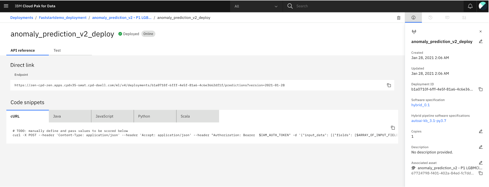
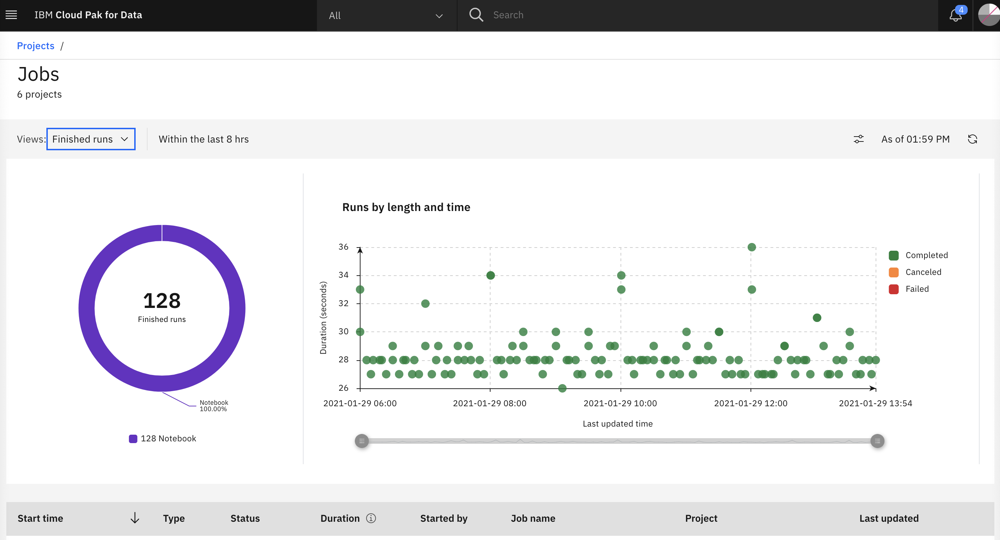

This section will show how to use Cloud Pak for Data for anomaly detection from streaming events using the anomaly detection model deployed in Watson Machine Learning.  The events will come to an event bus, Kafka, and from there the anomaly detection model will be called in an asychronous manner.  In this usage pattern, the events are assumed to be coming into the event bus, Kafka, in Cloud Pak for Integration.  There would be a consumer running in Cloud Pak for Data that will consume the events at a scheduled frequency.  The consumer will call the deployed anomaly detection model for each event to identify those that are anomalous.  

Here is the notebook that achieves the above goal. 

(insert link to notebook)

The notebook internally calls this model deployment endpoint of the anomaly detection model:

 

The notebook can be run as a job using the job framework in Cloud Pak for Data

(insert job image)

After creating the job, the status of the streaming job can be monitored using the Cloud Pak for Data interface. 

 

Since this model is monitored in Watson OpenScale, the predictions can be tracked over a period of time.

 
 
 
 
