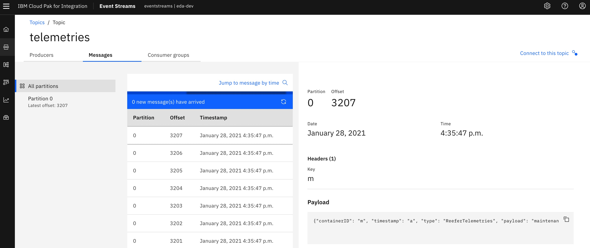

Another popular date sources or data connection is streaming data from other streaming data platform, like IBM Event Stream in Cloud Pak For Integration.

Following is the example topic Event Stream will use to push all the vaccine monitoring data and also Cloud pak for data will use this topic to get all the streaming data.

Here is the sample code link on how to set up the connection to Event Stream topic:

[example notebook](https://github.com/ibm-cloud-architecture/vaccine-solution-main/tree/master/docs/src/pages/solution/cp4d/notebook)

Following is the whole architecture on how the user case works: Cloud pak for data will read streaming data from Cloud pak for integration and then build model on the streaming data and deploy it with Watson Machine Learning in Cloud Pak for Data. After the model is deployed, it will have a endpoint to score the new message from Event Stream in Cloud pak for Integration.

