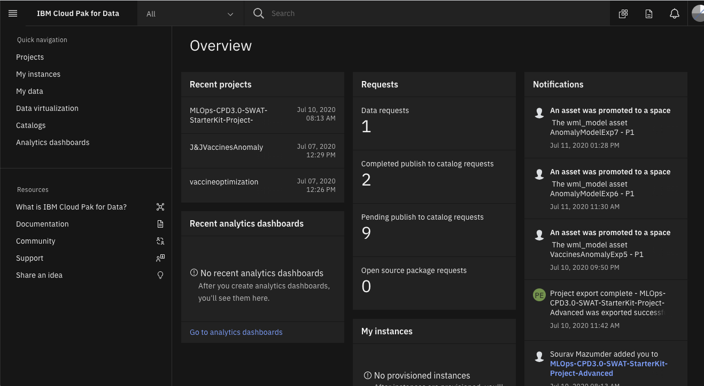
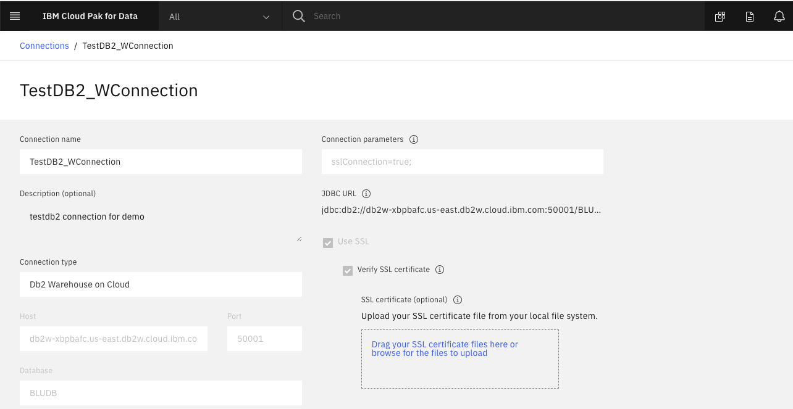
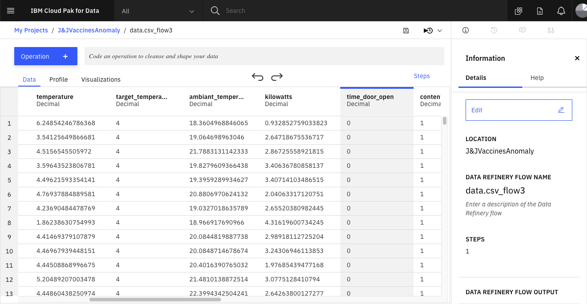
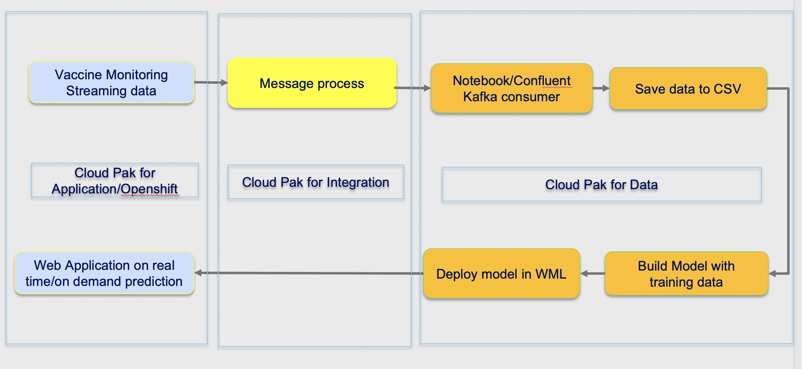

Now we shall show how various components of Cloud Pak For Data can be used to Develop, Deploy and Monitor an Anomaly detection Model in a very quick turn around time. 

 

Like any other Cloud Pak, Cloud Pak for Data can also run in any Cloud infrastructure - IBM Cloud, Azure, Google or Amazon or even in On Premise infrastructure.

The refrigerated containers, those would be used to ship the Vaccines to the Medical facilities, need monitoring. That is to ensure that all sensors within the containers are working properly so that its internal control system maintains  the necessary temperature and the concentration of cryogenic fluids. Otherwise the Vaccines would be spoiled and cannot be used for the treatment of patients.

The data of various sensors from the containers (while they are on job to fulfill a shipment) can be continuously captured as event data and kept in any kind of datastore. The same can be then used to build a AI model to continuously check if any irregularity happening in the Containers while in move (which can in turn spoil the Vaccines).

Cloud Pak for Data can access data available in variety of Data Stores - Relational, No SQL, Message Queues, HDFS; around 40 different types of them. The Datastores can be public cloud, private cloud or on premise.
  
  

Here we are assuming the Data is available in a DB2 relational store and accessing the same in Data Refinery Component on Cloud Pak For Data.

  
  
The Model Developer, the Data Scientist, can access the Data in Data Refinery and at first Profile the Data. 

After that she needs to decide how to define Anomaly. In this type of cases, a typical way to define anomaly is based on difference in Target Temperature and Actual Temperature. If that difference is high then it signifies that the Control system is not working as needed. 

So she may create a dataset to build an Anomaly detection model based on concentration of various fluids as independent variables and an AnomalyFlg as Dependent variable. The Anomaly flag would be derived based on the certain threshold of the temperature difference mentioned before. She may also add some other factual indicators like number of minutes doors were open, number of defrost cycles, power, etc as the additional features.

She can create this dataset for development of the model based on the original sensor datasets through few quick steps using Data Refinery.

[Showing Following Steps using Refinery - Create TempDiff value, Anomaly Flg, Remove other fields]

Now she can use Auto AI of Cloud Pak For Data to build the Model by running multiple data science experiments within few minutes.

 

[Showing Following Steps using AutoAI - Ingest Prepared Data, Setup Experiments, Choose Right Model, Save the Model]

Now she can immediately deploy the Model so that Model can be called for Anomaly prediction from anywhere, any application over Rest Interface. 

5. [Cloud Pak For Data - WML Screen]

This Model can predict whether there is any possible Anomalous behaviour in Container because of faulty Temperature sensor. Appropriate action can be taken based on that prediction.

6. [Cloud Pak For Data - Open Scale Home Screen]

The deployed Model can then further be monitored using Open Scale of Cloud Pak For Data. It can be used for Explainaing why Model is predicting in a particular way, Is there any drift in Input Data, is there any possible Bias in the Model that comes up after few predictions, etc.

For example  Whether a prediction is based on the time the doors were open, concentration of CO2, or based on Defrost cycle. Also is there any Drift in Input Data (the concentration of fluids, time doors are open, defrost cycle, etc) over a period of time w.r.t the training data (historical value). All these inputs can further help in taking any decision on what to do in such situations.
 
Cloud Pak for data makes the data ready in days and ensures that the data scientists can use their tooling of preference whose security is ensured by IBM using Watson Studio.  Business can have the confidence to know what were the factors and data used by the model to make a decision.

Another popular date sources or data connection is streaming data from other streaming data platform, like IBM Event Stream in Cloud Pak For Integration.

