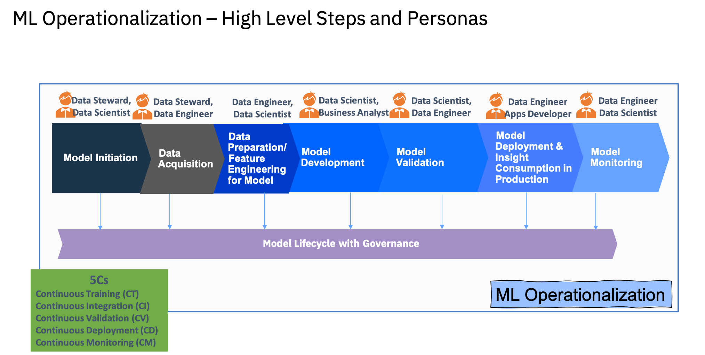
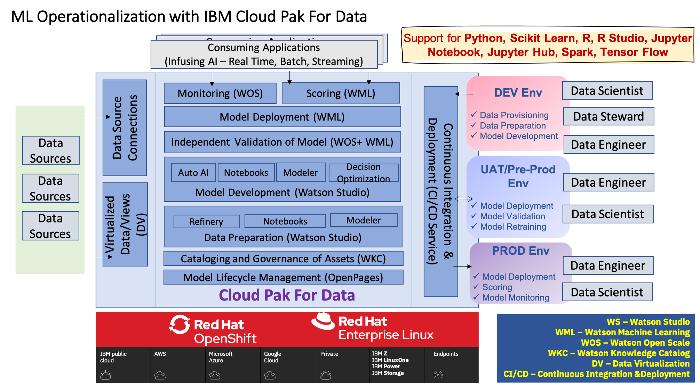

Cloud Pak For Data is the Data and AI platform which can be used to dvelop model for any kind of Anomaly detection in the Refrigeration Container based on the event generated by the sensors in the container.

To detect any kind of Anomaly in the Refrigeration Container an Anomaly detection model can be generated using Cloud Pak for Data. Cloud Pak for Data various components those can be used for that purpose.

In Cloud Pak For Data a Predictive Model can be created based on the process depicted in the diagram below.

 

Different components of Cloud Pak For Data can be used to implement the above process as shown in the diagram below.

 
