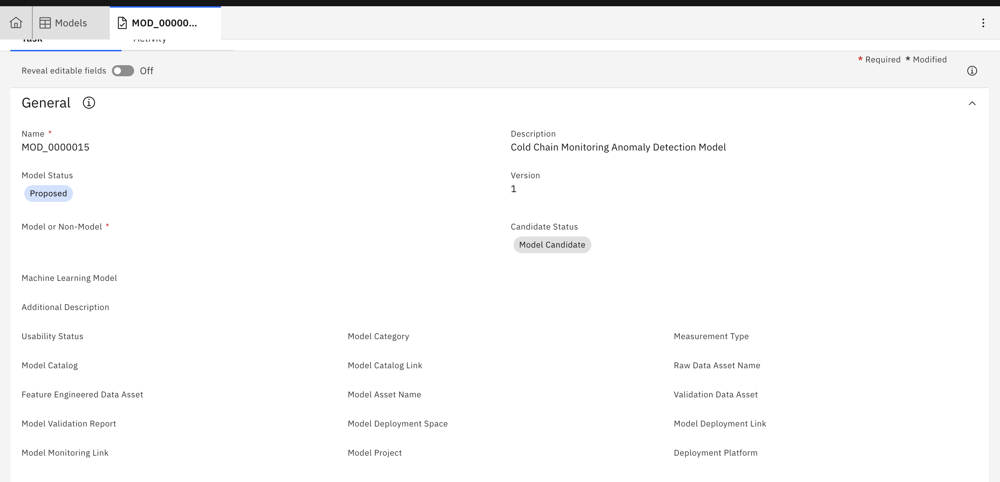

In this section we have the step by step guidance on how to develop and deploy a model using a simple Model Development Lifecycle Workflow with Governance in Cloud Pak For Data. We show here a very basic workflow. The workflow can be made as complex as needed with sub-workflow with more manual and system controlled gates as needed by a customer.

__Prerequisites__

1. Ensure you have installed Cloud Pak For Data 3.5 with following components - Watson OpenPages, Watson KNowledge Catalog, Watson Studio, Watson Machine Learning, Watson OpenScale and Db2.

2. You have to ensure that in OpenPages a Model is created with all fields as needed in the following workflows. The list of the fields you can see in the diagram below. You can add these fields by going through Solution Configuration -> Objects -> Model -> Fields -> New Field in OpenPages with 'Enable System Admin Model' set. You should add these fields to MRG-Model grouop. After that add these fields to the Views -> Demo-Task_model.

3. You have to ensure that you have all necessary users created in OpenPages - ModelManager, ModelOwner, ModelDataEngineer, ModelDEveloper, ModelValidator, and ModelDeployer. You can add these users by going through Solution Configuration -> Users and Security -> Users -> Create User.

4. You have to ensure that necessary configuration is done in OpenPages to integrate the same with OpenScale.

__Step 1 : Initiate Model Development Lifecycle__

Role - ModelManager

1. Login to OpenPages. Create a Model in OpenPages and assign it Proposed stage
2. Provide Description with Model's details. Additional Description with Model purpose, Data Sources to be used. 
3. Select Yes for the fields Machine Learning Model, Monitored With OpenScale. Select Yes for Usability Status
4. Create a Catalog for the model in Watson Knowledge Catalog. Provide the name and link of the Catalog in the respective fields.
5. Save the Model Workflow.

Role - ModelOwner

6. Login to OpenPages. Go to the Model. Review the Model Deatils
7. Change the model status to Approved for Data Acquisition. Save the Model Workflow.

__Step 2 : Data Acquisition, Feature Engineering and Model Development__

Role - ModelDataEnginner

1. Login to OpenPages. Get Model details. Get Catalog name. Get Data Asset name.
2. Create a Analytics Project in Cloud Pak For Data
3. To the project add the Notebook provided for acquiring Data from Kafka in Clous Pak For Integration
4. Run the Notebook. It will generate the data in a csv file. 
5. Publish the CSV file to Catalog designated for the Model - give the Data Asset an appropriate name. Also publish the Notebook to the Catalog.
6. Go to the OpenPages. Update the name of the Raw Data Asset published to the Catalog to the appropriate field of the Catalog. Change the Model Status to Data Acquisition Completed.

Role - ModelOwner

7. Login to OpenPages. Go to the Model. Check the name of the Data Asset for model development. Go to the Catalog. Review the Raw Data Asset.
8. Change the model status to Approved for Feature Engineering. Save the Model Workflow.

Role - ModelDeveloper

9. Login to OpenPages. Get Model details. Get Catalog name.
10. Create a Analytics Project in Cloud Pak For Data
11. To the project add the Raw Data Asset from the Catalog. 
12. Use Refinery to do the feature engineering based on the instructions provided in the Solution section. Add the Anomaly Flag. Alternatively one can use Notebooks or SPSS Modleer for the Feature Engineering.
13. Publish the Feature Engineered Data to Catalog. Create Related Asset for the Feature Engineered Data Asset in the Catalog pointing it to the Raw Data Asset. Also publish the Data Refinery Flow (export from project and import as data asset) to the Catalog.
14. Go to the OpenPages. Update the name of the Featured Engineered Data Asset published to the Catalog to the appropriate field of the Catalog. Change the Model Status to Feature Engineering Completed.

Role - ModelOwner

15. Login to OpenPages. Go to the Model. Check the name of the Feature Engineered Data Asset for model development. Go to the Catalog. Review the Feature Engineered Data Asset
16. Change the model status to Approved for Development. Save the Model Workflow.

Role - ModelDeveloper

17. Login to OpenPages. Get Model details. Get Catalog name.
10. Create a Analytics Project in Cloud Pak For Data
11. To the project add the Feature Enfgineered Data Asset from the Catalog. 
12. Use Auto AI to create thye model based on the instructions provided in the Solution section. Alternatively one can use Notebooks or SPSS Modleer for the Model Development.
13. Publish the Model Asset to Catalog. Create Related Asset for the Model in the Catalog pointing it to the Feature Engineered Data Asset . Also publish the Notebook (generated from Auto AI) that is used to create the model to the Catalog.
14. Go to the OpenPages. Update the name of the Model Asset published to the Catalog to the appropriate field of the Catalog. Change the Model Status to Model Development Completed.

Role - ModelOwner

15. Login to OpenPages. Go to the Model. Check the name of Model Asset. Go to the Catalog. Review the Model Data Asset
16. Change the model status to Approved for Validation. Save the Model Workflow.

__Step 3 : Model Validation__

Role - ModelValidator

1. Login to OpenPages. Get Model details. Get Catalog name. Get Model Asset name.
2. Create a Analytics Project in Cloud Pak For Data for Model Validation.
3. To the project add the Model Asset from the Catalog. 
4. Create a Deployment Space for deploying the model for Validation. Associate the Deployment Space to the Validation Project. Promote Model Asset from project to that Deployment Space.
5. Create Online Deployment of the Model. Configure the Deployment in OpenScale for Validation using pre-production deployment space. Use the steps mentioned in the Solution section.
6. Create a Validation Dataset. Use the same in OpenScale to validate the Model. Generate the Validation Report from OpenScale.
7. Publish the Validation Data Asset to Catalog. Download Model Validation Report and upload the same to Catalog. 
8. Go to the OpenPages. Update the name of the Validation Data Asset published to the Catalog to the appropriate field of the Catalog. Also update the name of the Validation Report. Change the Model Status to Model Validation Completed.

Role - ModelOwner

9. Login to OpenPages. Go to the Model. Check the name of Validation Data Asset and Validation Report. Go to the Catalog. Review those assets.
10. Change the model status to Approved for Deployment. Save the Model Workflow.

__Step 3 : Model Deployment__

Role - ModelDeployer

1. Login to OpenPages. Get Model details. Get Catalog name. Get Model Asset name.
2. Create a Analytics Project in Cloud Pak For Data for Production Deployment.
3. To the project add the Model Asset from the Catalog. 
4. Create a Deployment Space for production deployment of the model. Associate the Deployment Space to the Production Deployment Project. Promote Model Asset from project to that Production Deployment Space.
5. Create Online Deployment of the Model. Configure the Deployment in OpenScale for Monitoring using Production deployment space. Use the steps mentioned in the Solution section.
6. Go to the OpenPages. Update the name of the Production Deployment Space name, Prduction Deployment link and link to Open Scale Tile for the Model as Model Monitoring Link. Change the Model Status to Model Deployment Completed.

Role - ModelOwner

7. Login to OpenPages. Go to the Model. Check Production Deployment Space name, Prduction Deployment link and link to Open Scale Tile specified for the Model. Go to the Deployment Soace and OpenScale. Review those assets.
8. Change the model status to Ready to Use. Save the Model Workflow. Provide the Model Endpoint Link to the Model using applications.

