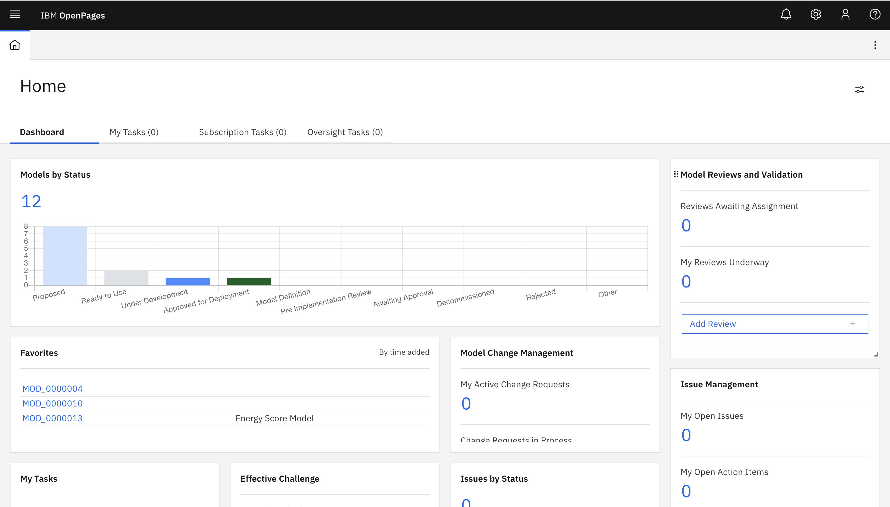
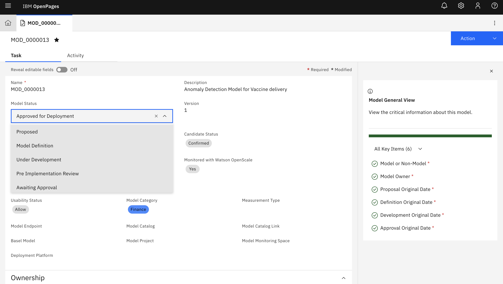
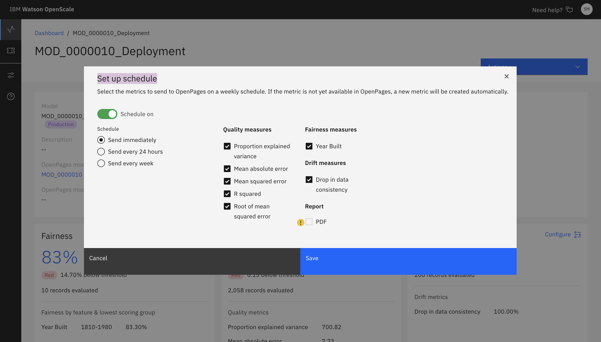

Now we shall show how various components of Cloud Pak For Data can be used to govern and manage the Model Lifecycle. 

Managing Model's lifecycle with a proper Governance workflow is key to reliability of such mission critical solution. The components of Cloud Pak For Data; like OpenPages, Watson Knowledge Catalog, and Wayson OpenScale can be used to achieve the same.

Model Lifecycle (MDLC) can be defined using OpenPages with gates for manual/Automated approvals at various stages of MDLC. For example - 

a) Proposal stage - The type of algorithms and data sources to be used can be verified by appropriate SMEs
b) Development stage - After the Model is developed independent validation of the Model can be done by separate team using OpenScale
c) Deployment Stage - Before production deployment any additional validation can be added by Business team and appropriate Monitoring measures can be established
d) Change Management - Based on Monitored metrics upgrading to new version or decommisioing of the Model can be initiated with controlled Change Management

All assets related to the Model can be govered in a single Catalog using Watson Knwledge Catalog.

The diagram below shows how OpenPages can help in managing MDLC of various models those are in different stages of MDLC with appropriate manual intervention.

 

In OpenPages, workflow for MDLC can be configured in a way that alligns to regulatory requirements of an organization. The stages of the MDLC, approval gates, fields for mandatory information and any other specific needs can be configured in OpenPages and can be saved as a template in the Library. The same can be used to create workflows for various Models.

The diagram below shows a sample MDLC template for a Model with various stages. Custom fields can be created to link the MDLC with respective Catalog (of watson Knowledge Catalog), Model's Deploymebnt Endpoint, Model Development Project, etc as needed by the organizational requirement.

For details on how to configure OpenPages for a paerticular MDLC requirement following guidelines can be used https://www.ibm.com/support/knowledgecenter/SSQNUZ_3.5.0/svc-welcome/openpages.html and https://www.ibm.com/support/knowledgecenter/SSFUEU_8.2.0/op_grc_user/c_oppm_mrg_about_objects.html

The results of monitoring the Model in OpenScale can be sent to OpenPages on periodic basis or on demand. That is to help the Model Owner to take decision about Model's effectiveness and decide whether the Model needs to be changed or decommisioned. The diagram below shows how to send the monitoring metrics from OpenScale to OpenPages. For configuration of the same you can check this link - https://www.ibm.com/support/knowledgecenter/SSFUEU_8.2.0/op_grc_user/c_oppm_mrg_intr_module_description.html

