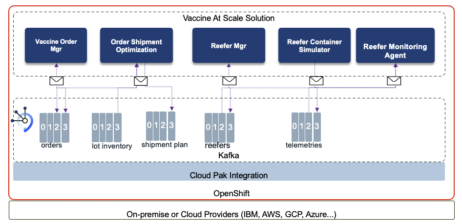
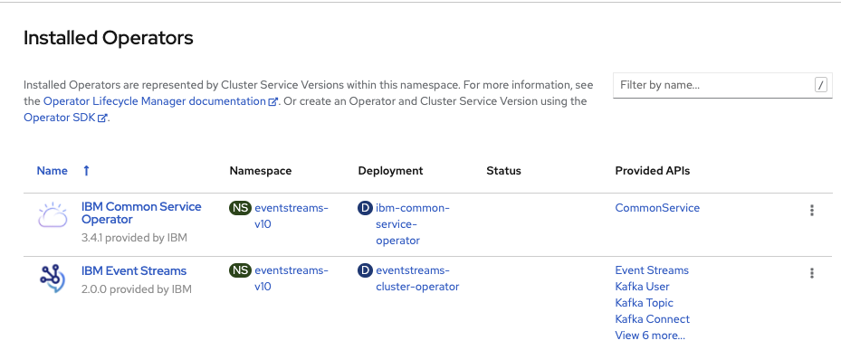
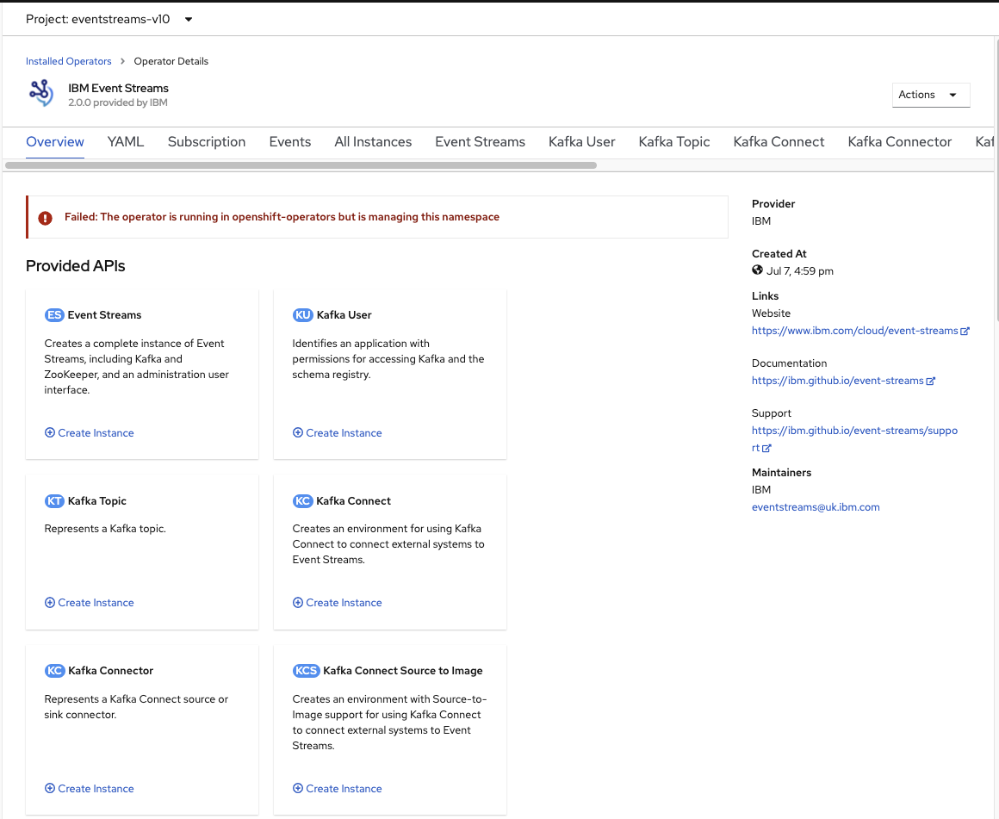

The solution is using different IBM products which run on OpenShift as part of the Cloud Pak portfolio. Most of the products used are exposed in Operator catalog on OpenShift and can be installed in few clicks. At the lower level of the stack, OpenShift delivers the uniform management and orchestration of the different applications running on it. It can run on most of the cloud providers on the market. 


 

The microservices developed for this MVP solution (Reefer IoT simulator, Reefer Manager, Cold Chain montoring agent, Order managers, Order Optimization) are developed, and continuously deployed with GitOps and Tekton capabilities. Most of those services are event driven, leveraging Event Streams as Kafka based event backbone. API can be exposed and managed with API management, and integration with existing system can also be done with App Connect. The business process to engage human to do the refrigerator maintenance runs on Business Automation Workflow product as part of the Cloud Pak for Automation.

The data governance is controlled by the cloud Pak for Data product portfolio, and the anomaly detection is developed with Watson Studio and deployed with Watson ML pipeline. 

Finally the multi cloud management platform ensures the deployment of the products and the solutions on multi cloud providers. 

## Getting started

We assume the following clusters are up and running:

* OpenShift 4.6 with Cloud Pak for Integration deployed
* OpenShift 4.6 with Cloud Pak for Data deployed

### Integration 

As most of the services developed in this solution are publishing and consuming events, we are using Event Streams (IBM packaging of Apache Kafka) from Cloud Pak for Integration. The components and Kafka relationships are detailed in the diagram below:

 

* OpenShift is the container orchestration platform to run on any cloud providers
* [Cloud Pak for integration](https://www.ibm.com/support/knowledgecenter/SSGT7J_20.2/welcome.html) is the common layer to define the IBM middleware product catalog and offers a set of common services. From an existing OpenShift cluster it is possible to [add the IBM Operator Catalog](https://www.ibm.com/support/knowledgecenter/SSGT7J_20.2/install/install_online_catalog_sources.html) and the IBM Common Services Catalog to your cluster and using OLM to install the IBM operators. Once the catalog is integrated, you can [get an entitlement key](https://www.ibm.com/support/knowledgecenter/SSGT7J_20.2/install/entitlement_key.html) to run licensed software.
* In cloud pak for Integration we can deploy a Kafka Cluster via [IBM Event Streams](https://ibm.github.io/event-streams/about/overview/) operator. Event Streams is an operator-based release and uses custom resources to define your Event Streams configurations. The Event Streams operator uses the custom resources to deploy and manage the entire lifecycle of your Event Streams instances. Custom resources are presented as YAML configuration documents that define instances of the EventStreams custom resource type. 

#### Event Streams

We strongly recommend to follow [this video](https://www.youtube.com/watch?v=nSza-RwvxSE) to see how easy is to get started with Event Streams v10. 

The installation is in two steps:

* first time deploy the Event Streams operator, which will also automatically deploy the required IBM Cloud Platform Common Services if not present.

 

* Once operator installed, then create cluster instance, users, topics...

 

The installation instructions are in the [product documentation](https://ibm.github.io/event-streams/installing/installing/).

*If you need admin password to access Cloud Pak for Integration console or Event Streams console use the following command:*

 ```shell
 oc --namespace ibm-common-services get secret platform-auth-idp-credentials -o jsonpath='{.data.admin_password}' | base64 --decode && echo ""
 ```

Once installation is terminated, install CLI if you want to automate some of the Kafka topic creation, or users creation... See [the post installation document](https://ibm.github.io/event-streams/installing/post-installation/) and [see our detail lab here](https://ibm-cloud-architecture.github.io/refarch-eda/use-cases/overview/pre-requisites#install-event-streams-using-operators).

* Get service account TLS credentials to remote connect to Kafka Brokers. [See instructions here](https://ibm-cloud-architecture.github.io/refarch-eda/use-cases/overview/pre-requisites#getting-tls-authentication-from-event-streams-on-openshift). 

* The topics (telemetries, orders, reefers, shipments...) for the solution can be defined from this project using the following type of command (see `environment/kafka/createTopics.sh`), where `light-es-kafka-2` is the name of a pod from one of the broker:

 ```shell
  oc exec -ti  light-es-kafka-2  -c kafka  bash <<EOF
  /opt/kafka/bin/kafka-topics.sh --bootstrap-server localhost:9092 --create  --replication-factor 1 --partitions 1 --topic db_history_vaccine_orders
  /opt/kafka/bin/kafka-topics.sh --bootstrap-server localhost:9092 --create  --replication-factor 1 --partitions 1 --topic vaccine_shipments
  /opt/kafka/bin/kafka-topics.sh --bootstrap-server localhost:9092 --create  --replication-factor 1 --partitions 1 --topic transportation
  /opt/kafka/bin/kafka-topics.sh --bootstrap-server localhost:9092 --create  --replication-factor 1 --partitions 1 --topic reefer_telemetries
  /opt/kafka/bin/kafka-topics.sh --bootstrap-server localhost:9092 --create  --replication-factor 1 --partitions 1 --topic vaccine_lots
  EOF
 ```

