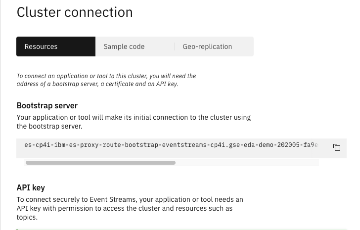

<PageDescription>
This microservice manages order for vaccine demand.
</PageDescription>

<AnchorLinks>
  <AnchorLink>Overview</AnchorLink>
  <AnchorLink>Build</AnchorLink>
  <AnchorLink>Run</AnchorLink>
  <AnchorLink>Usage Details</AnchorLink>
</AnchorLinks>

## Overview


**Github repository:** []()

**Kafka topics consumed from:**

**Kafka topics produced to:**

**Events reacted to:**

**Events produced:**

## Build

This microservice is built using the [Appsody](https://appsody.dev/) development framework. The [Appsody CLI](https://appsody.dev/docs/installing/installing-appsody) is a required prerequisite for building the application locally.

Appsody will build the application by pulling the contents of the Appsody Stack it is based on and then performing the local application build inside the containerized environment:

`appsody build -t <yournamespace>/kcontainer-order-command-ms[:tag] [--push]`

- You can optionally specify a container tag. If left blank, `latest` will be used.
- You can optionally supply the `--push` flag to automatically push the built image to specified remote repository.

Performing an Appsody build will update the `app-deploy.yaml` file in the same directory with current information for the application image, labels, and annotations fields.

## Run 

### Pre-requisites

* Define a config map for the kafka brokers URL coming from the Event streams cluster connection panel:

 

  ```shell
  oc create configmap kafka-brokers --from-literal=brokers='es-cp4i-ibm-es-proxy-route-bootstrap-eventstreams-cp4i.gse-eda-demo-202005-fa9ee67c9ab6a7791435450358e564cc-0000.us-south.containers.appdomain.cloud:443' -n vaccine-cold-chain

  ```

* Define a secret for the event streams API key

  ```shell
  oc create secret generic es-cp4i-apikey --from-literal=binding='b77......tgMJZ' -n vaccine-cold-chain
  ```

* Add a secret for the java truststore, downloaded from Event Stream console or using the CLI `cloudctl es certificates --format jks`

  ```shell
  oc create secret generic es-truststore-jks --from-file=certs/es-cert.jks
  ```

* Modify the `app-deploy.yaml` to add environment variables and mount point.

```yaml
  env:
    - name: KAFKA_BROKERS
      valueFrom:
        configMapKeyRef:
          key: brokers
          name: kafka-brokers
    - name: KAFKA_APIKEY
      valueFrom:
        secretKeyRef:
          key: binding
          name: es-cp4i-apikey
          optional: true
    - name: CERT_LOCATION
      value: /config/certs/truststore.jks
```

### Deployment Parameters

The following deployment parameters are defined in the `app-deploy.yaml` file:

| Name                                     | Required | Description                                                                                                            |
|------------------------------------------|----------|------------------------------------------------------------------------------------------------------------------------|
| KAFKA_BROKERS                            | YES      | Comma-separated list of Kafka brokers to connect to                                                                    |
| KAFKA_APIKEY                             | NO       | API Key used to connect to SASL-secured Kafka brokers. This is required when connecting to IBM Event Streams clusters. |
| TRUSTSTORE_ENABLED                       | NO       | Required to be set to `true` when connecting to IBM Event Streams on the IBM Cloud Pak for Integration (CP4I).         |
| TRUSTSTORE_PATH                          | NO       | The local path to the required truststore file when connecting to IBM Event Streams on CP4I. See [**Volume Mounts**](#volume-mounts) below.  |
| TRUSTSTORE_PWD                           | NO       | The password for the truststore file used for IBM Event Streams server verification.                                   |


### Volume mounts

The order manager microservice requires up to one file to be injected at runtime for proper operation. As noted in the `TRUSTSTORE_PATH` parameter above, these files are SSL-based certificates which are required to verify the identity of the external service when calling it. These files are provided as `--docker-options "-v host-src:container-dest ..."` when running the microservice locally and as a Volume Mount when running the microservice on a Kubernetes cluster.

The `TRUSTSTORE_PATH` parameter is documented in the **Event Streams Certificates** section of the [Prerequisites](/microservices/prereqs/#ibm-event-streams-on-redhat-openshift-container-platform) page. The Appsody run command should include a parameter similar to `-v ./certs/es-cert.jks:/config/resources/security/es-cert.jks` in its `--docker-options` string to run this microservice locally.

**Example:** `appsody run --docker-options "-v /Users/myuser/Downloads/es-cert.jks:/config/resources/security/es-ssl/es-cert.jks" ...`

### Running locally

When running the microservice locally, you must specify all the required [deployment parameters](#deployment-parameters) from above as environment variables via the `--docker-options` flag being passed in from the Appsody CLI command.

**Example:** `appsody run --docker-options "-e KAFKA_BROKERS=es-cp4i-ibm-es-proxy-route-bootstrap-eventstreams-cp4i.gse-eda-demo-202005-fa9ee67c9ab6a7791435450358e564cc-0000.us-south.containers.appdomain.cloud:443 -e KAFKA_APIKEY=b77... -e CERT_LOCATION=/deployment/certs/es-cert.jks   -v $(pwd)/certs/es-cert.jks:/deployments/certs/es-cert.jks" `

For more details on running the microservice locally, consult the Appsody run documentation as well as the deployment information contained in the app-deploy.yaml file.

### Running remotely 

The [Appsody Operator](https://appsody.dev/docs/reference/appsody-operator/) is a required prerequisite for deploying the microservice to a remote Kubernetes or OpenShift cluster. If the operator is not present in the current project, `appsody deploy... ` will add one.

To deploy the microservice to a remote cluster:

```shell
oc get route --all-namespaces | grep registry
export IMAGE_REGISTRY=default-route-openshift-image-registry.gse-eda-demo-202005-fa9ee67c9ab6a7791435450358e564cc-0000.us-south.containers.appdomain.cloud
appsody deploy -t vaccine-cold-chain/orderms:0.0.1 --push-url $IMAGE_REGISTRY --push --namespace vaccine-cold-chain --no-build
```

- You can omit the `--no-build` flag to have Appsody perform a build before deploying the application.
- _**Note:**_ Performing a build at deploy time requires specifying the absolute container reference path, as well as the `--push` flag.
- The neccesary deployment parameter information will be read from the `app-deploy.yaml` file in the same directory.

## Usage Details

### REST APIs