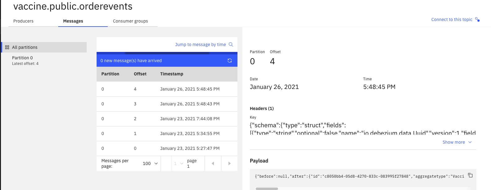

This microservice manages vaccine orders for a world wide demand and distribution. This is an example of using [Quarkus](https://quarkus.io), microprofile [Reactive Messaging](https://smallrye.io/smallrye-reactive-messaging/smallrye-reactive-messaging/2/concepts.html), [Debezium outbox quarkus extension](https://debezium.io/documentation/reference/integrations/outbox.html) with Debezium [change data capture  for Postgresl](https://debezium.io/documentation/reference/connectors/postgresql.html) to Kafka. The database is Postgresql, the service uses Hibernate ORM with Panache. 

The DevOps is supported by Git Action and then gitops repository.


<AnchorLinks>
  <AnchorLink>Overview</AnchorLink>
  <AnchorLink>Build and deploy to OpenShift</AnchorLink>
  <AnchorLink>Demonstration script</AnchorLink>
</AnchorLinks>

## Overview

This project implements a very simple event driven microservice to support the Create, Read, Update, of vaccine orders. This implementation highlights the following capabilities and patterns:

* Quarkus reactive microservice using Microprofile 3.x - reactive messaging extension to consume Vaccine lot shipment plans
* Postgresql with Hibernate ORM with [Quarkus Panache](https://quarkus.io/guides/hibernate-orm-panache)
* Quarkus Debezium Outbox pattern to get create OrderEvents while writing to the main VaccineOrderEntity table
* Integrate a Kafka Connector with Debezium change data capture table updates on the OrderEvents table.

In term of business scenario, a sale representative uses his mobile device or web browser to enter information about a vaccine order to be shipped to a given country or a province within a country at given date for a given quantity: 

 

The user interface is for demonstration purpose only, and illustrates some standard Vuejs / vuetify components. 

The following diagram presents the simple context view of the service deployed on OpenShift, integrated with Kafka, Change data capture and the [Vaccine order reefer optimization service](/solution/orderms/voro-solution/). The integration with this component is using pub/sub via Kafka topics. The integration with Blockchain is not done yet, but it can be seen as the source of truth for the business companies participating to then end to end delivery.  

 


The component writes to the database all the orders received, but also produces records to Kafka via the Outbox pattern and change data capture.

Another view could be a pods view of the solution to deploy. The Debezium change data capture is a Kafka connector.

 

**Github repository:** [Vaccine-order-mgr-pg](https://github.com/ibm-cloud-architecture/vaccine-order-mgr-pg)


**Kafka topics produced to:** vaccine.public.vaccineorderentity
**Kafka topics consumed from :** vaccine-shipment-plans

**Events produced:**

We will simplify the process and aggregate in the following event types:

* orderCreated
* orderUpdated


## Build and deploy to OpenShift

This microservice is built using maven and Quarkus extensions. We have already pushed the last version of this service on dockerhub, if you do not want to build it. 

To build and run locally see the [repository main readme](https://github.com/ibm-cloud-architecture/vaccine-order-mgr-pg) as we have different docker-compose files to run in demonstration mode or in development mode.

In this section we address how to use OpenShift Source to Image to build and deploy the application to OpenShift. The application is using environment variables to access to user, password, URLs to access Postgres and Kafka. We are using Event Streams deployed in Cloud Pak for Integration, but it could work the same with Strimzi. 

As an example we created the OpenShift project called "vaccine" with a command: `oc new-project vaccine`.

### Pre requisites

* Clone the source git repository: `git clone https://github.com/ibm-cloud-architecture/vaccine-order-mgr-pg`
* Deploy a postgres server. The orders are persisted in an external Postgres instance running on Openshift cluster. To do a simple deployment performs the following commands:

  ```shell
  # Define environemt variables
  SERVICE_ACCOUNT_NAME=postgres-sa
  DEPLOYMENT_NAME=postgres
  SERVICE_NAME=postgres
  DOCKER_IMAGE=docker.io/postgres:11.6-alpine
  POSTGRES_PASSWORD=adifficultpasswordtoguess

  oc create serviceaccount ${SERVICE_ACCOUNT_NAME}
  oc adm policy add-scc-to-user anyuid -n ${PROJECT_NAME} -z ${SERVICE_ACCOUNT_NAME}
  oc create deployment ${DEPLOYMENT_NAME} --image=${DOCKER_IMAGE}
  oc set serviceaccount deployment/${DEPLOYMENT_NAME} ${SERVICE_ACCOUNT_NAME}
  oc patch deployment ${DEPLOYMENT_NAME} --type="json" -p='[{"op":"add", "path":"/spec/template/spec/containers/0/args", "value":[]},{"op":"add", "path":"/spec/template/spec/containers/0/args/-", "value":"-c"},{"op":"add", "path":"/spec/template/spec/containers/0/args/-", "value":"wal_level=logical"} ]'
  oc set env deployment ${DEPLOYMENT_NAME} POSTGRES_PASSWORD=${POSTGRES_PASSWORD}
  oc expose deployment ${DEPLOYMENT_NAME} --port 5432 --name ${SERVICE_NAME}
  ```

* Get an instance of Kafka deployed on OpenShift like [IBM Event Streams](https://ibm-cloud-architecture.github.io/refarch-eda/use-cases/overview/pre-requisites#install-event-streams-using-operators)...). 


### Define Kafka user and postgres user secrets

* Get Kafka user to access Event Streams bootstrap in external route.

 ```shell
 oc get kafkausers -n eventstreams 
 # NAME                                CLUSTER   AUTHENTICATION   AUTHORIZATION
 # app-scram                           eda-dev   scram-sha-512    simple
 # app-tls                             eda-dev   tls              simple
 ```
* Get password with: ``
* Define a secret manifest with a command like below, or by updating the  [src/main/kubernetes/secrets.yaml](https://github.com/ibm-cloud-architecture/vaccine-order-mgr-pg/blob/master/src/main/kubernetes/secrets.yaml) secret file.

 ```shell
 oc apply -f - <<EOF
 apiVersion: v1
 kind: Secret
 metadata:
   name: vaccine-order-secrets
 data:
    KAFKA_USER: <username-base64-encoded>
    KAFKA_PASSWORD: <pwd-base64-encoded>
    QUARKUS_DATASOURCE_PASSWORD: <postgres-user-pwd-base64-encoded>
    QUARKUS_DATASOURCE_USERNAME: <postgres-user-base64-encoded>
 EOF
 ```

The strings in the secret are base64 encoded, so use something like: `echo "app-scram" | base64 `. The password is already encrypted in a secret within the `eventstreams` project, so use `oc get secret app-scram -n eventstreams -o jsonpath='{.data.password}'` command.


### Get Event Streams certificates

For Event Streams get URL of the bootstrap server and the service credentials (TLS certificates) following [those instructions.](https://ibm-cloud-architecture.github.io/refarch-eda/use-cases/overview/pre-requisites#getting-tls-authentication-from-event-streams-on-openshift)

If not done before, copy the cluster certificate via the secret to your project (`vaccine`):

  ```shell
  oc get secret eda-dev-cluster-ca-cert -n eventstreams --export -o yaml | oc apply -f -
  ```

### Define environment variables via ConfigMap

Modify the config map from [src/main/kubernetes/configmap.yaml](https://github.com/ibm-cloud-architecture/vaccine-order-mgr-pg/blob/master/src/main/kubernetes/configmap.yaml) with the URL of your Kafka bootstrap server.

  ```yaml
  apiVersion: v1
  kind: ConfigMap
  metadata:
    name: vaccine-order-ms-cm
  data:
    KAFKA_BOOTSTRAP_SERVERS: "light-es-kafka-bootstrap.eventstreams.svc:9092"
    KAFKA_SSL_PROTOCOL: "TLSv1.2"
    KAFKA_SSL_TRUSTSTORE_LOCATION: "/deployments/certs/server/ca.p12"
    KAFKA_SSL_TRUSTSTORE_TYPE: "PKCS12"
    SHIPMENT_PLAN_TOPIC: "vaccine_shipment_plans"
    KAFKA_SASL_MECHANISM: SCRAM-SHA-512
    KAFKA_SECURITY_PROTOCOL: SASL_SSL
  ```

Those environment variables are used by the application, and configured via the [src/main/resources/application.properties](https://github.com/ibm-cloud-architecture/vaccine-order-mgr-pg/blob/master/src/main/resources/application.properties). Below is the declaration that defines environment variables from the previously created secrets and configmap.

  ```propertiies
  quarkus.openshift.env.configmaps=vaccine-order-ms-cm
  quarkus.openshift.env.secrets=vaccine-order-secrets
  quarkus.openshift.env.mapping.KAFKA_SSL_TRUSTSTORE_PASSWORD.from-secret=eda.dev-cluster-ca-cert
  quarkus.openshift.env.mapping.KAFKA_SSL_TRUSTSTORE_PASSWORD.with-key=ca.password
  quarkus.openshift.mounts.es-cert.path=/deployments/certs/server
  quarkus.openshift.secret-volumes.es-cert.secret-name=eda-gse-cluster-ca-cert
  ```

* Then proceed with the following command to define the config map into OpenShift:

 ```shell
 oc apply -f src/main/kubernetes/configmap.yaml
 ```

### Deploy the application

The application uses Quarkus OpenShift extension to create yaml files for OpenShift and deploy the application using source to image capability of OpenShift:

 ```shell
 ./mvnw clean package -Dui.deps -Dui.dev -Dquarkus.kubernetes.deploy=true -DskipTests
 ```

The `-Dui.deps -Dui.dev` arguments are used to prepare and build the vue.js app from the `ui` folder. The packaging build a runner jar and push it to the private image registry in OpenShift.


It can take some seconds to build and deploy: `oc get pods -w` lets you see the build pods and the running app once the build is done. As we set properties to expose the application, an OpenShift route was created. 

* Be sure to get the Order Microservice URL to access the user interface, using `oc get routes` on the project. Using your web browser, pointing to this address you should get the UI:

 


### Deploy Debezium CDC connector

The Event Streams product documentation goes over the tasks to be done, but to summarize them, here are the actions done to deploy the postgres debezium connector:

* Start a Kafka connector cluster: We use the custom resource called `KafkaConnectS2I`, which one instance represent a Kafka connect cluster. Each connector is represented by another custom resource called KafkaConnector. Kafka connect needs the same user access to the Brokers. 
  * Event Streams UI has a Toolbox menu with the `Set up a Kafka Connect environment` where we can download the `KafkaConnectS2I` configuration. The matching configuration is [in this file](https://github.com/ibm-cloud-architecture/vaccine-order-mgr-pg/blob/main/environment/cdc/kafka-connect-s2i.yaml) and uses predefined TLS user and cluster certificate. The cluster name is `connect-cluster`.
  * Modify the bootstrap server and the TLS user to be used. Ensure the user can access any topics.
  * Deploy the cluster with: `oc apply -f kafka-connect-s2i.yaml -n eventstreams`
  * Validate it via: 

   ```shell
   oc get kafkaconnects2i -n eventstreams
   oc describe kafkaconnects2i connect-cluster -n eventstreams
   ```
* Download the postgres plugin archive from [debezium maven repository](https://repo1.maven.org/maven2/io/debezium/debezium-connector-postgres/1.4.0.Final/debezium-connector-postgres-1.4.0.Final-plugin.tar.gz) and then add the jar files to the `my-plugins\debezium-connector` folder. We need a subfolder as this connector includes multiple jars. 

  ```
  ├── my-plugins
  │   └── debezium-connector
  │       ├── CHANGELOG.md
  │       ├── CONTRIBUTE.md
  │       ├── COPYRIGHT.txt
  │       ├── LICENSE-3rd-PARTIES.txt
  │       ├── LICENSE.txt
  │       ├── README.md
  │       ├── README_ZH.md
  │       ├── debezium-api-1.4.0.Final.jar
  │       ├── debezium-connector-postgres-1.4.0.Final.jar
  │       ├── debezium-core-1.4.0.Final.jar
  │       ├── failureaccess-1.0.1.jar
  │       ├── guava-30.0-jre.jar
  │       ├── postgresql-42.2.14.jar
  │       └── protobuf-java-3.8.0.jar
  └── pg-connector.yaml
  ```

* Deploy the connector configuration:

  ```shell
  oc start-build connect-cluster-connect --from-dir ./my-plugins/
  oc get builds
  # NAME                        TYPE     FROM             STATUS    STARTED          DURATION
  # connect-cluster-connect-3   Source   Binary@f639186   Running   19 seconds ago   
  # once build is completed... wait to get the 3 kafka connect workers ready
  oc get pods -w
  ```
* Start the connector: `oc apply -f pg-connector.yaml`
* Verify it is running: `oc describe kafkaconnector pg-connector` 

## Demonstration script

* Connect to the order microservice URL, for example it could look like http://vaccineorderms-vaccine.clusternametochangewithyours.containers.appdomain.cloud. You should reach the home page. Then select Orders tab. 

If there is no order created click on `NEW ORDER` button 

 

and fill the following data:

 ```yaml
 organization: French Government
 delivery location: Paris
 delivery date: 2021-01-24
 quantity: 150
 priority: 2
 vaccine type: covid-19
 ```


* Verify the data in postgresql: 

Once submitted the data are saved into the postgres DB, with the outbox pattern having created new records in the corresponding Event tables. 
This can be done using different tools, like `psql` directly in the pod, or `pgadmin4`.

 ```shell
 oc get pods | grep postgres
 oc rsh <postgres pod id>
 # in the shell session within the pod do:
 psql -U postgres
 # in the psql shell, list the table
 \d 
 # Look at the content of the main table:
 select * from public.vaccineorderentity;
 # You should get one new record matching your data
 # Verify outbox pattern works:
 select * from public.orderevents;

 id    |   aggregatetype    | aggregateid | type         | timestamp |payload 
 c80.. | VaccineOrderEntity | 1           | OrderCreated | 2021-01-24 03:44:08.131634 | {"orderID":1,"deliveryLocation":"Paris","quantity":150,"priority":2,"deliveryDate":"2021-01-24","askingOrganization":"French Government","vaccineType":"COVID-19","status":"OPEN","creationDate":"24-Jan-2021 03:44:08"} | 
 ```

The outbox table of the order events has metadata attributes and then a payload matches the saved record in the orign table.

* Verify the message in the Kafka topic: `vaccine.public.orderevents`

 

  ```json
  {"before":null,"after":
  {"id":"c8050bb4-05d8-4270-833c-083995f27848",
   "aggregatetype":"VaccineOrderEntity",
   "aggregateid":"1",
   "type":"OrderCreated",
   "timestamp":1611459848131634,
   "payload":"{\"orderID\":1,\"deliveryLocation\":\"Paris\",\"quantity\":150,\"priority\":2,\"deliveryDate\":\"2021-01-24\",\"askingOrganization\":\"French Government\",\"vaccineType\":\"COVID-19\",\"status\":\"OPEN\",\"creationDate\":\"24-Jan-2021 03:44:08\"}",
  "tracingspancontext":"#Sun Jan 24 03:44:08 GMT 2021\n"},
  "source":{"version":"1.4.0.Final",
  "connector":"postgresql","name":"vaccine",
  "ts_ms":1611712125168,"snapshot":"last",
  "db":"postgres","schema":"public","table":"orderevents",
  "txId":1371,"lsn":41341808,"xmin":null},"op":"r","ts_ms":1611712125173,"transaction":null}
  ```

### REST APIs

The REST end points this service expose are in the OpenApi doc below, but not all operations are fully implemented yet.

 

