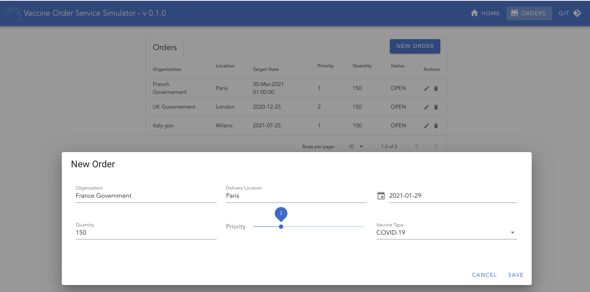
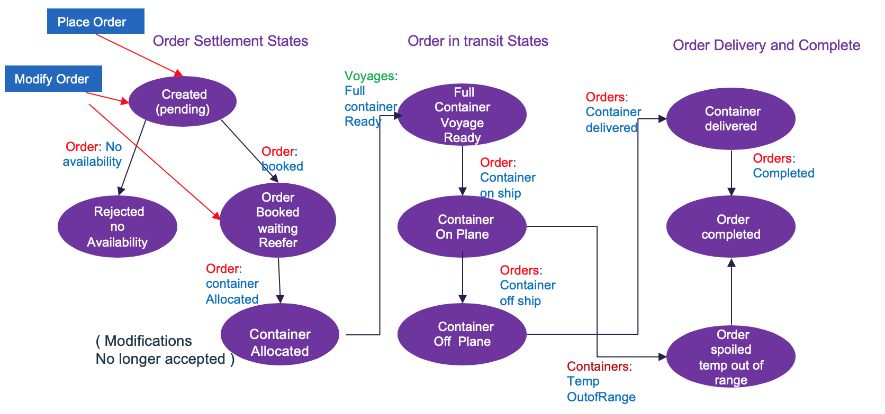

<PageDescription>
This microservice manages vaccine orders for a world wide demand and distribution. This is an example of 
</PageDescription>

<AnchorLinks>
  <AnchorLink>Overview</AnchorLink>
  <AnchorLink>Build with s2i</AnchorLink>
  <AnchorLink>Assess application runs</AnchorLink>
  <AnchorLink>Demonstration script</AnchorLink>
</AnchorLinks>

## Overview

This project implements a very simple event driven microservice to support the Create, Read, Update, of vaccine orders. This implementation highlights the following capbilities / patterns:

* Quarkus reactive microservice using Microprofile 3.x - reactive messaging extension to consume Vaccine lot shipment plans
* DB2 with Hibernate ORM with Quarkus Panache
* Quarkus Debezium Outbox pattern to get update to the OrderEvents table using Debezium change data capture and DB2 change agent.

In term of business scenario, a sale representative uses his mobile device or web browser to enter information about a vaccine order to be shipped to a given country or a province within a country. 

 

The user interface is for demonstration purpose only and illustrates some standard Vuejs development practices. 

 


The component writes to the database (DB2) all the orders received, but also produces records to Kafka via the Outbox pattern and change data capture.

**Github repository:** [Vaccine-order-mgr](https://github.com/ibm-cloud-architecture/vaccine-order-mgr)

**Order Life Cycle**

The order follows a set of states as described in the following diagram:

 

**Kafka topics produced to:**


**Events produced:**

We will simplify the process and aggregate in the following event types:

* orderCreated
* orderUpdated

Some events are related to the vaccine lot

* lotAssignedToOrder
* lotLoaded
* lotDelivered

## Build with s2i

This microservice is built using maven and Quarkus extensions. We have already pushed the last version of this service on dockerhub, if you do not want to build it. 

To build and run locally see the [repository main readme](https://github.com/ibm-cloud-architecture/vaccine-order-mgr) as we have different docker-compose files to run in demonstration mode or in development mode.

In this section we address how to use OpenShift Source to Image to build and deploy the application to OpenShift. The application is using environment variables to access to user, password, URLs to access DB2, and Kafka deployed in Cloud Pak for Integration. So first thing is to define such secrets and config map.

As an example we created the OpenShift project called "vaccine" with a command: `oc new-project vaccine`.

### Pre requisites

The orders are persisted in an external DB2 instance running on IBM Cloud Pack for Data. You need to get the username and password to connect to the DB2 instance with the jdbc URL (something like jdbc:db2://dashdb-....:50001/BLUDB)

Get an instance of Kafka deployed on OpenShift like [IBM Event Streams](https://ibm-cloud-architecture.github.io/refarch-eda/use-cases/overview/pre-requisites#install-event-streams-using-operators)...). 


### Defining DB access secrets

We need to get IBM DB2 user credentials and JDBC URL as secrets. So from the DB2 service credentials get the following attributes: user, password, and JDBC URL. You need to encrypt each of those values using base64 encoding:

```shell
# Example of URL encryption
echo "jdbc:db2://dashdb-txn-sbox-....services.dal.bluemix.net:50001/BLUDB:sslConnection=true;" | base64
```

Then define a secret manifest with a command like:

```shell
oc apply -f - <<EOF
apiVersion: v1
kind: Secret
metadata:
  name: vaccine-order-db-secret
data:
    DB_URL: ...encrypted URL...
    DB_USER: ...encrypted user..
    DB_PWD: ...encrypted pwd
EOF
```

See [the file here](https://github.com/ibm-cloud-architecture/vaccine-order-mgr/blob/master/src/main/kubernetes/secrets.yaml)

### Get Event Streams credentials

For Event Streams get URL of the bootstrap server and the service credentials (TLS certificates) following [those instructions.](https://ibm-cloud-architecture.github.io/refarch-eda/use-cases/overview/pre-requisites#getting-tls-authentication-from-event-streams-on-openshift)

We assume Event Streams is deployed in `eventstreams` project and the solution is running under `vaccine` namespace.

* Client application will use the server side public TLS certificate to connect to Kafka Brokers. See [those instructions](https://ibm-cloud-architecture.github.io/refarch-eda/use-cases/overview/pre-requisites#get-tls-server-public-certificate) to get the Server TLS certificate into the `certs` folder for local run as a secret for deploying to OpenShift. The following command copy the event streams ca cert secret to the current OpenShift project so it can be mounted to a path for the order microservice to get access to:

 ```shell
 # Under the 'vaccine' project
 oc get secret light-es-cluster-ca-cert   -n eventstreams --export -o yaml | oc apply -f -
 ```

* Modify the config map from [src/main/kubernetes/configmap.yaml](https://github.com/ibm-cloud-architecture/vaccine-order-mgr/blob/master/src/main/kubernetes/configmap.yaml) with the URL of your bootstrap server.

```yaml
apiVersion: v1
kind: ConfigMap
metadata:
  name: vaccine-order-ms-cm
data:
  KAFKA_BOOTSTRAP_SERVERS: "light-es-kafka-bootstrap.eventstreams.svc:9092"
  KAFKA_SSL_PROTOCOL: "TLSv1.2"
  KAFKA_SSL_TRUSTSTORE_LOCATION: "/deployments/certs/server/ca.p12"
  KAFKA_SSL_TRUSTSTORE_TYPE: "PKCS12"
  SHIPMENT_PLAN_TOPIC: "vaccine_shipment_plans"
```

Those environment variables are used by the application, and configured via the [src/main/resources/application.properties](https://github.com/ibm-cloud-architecture/vaccine-order-mgr/blob/master/src/main/resources/application.properties). Below is the declarations that define environment variables from the previously created secrets and configmap.

```propertiies
quarkus.openshift.env.configmaps=vaccine-order-ms-cm
quarkus.openshift.env.secrets=vaccine-order-secrets
quarkus.openshift.env.mapping.KAFKA_SSL_TRUSTSTORE_PASSWORD.from-secret=light-es-cluster-ca-cert
quarkus.openshift.env.mapping.KAFKA_SSL_TRUSTSTORE_PASSWORD.with-key=ca.password
quarkus.openshift.mounts.es-cert.path=/deployments/certs/server
quarkus.openshift.secret-volumes.es-cert.secret-name=light-es-cluster-ca-cert
```

### Remote access to event streams

* If you need to access Event Streams from an application running outside of CP4I cluster then create a scram access user. Verify the user is created with `oc get kafkausers -n eventstreams`, and then add the following declarations into the config maps:

  ```properties
  KAFKA_SECURITY_PROTOCOL: "SASL_SSL"
  KAFKA_SASL_MECHANISM: "SCRAM-SHA-512"
  KAFKA_SASL_JAAS_CONFIG: "org.apache.kafka.common.security.scram.ScramLoginModule required username\=\"${KAFKA_USER}\" password\=\"${KAFKA_PWD}\";"
  ```


### Build and deploy

```shell
# if not logged yes to your openshift cluster where the docker private registry resides do:
oc login --token=... --server=https://c...

# Then build the code using source 2 image and push the image to the internal registry
mvn package -Dui.deps -Dui.dev -Dquarkus.kubernetes.deploy=true -DskipTests
```

It can take some seconds to build and deploy: `oc get pods -w` lets you see the build pods and the running app once the build is done. As we set properties to expose the application, an OpenShift route was created. The url is visible at the end of the build output, something like:

...The deployed application can be accessed at: http://quarkus-kstreams-lab3...

## Demonstration script

### User interface 


### REST APIs

The REST end point for this service expose the following OpenAPI:

 

