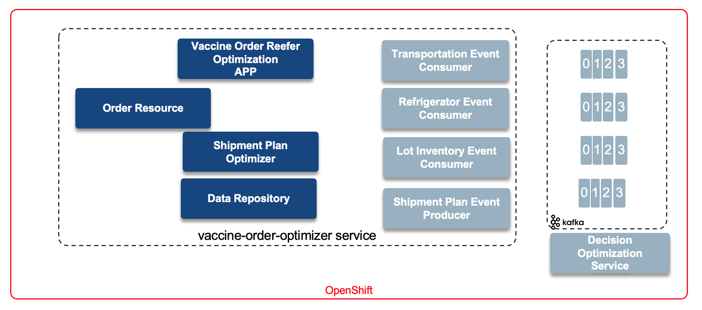
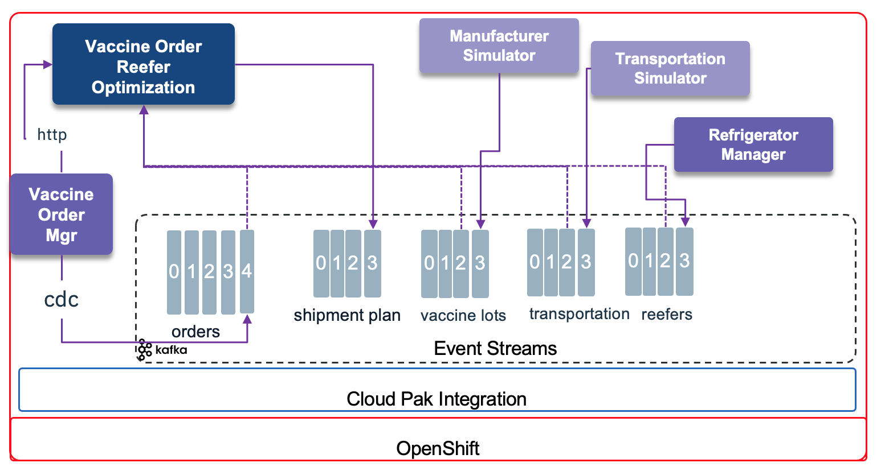
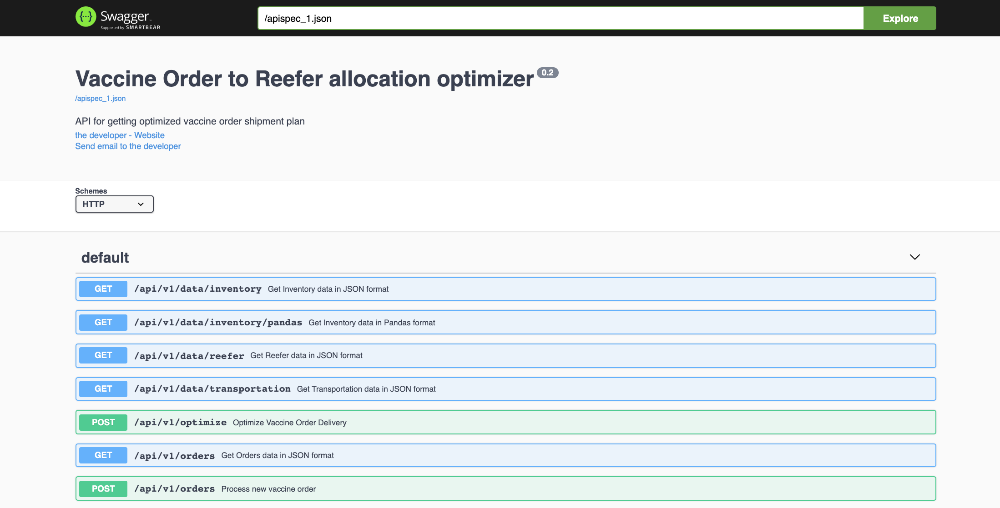

<AnchorLinks>
  <AnchorLink>Overview</AnchorLink>
  <AnchorLink>Build</AnchorLink>
  <AnchorLink>Run locally</AnchorLink>
  <AnchorLink>Deploy to OpenShift</AnchorLink>
  <AnchorLink>Usage Details</AnchorLink>
</AnchorLinks>

## Overview

This service is exposing a send order and optimize API to build a shipment plan for all the vaccine lots given a new order. The implementation use CPLEX and an event driven solution to get a continuous streams of information coming frm the manufacturing, the refrigerator inventory and the available transportation capacity and cost.

The following diagram illustrates all the components working together to support and event-driven shipment plan real time optimization:



1. The app is done in python with Flask and Gunicorn WSGI server to run in a container deployable on Openshift. The [Dockerfile is here](https://github.com/ibm-cloud-architecture/vaccine-order-optimizer/blob/master/Dockerfile)
1. A set of [Resource classes](https://github.com/ibm-cloud-architecture/vaccine-order-optimizer/tree/master/server/api) expose REST API for orders and optimization. For demonstration purpose other resoources are implemented.
1. The optimization component transforms the data to pandas structure for CPLEX to run. As the domain was very limited, it can run internally to the python app, but a remote client is also implemented to access the decision optimization service when the problem is becoming more complex.
1. A set of Kafka consumers, using AVRO schema are used to get real time data.


See the code in this [Vaccine order optimizer github repository.](https://github.com/ibm-cloud-architecture/vaccine-order-optimizer)


The application is deployed on OpenShift and participates with other components to demonstrate the vaccine order processing, as illustrated below:



1. An external app is managing the order life cycle and can be accessible from the [Vaccine Order manager](https://github.com/ibm-cloud-architecture/vaccine-order-mgr) git repository.
1.This Vaccine Order Reefer Optimization component.
1. Manufacturer simulator to be send a vaccine lot inventory to the `vaccine-inventory` Kafka topic.
1. Refrigerator manager to manage the availability of refrigerator container to carry the vaccine lots
1. Transportation simulator to send updated itinerary update.

## Build

Simply build the docker image and push it to your registry. Here is an example of commands:

```shell
docker build -t ibmcase/vaccine-order-optimizer .

docker push ibmcase/vaccine-order-optimizer
```

The repository include a [github action workflow](https://github.com/ibm-cloud-architecture/vaccine-order-optimizer/blob/master/.github/workflows/dockerbuild.yaml) to build and push the image automatically to the [public docker registry.](https://hub.docker.com/repository/docker/ibmcase/vaccine-order-optimizer)

The flow uses a set of secrets in the git repo:
* DOCKER_IMAGE_NAME = vaccine-order-optimizer
* DOCKER_REPOSITORY = ibmcase
* DOCKER_USERNAME and DOCKER_PASSWORD

## Run locally

It is possible to run the code on your laptop or server but connected to Event Streams deployed on OpenShift. Some pre-requisites need to be done:

* Get the Kafka URL, schema registry URL, the user and password and any pem file containing the server certificate.
* The certificate needs to be under certs folder.
* Copy the script/setenv-tmpl.sh  to script/setenv.sh
* modify the environment variables.

```shell
source ./script/setenv.sh

docker run -ti -e KAFKA_BROKERS=$KAFKA_BROKERS -e SCHEMA_REGISTRY_URL=$SCHEMA_REGISTRY_URL -e REEFER_TOPIC=$REEFER_TOPIC -e INVENTORY_TOPIC=$INVENTORY_TOPIC -e TRANSPORTATION_TOPIC=$TRANSPORTATION_TOPIC -e KAFKA_USER=$KAFKA_USER -e KAFKA_PASSWORD=$KAFKA_PASSWORD -e KAFKA_CERT=$KAFKA_CERT -p 5000:5000  ibmcase/vaccine-order-optimizer
```

The swagger looks like:



## Deploy to OpenShift

* Connect to the vaccine project using: `oc project vaccine`
* Modify the kubernetes/configmap.yaml with the Kafka Broker URL you are using, and if you changed the topic names too. Then do:

 ```shell
 oc apply -f kubernetes/configmap.yaml
 ```

* Get pem certificate from eventstreams or the Kafka cluster project to the local vaccine project with a command like:

 ```shell
 oc get secret light-es-cluster-cert-pem  -n eventstreams --export -o yaml | oc apply -f - 
 ```
 
 This pem file is mounted to the pod via the secret as:

   ```yaml
   volumeMounts:
  - mountPath: /certs
    name: eventstreams-cert-pem
  volumes:
  - name: eventstreams-cert-pem
    secret:
      secretName: light-es-cluster-cert-pem
  ```

 and the path for the python code to access this pem file is defined in the environment variable: 

 ```yaml
  - name: KAFKA_CERT
    value: /certs/es-cert.pem
 ```

 the name of the file is equal to the name of the {.data.es-cert.pem} field in the secret.
 
 ```yaml
 Name:         eventstreams-cert-pem
 Namespace:    vaccine
 Labels:       <none>
 Annotations:  <none>

 Type:  Opaque

 Data
 ====
 es-cert.pem:  1164 bytes
 ```

* Copy the Kafka user's secret from the e`ventstreams` or Kafka project to the current vaccine project. This secret has two data fields: username and password

 ```shell
 oc get secret eventstreams-cred -n eventstreams --export -o yaml | oc apply -f - 
 ```

They are used in the Deployment configuration as:

 ```yaml
 - name: KAFKA_USER
    valueFrom:
      secretKeyRef:
        key: username
        name: eventstreams-cred
  - name: KAFKA_PASSWORD
    valueFrom:
      secretKeyRef:
        key: password
        name: eventstreams-cred
 ```

## Usage Details

This section address a simple validation of this component as standalone. 

TBD