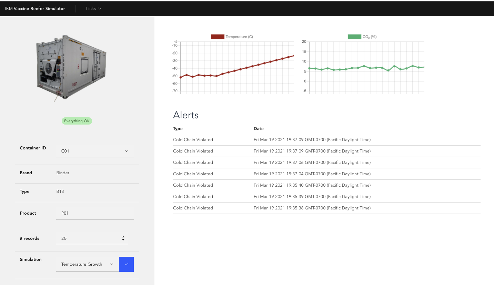

<PageDescription>
This Simulator web application is a simple python (3.7) Flask app, exposing a REST POST end point to control the type of simulation we want to run and to produce refrigerator container telemetry events to kafka `telemetries` topic.
</PageDescription>

Updated on 3/21/2021, a new user interface was added to present the simulation and connect to the Freezer manager microservice to get server side event. 

<AnchorLinks>
  <AnchorLink>Overview</AnchorLink>
  <AnchorLink>Anatomy</AnchorLink>
  <AnchorLink>Build</AnchorLink>
  <AnchorLink>Run</AnchorLink>
  <AnchorLink>Demonstrate</AnchorLink>
</AnchorLinks>

## Overview

The user interface is intuitive and presents a form to select the container, product, number of record to generate and the type of simulation:



The right side presents the temperature and co2 gauges and the potential Alerts created by the monitoring agent.

### Application requirements

The simulator is here to help us develop the other components of the solution as we do not have real life Refrigerator container. The supported features:

1. Run the simulator as command line to generate csv file with telemetry data to be shared with Data Scientists.
1. Support the following simulation: normal behavior, co2 sensor, o2 sensor, temperature and power sensor strange behavior, and continue temperature growth up to ambiant temperature. 
1. Send telemetries to a Kafka topic
1. Support a user interface to make the demonstration of the end to end solution
 
The following figure illustrates the components involved with this simulator.

 

The simulator needs to integrate with Kafka deployed as service on the cloud or deployed within an OpenShift cluster. For deployment we are proposing to use Event Streams with Cloud Pak for Integration or [Strimzi](https://strimzi.io) / Redhat AMQ Streams. The [gitops project](https://github.com/ibm-cloud-architecture/vaccine-gitops) includes yaml files to deploy event streams or kafka cluster using Strimzi operators.

## Anatomy

The simulator expose one POST operation on the `/control` URL, as you can see from the Swagger UI (`/openapi`)


 The Json control object defines the number records to produce, the sensor to impact (co2sensor, temperature, o2sensor, power) , the container ID, (one of C01, C02, C03, C04) which carries the product referenced by product_id (one of P01, P02, P03, P04, P05, covid-19) - The P01 is the covid-19 vaccine:

```json
    { 'containerID': 'C02',
    'simulation': 'tempGrowth',
    'nb_of_records': 100,
    "product_id":  "covid-19"
    }
```

We have tried to support a domain driven design approach to structure the code, with domain, infrastructure and app modules. The domain module has a unique class for the simulator which main goal is to generate data tuples or records for the different simulation types. It is reused by the standalone simulation CLI tool to generate csv data.

As the simulator is also a webapp we need to package it with [Flask](https://www.fullstackpython.com/flask.html) and run it using one of the Web Server Gateway Interface (WSGI) implementation, like [Gunicorn](http://docs.gunicorn.org/).

If you want to go over the code, we recommend to follow [Flask tutorial](https://flask.palletsprojects.com/en/1.1.x/tutorial/).

Flask is a simple library to implement REST based microservice and web application in Python. It has other related projects to add interesting features to develop production ready application. The standard development includes defining routes, function to support handling the request and generating HTTP response, but also defining APIs... Read more with the [explore Flask book online](http://exploreflask.com/en/latest/).

Flask is mono threaded so it fits well in a simple web application for development purpose, but for production it is recommended to add a web server like [Gunicorn](https://gunicorn.org/) to handle multiple concurrent requests.


The app is also using Flask blueprint, flasgger, flask_restful, prometheus, confluent_kafka.

The app.py Flask application imports the different blue prints, serves the Vuejs app, serves the apidoc and starts the server. Each [Flask blueprints](https://flask.palletsprojects.com/en/1.1.x/blueprints/) is defined in the `api` folder. 

The basic concept of blueprints is that, they record operations to execute when each operation is registered on an application. So to add one operation to support a `/control` resource, we add a blueprint, and then register it in the main application: `app.py`.

```python
from api.controller import control_blueprint
app.register_blueprint(control_blueprint)
```

To define the API, we use [Flasgger](https://github.com/flasgger/flasgger) as an extension to Flask to extract [Open API specification](https://swagger.io/docs/specification/about/) from the code. It comes with Swagger UI, so we can see the API documentation of the microservice at the URL `/apidocs`.  It can also validate the data according to the schema defined.

For the POST `/control` we defined the Swagger 2.0 API in a separate file: `api/controlapi.yml` and import it at the method level to support the POST operation. This method is defined in its blueprint as a REST resource. The code [controller.py](https://github.com/ibm-cloud-architecture/vaccine-reefer-simulator/blob/master/simulator/api/controller.py) is under `api` folder.

Below is a code extract to illustrate the use of Flask-RESTful and blueprint and the swagger annotation:

```python
from flasgger import swag_from
from flask_restful import Resource, Api

control_blueprint = Blueprint("control", __name__)
api = Api(control_blueprint)

class SimulationController(Resource):
    @swag_from('controlapi.yml')
    def post(self):
        # ..
api.add_resource(SimulationController, "/control")
```

The [Pipfile](https://github.com/ibm-cloud-architecture/vaccine-reefer-simulator/blob/master/Pipfile) defines the dependencies for this component, and is used by `pipenv` during the docker build process.


**Github repository:** [vaccine-reefer-simulator](https://github.com/ibm-cloud-architecture/vaccine-reefer-simulator)

**Kafka topics produced to:** telemetries

**Event sents to the topic:**

```python
{"containerID": metric[0],
"timestamp": str(metric[1]),
"type":"ReeferTelemetries",
"payload"={ "timestamp": "2019-09-04 T15:31 Z",
            "containerID": "C101",
            "product_id": "P02",
            "sensors": {
              "temperature": 2.49647,
              "oxygen_level" : 20.4543,
              "nitrogen_level" : 79.4046,
              "carbon_dioxide_level" : 4.42579,
              "humidity_level" : 60.3148,
              "fan_1": "True",
              "fan_2" : "True",
              "fan_3" : "True",
              "ambiant_temperature": 19.8447
            },
            "content_type": 1,
            "target_temperature": 6.0,
            "kilowatts": 3.44686,
            "latitude": "37.8226902168957,",
            "longitude": "-122.3248956640928",
            "time_door_open" : 300,
            "defrost_cycle": 6
        }
}
```

## Build

This microservice is built using the docker:

```shell
docker build -t quay.io/ibmcase/vaccine-reefer-simulator .
docker push quay.io/ibmcase/vaccine-reefer-simulator
```

## Run

### Run locally with docker-compose

See the [readme in the repository](https://github.com/ibm-cloud-architecture/vaccine-reefer-simulator#run-locally) to execute the python app within a Dockerfile and remote connected to Evenstreams on OpenShift.

###  Deployment to OpenShift

We have moved the description on how to deploy this app to OpenShift in the [cold chain scenario](/use-cases/cold-chain/#deploy-the-vaccine-reefer-simulator). 


## Demonstrate

Once deployed, you can access the user interface and select one existing container, then

Enter the product to be used P01 for covid-19
The number of records to send ( less than 500, 100 should be fine)
The simulation type: For cold chain monitoring use case, select the `tempGrowth` simulation. After few second the gauge should display the generated telemetries. When the simulator is integrated with all the cold chain component, it will also display the Alerts created.

As an alternate is to access the OpenAPI docs user interface:

1. To determine the route, use the `oc get route reefer-simulator` command and go to the URL specified in the `HOST/PORT/apidocs` field in your browser.
2. From there, drill down into the `POST /control` section and click **Try it out!**.
3. Enter any of the following options for the fields prepopulated in the `control` body: P01 is the covid-19 vaccine.

    * Container: `C01, C02, C03, C04`
    * Product: `P01, P02, P03, P04`
    * Simulation: `tempGrowth`
    * Number of records: A positive integer

4. Click **Execute**


## More readings

* [Flask Restful](https://flask-restful.readthedocs.io/en/latest/quickstart.html)
* [Appsody build and deploy product documentation](https://appsody.dev/docs/using-appsody/building-and-deploying/)
