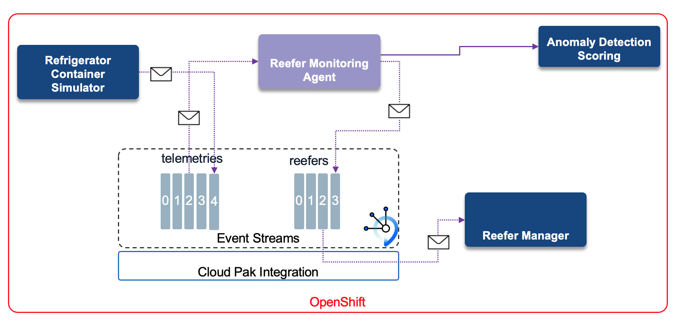

---
title: Anomaly detection
description: Refrigerator container anomaly detection
--- 

Update 4/11/21


## Components involved in this use case




* The [Vaccine Refrigerator container Simulator](https://github.com/ibm-cloud-architecture/vaccine-reefer-simulator)
 is a python Flask app, which supports simple API to control the Refrigerator container simulation. It is described in [this note](/solution/reefer-iot/), also see next section to deploy it on OpenShift.
* The [Monitoring Agent](https://github.com/ibm-cloud-architecture/vaccine-monitoring-agent) is a Quarkus app, using Kafka Streams, and microprofile reactive messaging to monitor the telemetries and assess any cold chain violation via stateful logic. For each uniquely identified refrigerator, it keeps the last measured temperatures and compute some min, max, average and the total number of concutives violated records: temperature above a Threshold. It may potentially call an Anomaly detection scoring service deployed on Watson ML service. We describe this scenario in another use case. To read more on the monitoring agent, see [the implementation  note](/solution/cold-monitoring/).
* The [Freezer manager service](https://github.com/ibm-cloud-architecture/vaccine-freezer-mgr)) is a simple quarkus app with Reactive messaging to process the alerts and support the Freezer inventory.
* [Anomaly detection scoring service](/analyze/ws-ml-dev/) with WatsonML and anomaly detection built in Cloud Pak for Data

* The model to assess if the refrigerator container has issue. To develop the model we need to [get the telemetry data](/solution/cp4d/) in Cloud Pak for data, and then perform feature engineering and use AutoAI for developing the model as described in [this note](/analyze/ws-ml-dev/). As an alternate to collect the data, it is possible to directly [integrate with Kafka topic](/solution/cp4d/eventStream/) and then save it as csv or in a datalake.


## Run on OpenShift

### Pre-requisites

The Cold chain use case's pre-requisites apply the same for this use case.

1. IBM Cloud Pak for Data, deployed on OpenShift Cluster


1. If you use the [Anomaly detection service deployed in Watson ML](/analyze/ws-ml-dev/):

   * Get user credential to access to cloud pack for data, with the API key.
   * Get the ANOMALY_DETECTION_URL.
   * Get the CP4D_AUTH_URL used to get access token.

1. Define a secret called `agent-secrets` that will hold the credentials and sensitive data for the Vaccine Monitoring Agent to connect to your instance of IBM Event Streams and your Watson ML Anomaly detection model:

   ```shell
  oc create secret generic agent-secrets \
  --from-literal=ANOMALY_DETECTION_URL=<YOUR_WATSON_ML_ANOMALY_DETECTION_MODEL_URL> \
  --from-literal=KAFKA_USER=${TLS_USER} \
  --from-literal=CP4D_USER=<YOUR_CP4D_USER> \
  --from-literal=CP4D_APIKEY=<YOUR_CP4D_APIKEY>  \
  --from-literal=CP4D_AUTH_URL=<YOUR_CP4D_AUTH_URL>
  ```

  where

   - `<YOUR_WATSON_ML_ANOMALY_DETECTION_MODEL_URL>` is the url to your Watson ML anomaly dectection model.
   - `<YOUR_CP4D_USER>` is your Cloud Pak for Data username.
   - `<YOUR_CP4D_APIKEY>` is your Cloud Pak for Data API key.
   - `<YOUR_CP4D_AUTH_URL>` is your Cloud Pak for Data IAM authentication and authorization API url.

  \***NOTE:** If you have not completed the [Developing the Anomaly Detection Model with Watson Studio](/analyze/ws-ml-dev/) section and as a result you don't have an anomaly detection model deployed to connect to, simply **use random string values** for the variables above.


### Anomaly detection

If you have deployed the anomaly detection model to Watson ML and configured the monitoring agent to call this entity, then the reefer topic will contain new message about potential issue on this refrigerator container. The downstream `reefer manager service` will assess the number of times this refrigerator was flagged as abnormal, and will trigger a business process in BPM. See [this note](/solution/bpm/) for the process application implementation detail.

_NOTE: The process application needs to be updated and the reefer manager service implemented to get the end-to-end scenario covered_