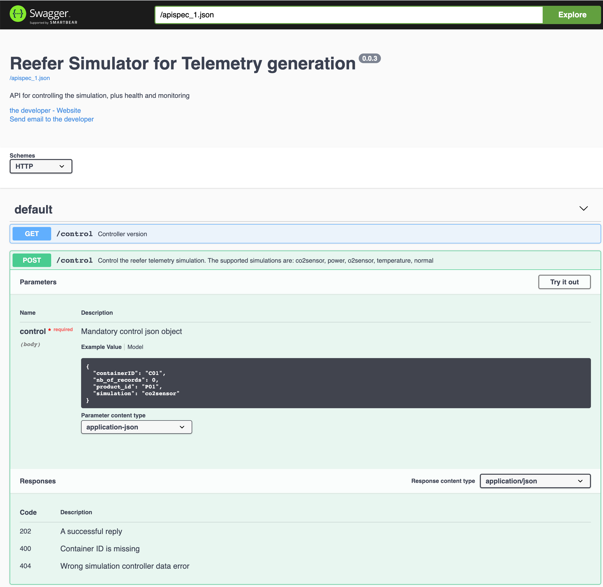
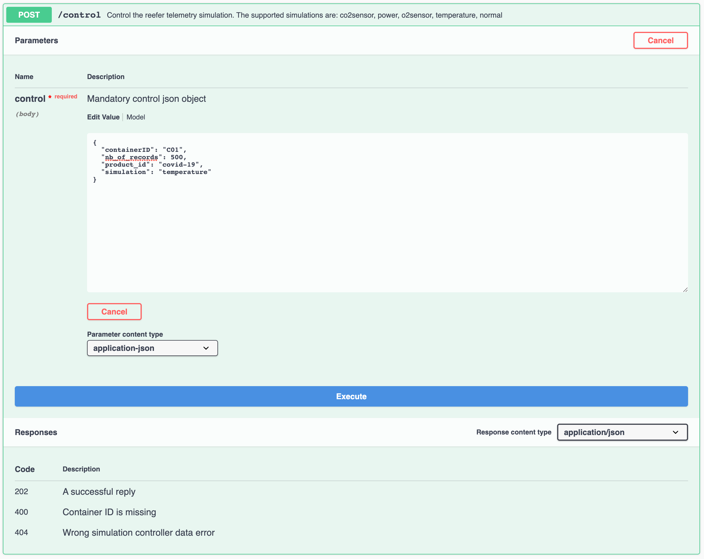
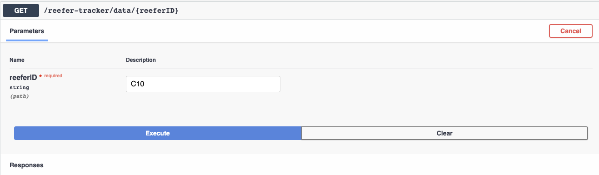

The vaccine lots need to be kept at a constant temperature for a period of time. The sensor telemetry data coming from the refrigerated shipping containers is processed to assess cold-chain violations.

The solution for this use case includes streaming telemetry events, a stateful microservice to implement aggregation & alarm generation, and integration with a microservice to log issues against the refrigerated shipping container.

## Components involved in this use case

* [Vaccine Refrigerator container Simulator](https://github.com/ibm-cloud-architecture/vaccine-reefer-simulator)
* [Vaccine Reefer Monitoring Agent](https://github.com/ibm-cloud-architecture/vaccine-monitoring-agent)
* [IBM Event Streams](https://ibm.github.io/event-streams/)
* [Anomaly detection scoring service](/analyze/ws-ml-dev/) with WatsonML and anomaly detection built in Cloud Pak for Data


*\*The reefer manager is not done yet*

## Understand the components

* The Reefer simulator is a python Flask app, which supports simple API to control the Refrigerator container simulation. It is described in [this note](/solution/reefer-iot/), also see next section to deploy it on OpenShift.
* The Monitoring Agent is a Quarkus app, with Kafka Streams, reactive messaging to monitor the cold chain with stateful operations. It also call the Anomaly detection service. Implementation details can be read in [this note](/solution/cold-monitoring/).
* The model to assess if the refrigerator container has issue. To develop the model we need to [get the telemetry data](/solution/cp4d/) in Cloud Pak for data, and then perform feature engineering and use AutoAI for developing the model as described in [this note](/analyze/ws-ml-dev/). As an alternate to collect the data, it is possible to directly [integrate with Kafka topic](/solution/cp4d/eventStream/) and then save it as csv or in a datalake.

## Run on OpenShift

### Pre-requisites

**IMPORTANT:** if you are sharing the IBM Event Streams instance with other people for this tutorial, you may want to add a unique suffix to the name of the resources to be created next, such as topics, projects, etc. If so, make sure you provide the appropriate name for these throught the rest of the tutorial.

1. Create the following artifacts in the `eventstreams` namespace on your OpenShift cluster (_note: if you happened to have an existing IBM Event Streams instance on a different namespace already, you don't need to create an new one but make sure you use the appropriate namespace name throughout the rest of the tutorial_). We will refer to this namespace as `YOUR_EVENT_STREAMS_NAMESPACE` throughout this tutorial:

   1. Create an EventStreams instance _(via the [Event Streams Custom Resource](https://ibm.github.io/event-streams/installing/installing/#install-an-event-streams-instance))_.
   1. Create a [Kafka User with SCRAM-based credentials](https://ibm.github.io/event-streams/security/managing-access/#managing-access-to-kafka-resources), as required by the [Vaccine Reefer Simulator](https://github.com/ibm-cloud-architecture/vaccine-reefer-simulator#application-deployment).
   1. Create a [Kafka User with TLS-based credentials](https://ibm.github.io/event-streams/security/managing-access/#managing-access-to-kafka-resources), as required by the [Vaccine Monitoring Agent](https://github.com/ibm-cloud-architecture/vaccine-monitoring-agent#create-a-tls-user).
   1. Create two [Kafka Topics](https://ibm.github.io/event-streams/getting-started/creating-topics/). One for the container telemetries events and another for the vaccine cold-chain violation alert events. These topics will be refered as `YOUR_TELEMETRIES_TOPIC` and `YOUR_REEFER_TOPIC` respectively throughout this tutorial. For the instructions on this tutorial, we will assume the names for these two topics to be `coldchain-telemetry` and `coldchain-reefers` respectively.

1. Create a new project that will be used for the deployment of all other components. This will be refered as `YOUR_PROJECT_NAME` throughout the rest of this tutorial. For the instructions on this tutorial, We will assume the name for the project is `coldchain`.
1. [OpenShift CLI](https://cloud.ibm.com/docs/openshift?topic=openshift-openshift-cli) on your local environment.
1. [jq](https://stedolan.github.io/jq/) on your local environment.
1. Get a cloud pak for data deployed on OpenShift Cluster
1. Use a Terminal and the oc cli. If you want to access the code source you can clone the two main repositories of this solution:

  ```shell
  git clone https://github.com/ibm-cloud-architecture/vaccine-reefer-simulator
  git clone https://github.com/ibm-cloud-architecture/vaccine-monitoring-agent
  ```

### Deploy the Vaccine Reefer Simulator

To get more detail of this Python Flask application [read this note](/solution/reefer-iot/).

1. Export your project name and ensure you are working in it from now on via the following commands:

  ```shell
  export PROJECT_NAME=<YOUR_PROJECT_NAME>
  oc project ${PROJECT_NAME}
  ```

  where

   - `<YOUR_PROJECT_NAME>` is the name for the project you created in the previous [pre-requisites](#pre-requisites) section where all the components for this cold chain solution will be deployed into.

1. Export the value of your Event Streams cluster name and the namespace it is installed on to environment variables:

  ```shell
  export CLUSTER_NAME=<YOUR_CLUSTER_NAME>
  export EVENTSTREAMS_NS=<YOUR_EVENT_STREAMS_NAMESPACE>
  ```
   
  where 
  
   - `<YOUR_EVENT_STREAMS_NAMESPACE>` is the name where you installed your IBM Event Streams instance in the [pre-requisites](#pre-requisites) section above.
   - `<YOUR_CLUSTER_NAME>` is the name of your IBM Event Streams cluster which can be found with the following `oc` command:   
   
   ```shell
   $ oc get eventstreams -n ${EVENTSTREAMS_NS}
   NAME           STATUS
   development    Ready
   ```

1. Create a ConfigMap named `reefer-simul-cm` to hold the configuration for our Vaccine Reefer Simulator component with the following `oc` command:

  ```shell
  oc create configmap reefer-simul-cm \
  --from-literal=KAFKA_CERT=/app/certs/ca.crt \
  --from-literal=KAFKA_MAIN_TOPIC=<YOUR_TELEMETRY_TOPIC> \
  --from-literal=KAFKA_BROKERS=<YOUR_KAFKA_BOOTSTRAP_EXTERNAL_ADDRESS>
  ```
  
  where

   - `<YOUR_TELEMETRY_TOPIC>` is the name of the topic that will get the container telemetries events you created in the [pre-requisites](#pre-requisites) section.
   - `<YOUR_KAFKA_BOOTSTRAP_EXTERNAL_ADDRESS>` is your IBM Event Streams **External** cluster bootstrap address presented to you during the creation of your SCRAM-based KafkaUser you went through in the [pre-requisites](#pre-requisites) section. You can get that value again by executing the following `oc` command:
    ```shell
    oc get route -n ${EVENTSTREAMS_NS} ${CLUSTER_NAME}-kafka-bootstrap -o jsonpath="{.status.ingress[0].host}:443"
    ```

1. Create a Secret named `reefer-simul-secret`, which will hold your SCRAM Kafka User credentials you created in the [pre-requisites](#pre-requisites) section, with the following `oc` command:

  ```shell
  oc create secret generic reefer-simul-secret \
  --from-literal=KAFKA_USER=<YOUR_SCRAM_KAFKA_USER_USERNAME> \
  --from-literal=KAFKA_PASSWORD=<YOUR_SCRAM_KAFKA_USER_PASSWORD>
  ```
  
  where

   - `<YOUR_SCRAM_KAFKA_USER_USERNAME>` is the name you gave in the [pre-requisites](#pre-requisites) section when you generated the SCRAM credentials. The generation of the SCRAM credential created a KafkaUser object behind the scenes with the name you specified. If you don't remember that name or you want to verify it, you can use the following `oc` command:
   ```shell
   $ oc get kafkausers -n ${EVENTSTREAMS_NS}
   NAME                    CLUSTER         AUTHENTICATION   AUTHORIZATION
   vaccine-scram           development     scram-sha-512    simple
   ```
   - `<YOUR_SCRAM_KAFKA_USER_PASSWORD>` is the password that IBM Event Streams generated for the KakfkaUser that got created behind the scenes when you generated the SCRAM credentials in the [pre-requisites](#pre-requisites) section. You can retrieve that password with the following `oc` command:
   ```shell
   oc get secret <YOUR_SCRAM_KAFKA_USER_USERNAME> -n ${EVENTSTREAMS_NS} -o jsonpath='{.data.password}' | base64 -D
   ```

1. Copy the server-side public TLS certificate of your IBM Event Streams instance to your local project so that the Vaccine Reefer Simulator application is able to establish secure connection with your IBM Event Streams instance:

  ```shell
  oc get secret ${CLUSTER_NAME}-cluster-ca-cert -n ${EVENTSTREAMS_NS} -o json | jq -r '.metadata.name="kafka-cluster-ca-cert"' | jq --arg project_name "${PROJECT_NAME}" -r '.metadata.namespace=$project_name' | oc apply -f -
  ```
  _\*Note that we are copying and renaming the certificate in a single command to minimize the need for editing deployment documents. That is, we are providing the server-side TLS certificate in the secret the Vaccine Reefer Simulator and the Vaccine Monitoring Agent microservices are expecting to find it._

1. Deploy Vaccine Reefer Simulator microservice components (application plus a service and a route to make it accessible) via the following `oc apply` command:

  ```shell
  oc apply -f https://raw.githubusercontent.com/ibm-cloud-architecture/vaccine-reefer-simulator/master/config/app-deployment.yaml
  ```

   - You should see the following output:

   ```shell
   service/vaccine-reefer-simulator created
   route.route.openshift.io/vaccine-reefer-simulator created
   odeployment.apps/vaccine-reefer-simulator created
   ```

   - You can verify the deployment state with the following `oc` command:

   ```shell
   oc get pods
   NAME                                       READY   STATUS    RESTARTS   AGE
   vaccine-reefer-simulator-7dcfcf5cb-4nvl7   1/1     Running   0          5m55s
   ```

   or the via the Openshift console:

   

  \*_Note: if you want to build, clone [the repository](https://github.com/ibm-cloud-architecture/vaccine-reefer-simulator) and follows the readme._

1. Get the route to access the Vaccine Reefer Simulator application with the `oc get routes` command.


### Deploy the Vaccine Monitoring Agent

To get more detail of this Java Quarkus microprofile application [read this note](/solution/cold-monitoring/). The project repository is in this [GitHub repository](https://github.com/ibm-cloud-architecture/vaccine-monitoring-agent). Follow the steps below to get the Vaccine Monitoring Agent microservice deployed on your OpenShift cluster:


1. Ensure you are working inside the correct project via the following `oc` command:

  ```shell
  oc project ${PROJECT_NAME}
  ```

1. Export the value of your TLS-based KafkaUser name and a unique identifier for the reources to be created into your OpenShift cluster as environment variables so that the following steps in this section can make use of these.

  ```shell
  export TLS_USER=<YOUR_TLS_USER>
  export YOUR_SUFFIX=<UNIQUE_IDENTIFIER>
  ```

  where

   - `<YOUR_TLS_USER>` is the name you gave when creating the tls credentials in the [pre-requisites](#pre-requisites) section. If you don't remember the tls KafkaUser you created, you can check it out with the following `oc` command:
    ```shell
    $ oc get kafkausers -n ${EVENTSTREAMS_NS}
    NAME                  CLUSTER         AUTHENTICATION   AUTHORIZATION
    vaccine-tls           development     tls              simple
    ```
    _\*Note that we are copying and renaming the credentials in a single command to minimize the need for editing deployment documents._
   - `<UNIQUE_IDENTIFIER>` is a unique identifier of your choice to be used as the suffix for any resource created in OpenShift and IBM Event Streams so that it does not collide with anyone else also completing this tutorial.

1. If not done so already in the previous section where we deployed the Vaccine Reefer Simulator microservice, copy the server-side public certificate of the Event Streams instance to your local project:

  ```shell
  oc get secret ${CLUSTER_NAME}-cluster-ca-cert -n ${EVENTSTREAMS_NS} -o json | jq -r '.metadata.name="kafka-cluster-ca-cert"' | jq --arg project_name "${PROJECT_NAME}" -r '.metadata.namespace=$project_name' | oc apply -f -
  ```
  _\*Note that we are copying and renaming the certificate in a single command to minimize the need for editing deployment documents. That is, we are providing the server-side TLS certificate in the secret the Vaccine Reefer Simulator and the Vaccine Monitoring Agent microservices are expecting to find it._

1. Copy your TLS-based KafkaUser's credentials you created in the [pre-requisites](#pre-requisites) section to the local namespace with the following `oc` command:

  ```shell
  oc get secret ${TLS_USER} -n ${EVENTSTREAMS_NS} -o json | jq -r '.metadata.name="tls"' | jq --arg project_name "${PROJECT_NAME}" -r '.metadata.namespace=$project_name' | oc apply -f -
  ```

1. Create a ConfigMap named `agent-cm` to hold the configuration for the Vaccine Monitoring Agent microservice with the following `oc` command:

  ```shell
  oc create configmap agent-cm \
  --from-literal=REEFER_TOPIC=<YOUR_REEFER_TOPIC> \
  --from-literal=TELEMETRY_TOPIC=<YOUR_TELEMETRY_TOPIC> \
  --from-literal=KAFKA_BOOTSTRAP_SERVERS=${CLUSTER_NAME}-kafka-bootstrap.${EVENTSTREAMS_NS}.svc:9093 \
  --from-literal=QUARKUS_KAFKA_STREAMS_APPLICATION_ID=cold-chain-agent-${YOUR_SUFFIX} \
  --from-literal=KAFKA_SECURITY_PROTOCOL=SSL \
  --from-literal=PREDICTION_ENABLED=<ARE_PREDICTIONS_ENABLED>
  ```

  where

   - `<YOUR_REEFER_TOPIC>` is the name of the topic that will get the vaccine cold chain temperature violation alert events that you created in the [pre-requisites](#pre-requisites) section.
   - `<YOUR_TELEMETRY_TOPIC>` is the name of the topic that will get the container telemetries events that you created in the [pre-requisites](#pre-requisites) section.
   - `<ARE_PREDICTIONS_ENABLED>` will be **true** or **false** depending on whether you completed the [Developing the Anomaly Detection Model with Watson Studio](/analyze/ws-ml-dev/) section or not. If you are not sure, set it to **false**.

1. If you use the [Anomaly detection service deployed in Watson ML](/analyze/ws-ml-dev/):

   * Get user credential to access to cloud pack for data, with the API key.
   * Get the ANOMALY_DETECTION_URL.
   * Get the CP4D_AUTH_URL used to get access token.

1. Define a secret called `agent-secrets` that will hold the credentials and sensitive data for the Vaccine Monitoring Agent to connect to your instance of IBM Event Streams and your Watson ML Anomaly detection model:

   ```shell
  oc create secret generic agent-secrets \
  --from-literal=ANOMALY_DETECTION_URL=<YOUR_WATSON_ML_ANOMALY_DETECTION_MODEL_URL> \
  --from-literal=KAFKA_USER=${TLS_USER} \
  --from-literal=CP4D_USER=<YOUR_CP4D_USER> \
  --from-literal=CP4D_APIKEY=<YOUR_CP4D_APIKEY>  \
  --from-literal=CP4D_AUTH_URL=<YOUR_CP4D_AUTH_URL>
  ```

  where

   - `<YOUR_WATSON_ML_ANOMALY_DETECTION_MODEL_URL>` is the url to your Watson ML anomaly dectection model.
   - `<YOUR_CP4D_USER>` is your Cloud Pak for Data username.
   - `<YOUR_CP4D_APIKEY>` is your Cloud Pak for Data API key.
   - `<YOUR_CP4D_AUTH_URL>` is your Cloud Pak for Data IAM authentication and authorization API url.
  
  \***Note:** If you have not completed the [Developing the Anomaly Detection Model with Watson Studio](/analyze/ws-ml-dev/) section and as a result you don't have an anomaly detection model deployed to connect to, simply **use random string values** for the variables above.

1. Deploy Vaccine Monitoring Agent microservice by executing the following `oc` command:

  ```shell
  oc apply -f https://raw.githubusercontent.com/ibm-cloud-architecture/vaccine-monitoring-agent/master/src/main/kubernetes/deployment.yml
  ```

  You should see the following output:

  ```shell
  serviceaccount/reefer-monitoring-agent created
  service/reefer-monitoring-agent created
  rolebinding.rbac.authorization.k8s.io/reefer-monitoring-agent-view created
  imagestream.image.openshift.io/openjdk-11 created
  deploymentconfig.apps.openshift.io/reefer-monitoring-agent created
  route.route.openshift.io/reefer-monitoring-agent created
  ```

## Scenario script

Once the solution is up and running, execute the following steps to present an end-to-end demonstration:

### Generate vaccine container telemetry events

1. Obtain the Vaccine Reefer Simulator's Flasgger UI via the following `oc` command:

  ```shell
  oc get route vaccine-reefer-simulator -o jsonpath="http://{.status.ingress[0].host}"
  ```

1. Open the above url in your web browser and click on the **POST `/control`** API in order to expand it.

  

1. Click on the **Try it out** button on the top right corner.

1. In the **Edit Value** text box, update the values of the records accordingly:
    * **containerID**: `C01`
    * **nb_of_records**: `500`
    * **product_id**: `covid-19`
    * **simulation**: `temperature`

    

1. Click **Execute**.

### Analyze simulated reefer telemetry data

1. Obtain your IBM Event Streams Console UI's url via the following `oc` command:

  ```shell
  oc get route -n ${EVENTSTREAMS_NS} ${CLUSTER_NAME}-ibm-es-ui -o jsonpath="https://{.status.ingress[0].host}"
  ```

1. Open your IBM Event Streams Console UI by pointing your browser to the above url.

1. Click on **Topics** from the left navigation menu and select your `YOUR_TELEMETRY_TOPIC` you created in the [pre-requisites](#pre-requisites) section from the topic list.

1. Explore the messages tab and the individual telemetry records emitted by the Vaccine Reefer Simulator component.

  

### Analyze generated cold-chain violations

1. Click **Topics** from the left navigation menu and select the topic that matches the `reefer-topic` value.

2. Explore the messages tab and the observed vaccine cold-chain violation alert events.

3. The reefer container information contained in this topic have been identified as having observed temperatures outside the allowable range more than the allowable number of times, as determined to preserve the state of the vaccine doses contained.
4. Get the service routes with `oc get route reefer-monitoring-agent -o jsonpath="http://{.status.ingress[0].host}"`
4. You may go to the service API at the `<URL>/swagger-ui/` and use the interactive query to see the state of the container `C01`:

 

 The response may look like:

 ```
 {
  "alreadyReportedColdChainViolation": false,
  "maxRecordToKeep": 25,
  "maxTemperature": -9,
  "maxTemperatureRegistered": -20,
  "maxViolationAllowed": 10,
  "reeferID": "C10",
  "temperatureList": [
    -49.92182102,
    -49.22471643,
    -50.9776016,
    -31.07841667,
    -28.75859987,
    -32.18018047,
    -31.04312727,
    -28.70898255,
    -32.03926825,
    -31.86666432,
    -30.40963273,
    -49.07404188
  ],
  "tooManyViolations": false,
  "violatedTemperatureCount": 0
}
 ```

### Anomaly detection

If you have deployed the anomaly detection model to Watson ML and configured the monitoring agent to call this entity, then the reefer topic will contain new message about potential issue on this refrigerator container. The downstream `reefer manager service` will assess the number of time this refrigerator was flagged as adnormal, and will trigger a business process in BPM. See [this note](/solution/bpm/) for the process application implementation detail.

_note that the process application needs to be updated and the reefer manager service implemented to get the end to end scenario covered_


### Clearing the project

To delete the different resources do the following:

```shell
oc delete cm agent-cm
oc delete cm reefer-simul-cm
oc delete secret agent-secrets
oc delete secret reefer-simul-secret
oc delete deployment vaccine-reefer-simulator
oc delete deploymentconfig reefer-monitoring-agent
oc delete project coldchain
```
