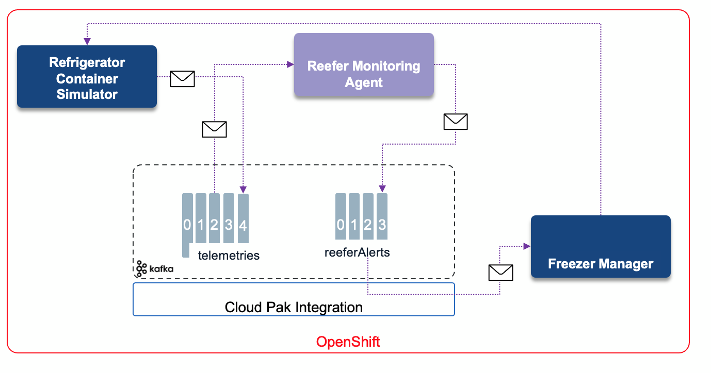
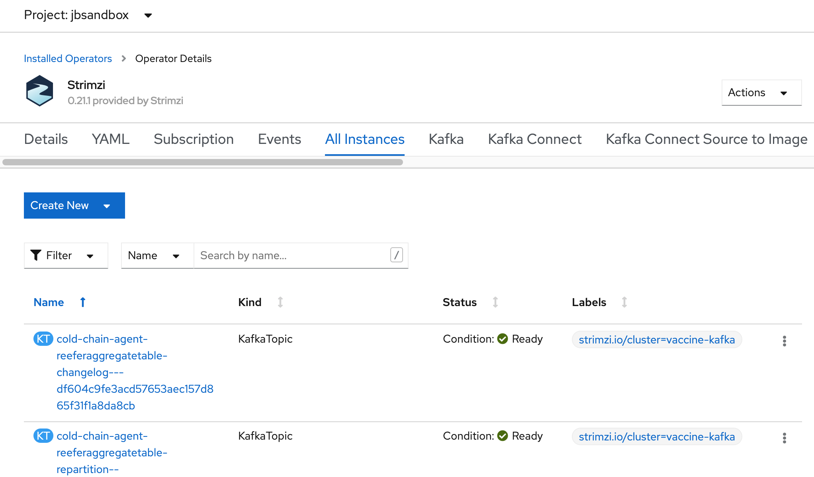
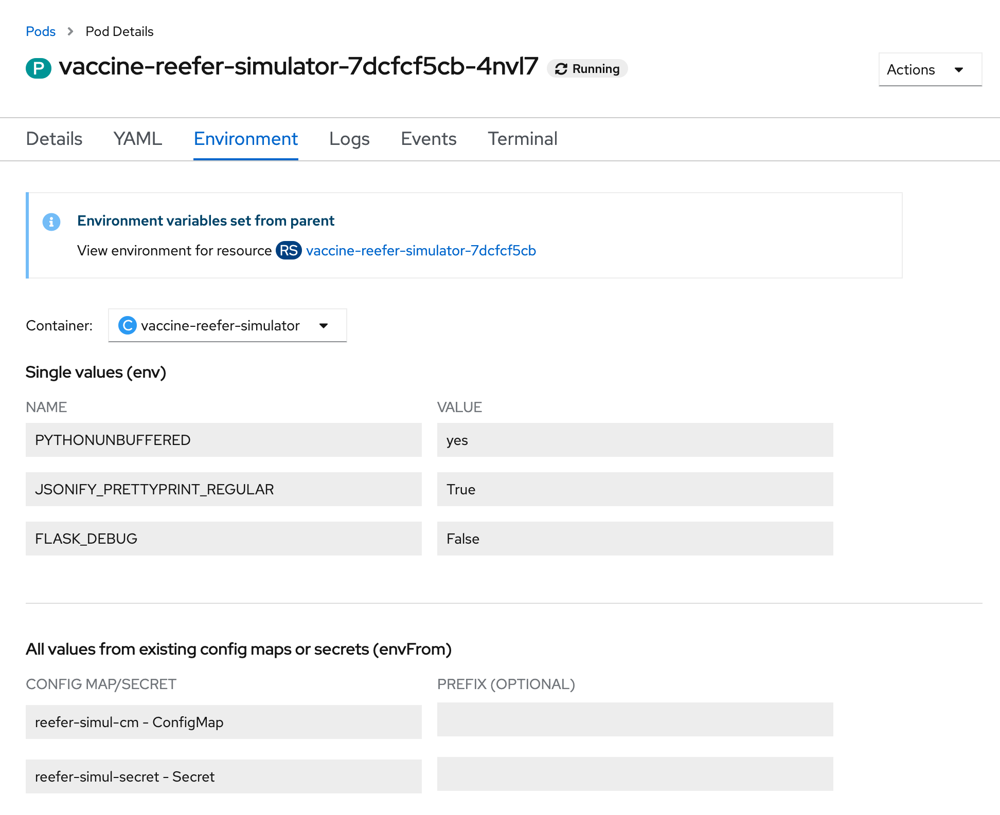
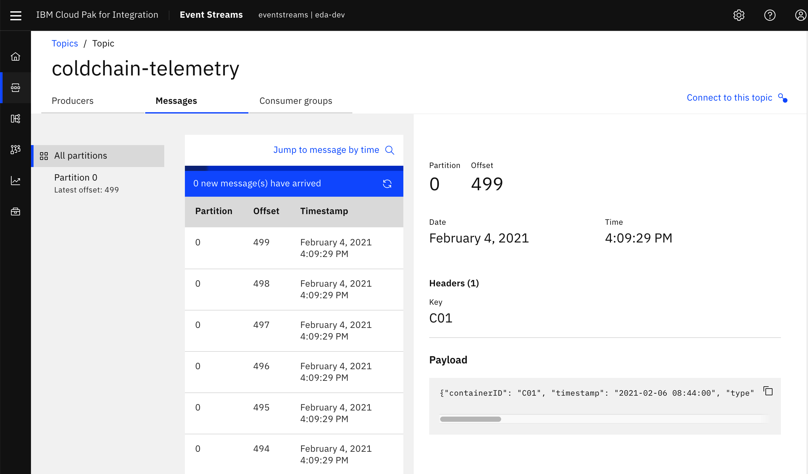
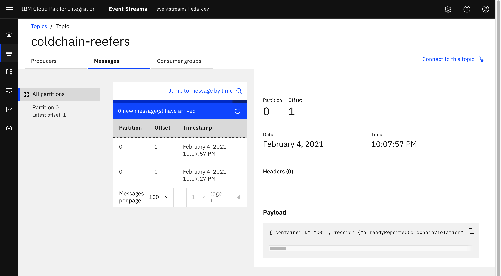
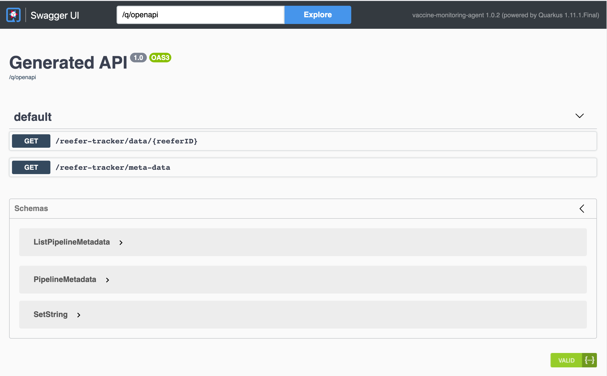
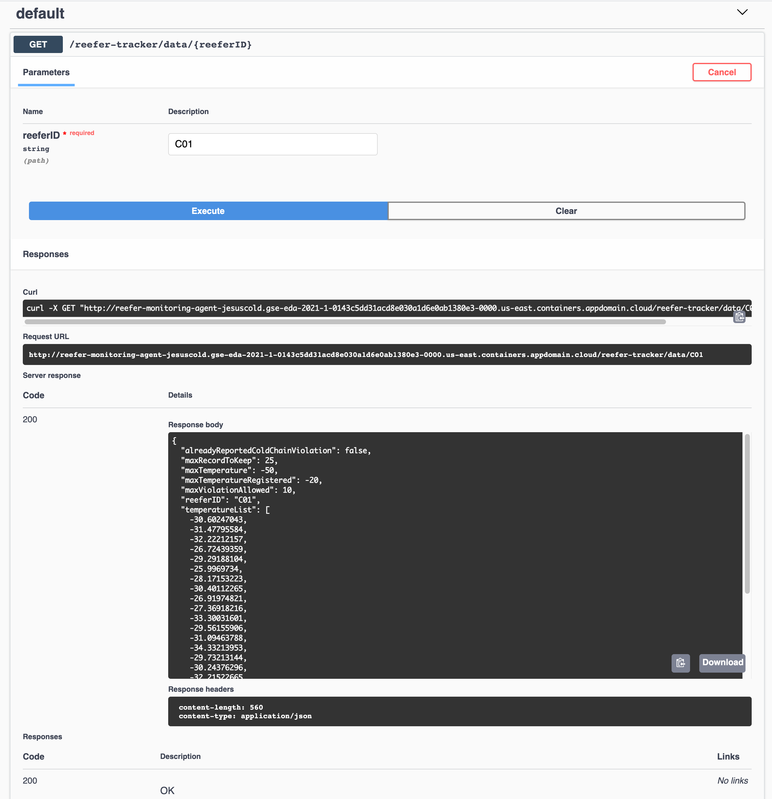

- UPDATED 03/21/2021

The vaccine lots need to be kept at a constant temperature from the manufacturing to the delivery time period. The sensor telemetry data coming from the refrigerated shipping containers is processed to assess cold-chain violations.

The solution for this use case includes streaming telemetry events, a stateful microservice to implement aggregation & alarm generation, and integration with a microservice to log issues against the refrigerated shipping container, and a Freezer manager service.

## Components involved in this use case

* [Vaccine Refrigerator container Simulator](https://github.com/ibm-cloud-architecture/vaccine-reefer-simulator)
* [Vaccine Reefer Monitoring Agent](https://github.com/ibm-cloud-architecture/vaccine-monitoring-agent)
* [IBM Event Streams](https://ibm.github.io/event-streams/) or Strimzi Kafka
* [Freezer manager service](https://github.com/ibm-cloud-architecture/vaccine-freezer-mgr).



### Understand the components

* The Reefer simulator is a python Flask app, which supports simple API to control the Refrigerator container simulation. It is described in [this note](/solution/reefer-iot/), also see next section to deploy it on OpenShift.
* The Monitoring Agent is a Quarkus app, using Kafka Streams, and microprofile reactive messaging to monitor the telemetries and assess any cold chain violation via stateful logic. For each uniquely identified refrigerator, it keeps the last measured temperatures and compute some min, max, average and the total number of concutives violated records: temperature above a Threshold. It may potentially call an Anomaly detection scoring service deployed on Watson ML service. We describe this scenario in another use case. To read more on the monitoring agent, see [the implementation  note](/solution/cold-monitoring/).
* The [Freezer manager service](https://github.com/ibm-cloud-architecture/vaccine-freezer-mgr)) is a simple quarkus app with Reactive messaging to process the alerts and support the Freezer inventory.

## Run on OpenShift

### Pre-requisites

1. You need an existing OpenShift Cluster with administrator access.
1. We can use Kafka 2.6 open source using the Strimzi operator, or Event Streams Operator as part of Cloud Pak for Integration. 
1. If you are sharing the IBM Event Streams instance with other people for this tutorial, you may want to add a unique suffix to the name of the resources to be created next, such as topics, projects, etc. If so, make sure you provide the appropriate name for these throught the rest of the tutorial.
1. If you want to use Strimzi, you can deploy it within your own project using our gitops yaml files (see next section)
1. Be sure to use an OpenShift  cluster user with admin role
1. Clone the vaccine-gitops repository:

  ```shell
  git clone https://github.com/ibm-cloud-architecture/vaccine-gitops
  ```

1. Create a new project to deploy of all components. This will be refered as `YOUR_PROJECT_NAME` throughout the rest of this tutorial. For the instructions on this tutorial, we use the project name: `vaccine-solution`.
1. [OpenShift CLI](https://cloud.ibm.com/docs/openshift?topic=openshift-openshift-cli) on your local environment.
1. [jq](https://stedolan.github.io/jq/) on your local environment.
1. [Kustomize](https://kubectl.docs.kubernetes.io/installation/kustomize/) for one script deploy
1. Use a Terminal and the `oc` cli.    


### Strimzi - One Click Deploy

Go to `vaccine-gitops` folder and do the following steps:

* Set your personal deployment parameters within the   `scripts/env-strimzi.sh` file. Normally only the name of the YOUR_PROJECT_NAME and KAFKA_NS needs to be changed.

  * KAFKA_NS to the name of the project where you will deploy Strimzi and the solution (`vaccine-solution`)
  * YOUR_PROJECT_NAME to the name of the project (`vaccine-solution`). 
* Use the `oc login --token...  --server ....` command to log to the OpenShift cluster. (From the OpenShift admin console, top right menu)
* Be sure to be in your project, for example:

```shell
oc project vaccine-solution
```

* If not done deploy Strimzi with the command

  ```shell
  ./scripts/deployStrimzi.sh --skip-login
  ```
  Three kafka pods and three zookeeper pods should be started.

* Start the secret creation and app deployment:

  ```shell
  ./scripts/deployColdChainWithStrimzi.sh --skip-login
  ``` 
* The following pods should be up and running:

 ```shell
  NAME                                            READY   STATUS    
  reefer-monitoring-agent-7dd5f7ccd9-z4cf9         1/1     Running  
  vaccine-reefer-simulator-669c5f5d8b-7mms4        1/1     Running  
  freezer-mgr-1-7x979                              1/1     Running  
  vaccine-kafka-cruise-control-76d68b845f-zqx6d    2/2     Running   
  vaccine-kafka-entity-operator-76f94d4d6d-zfr59   3/3     Running   
  vaccine-kafka-kafka-0                            1/1     Running  
  vaccine-kafka-kafka-1                            1/1     Running   
  vaccine-kafka-kafka-2                            1/1     Running   
  vaccine-kafka-zookeeper-0                        1/1     Running     0          34h
  vaccine-kafka-zookeeper-1                        1/1     Running     0          34h
  vaccine-kafka-zookeeper-2                        1/1     Running     0          34h
  vaccine-reefer-simulator-85dfb448c7-w78zh        1/1     Running     0          15h
 ```

If you go to the OpenShift Console, and review the Installed Operator within your project, you should have the Strimzi operator console and the elements created:



* Next step is to run the [demonstration](#scenario-script).

### Event Streams - One Click Deploy

* Set the project name in the `scripts/env.sh`:
* Run the command: 

```shell
./scripts/deployColdChainWithEventStreams.sh --skip-login
```

* Verify in the Event Streams console the created topics.
* Go to the [demonstration section](#scenario-script) to run the demo.

### Deploy the solution manually

If you want to do this scenario step by step as a lab, then this section addresses how to build and deploy the components to OpenShift:

#### Set Event streams resources


1. Define your OpenShift project name (Kubernetes namespace) as environment variable in the `./scripts/env.sh`:

  ```shell
  CLUSTER_NAME=<YOUR_CLUSTER_NAME>
  KAFKA_NS=<YOUR_EVENT_STREAMS_NAMESPACE>
  PROJECT_NAME=<YOUR_PROJECT_NAME>
  # modify the cluster URL for external and schema registry
  EXTERNAL_KAFKA_BOOTSTRAP_SERVERS
  ```

  where

   - `<YOUR_EVENT_STREAMS_NAMESPACE>` is the name where you installed your IBM Event Streams instance in the [pre-requisites](#pre-requisites) section above.
   - `<YOUR_CLUSTER_NAME>` is the name of your IBM Event Streams cluster which can be found with the following `oc` command:

   ```shell
   $ oc get eventstreams -n ${EVENTSTREAMS_NS}
   NAME           STATUS
   eda-dev    Ready
   ```
1. Be sure to be on your target project: 

   ```shell
   source ./scripts/setenv.sh
   oc project ${PROJECT_NAME}
   ```
1. Create users and topics using the gitops environment:

   ```shell
   oc apply -k environments/event-streams
   ```

1. Copy the server-side public TLS certificate of your IBM Event Streams instance to your local project so that each components are able to establish secure connection with your IBM Event Streams instance:

  ```shell
  oc get secret ${CLUSTER_NAME}-cluster-ca-cert -n ${EVENTSTREAMS_NS} -o json | jq -r '.metadata.name="kafka-cluster-ca-cert"' | jq --arg project_name "${PROJECT_NAME}" -r '.metadata.namespace=$project_name' | oc apply -f -
  ```
  _\*NOTE: We are copying and renaming the certificate in a single command to minimize the need for editing deployment documents. That is, we are providing the server-side TLS certificate in the secret the Vaccine Reefer Simulator and the Vaccine Monitoring Agent microservices are expecting to find it._

#### Deploy the Freezer manager service

* Define the `freezer-mgr-secret` secret: In the gitops repository do the following commands:

  ```shell
  # if needed rerun source ./scripts/env.sh to get the environement variables set
  oc create secret generic freezer-mgr-secret \
    --from-literal=KAFKA_BOOTSTRAP_SERVERS=$INTERNAL_KAFKA_BOOTSTRAP_SERVERS \
    --from-literal=REEFER_TOPIC=$YOUR_REEFER_TOPIC \
    --from-literal=ALERTS_TOPIC=$YOUR_ALERT_TOPIC \
    --from-literal=KAFKA_USER=$TLS_USER \
    --from-literal=KAFKA_CA_CERT_NAME:kafka-cluster-ca-cert 
  # Then deploy the Freezr mgr
  oc apply -k apps/freezer-mgr/
  ```

Verify the pods runs: 

```shell
oc get pods | grep freezer
```

Get the URL:

```
FREEZER_URL=$(oc get route freezer-mgr -o jsonpath="http://{.status.ingress[0].host}")
```

And get the list of predefined Refrigerators containers:

```
curl -X GET $FREEZER_URL/reefers
```

Expected results:
```
[{"brand":"Binder","capacity":80,"reeferID":"C02","status":"Empty","type":"B12"},
{"brand":"Binder","capacity":100,"reeferID":"C01","status":"Empty","type":"B13"},
{"brand":"Binder","capacity":100,"reeferID":"C03","status":"Empty","type":"B13"}]
```

#### Deploy the Vaccine Reefer Simulator

To get more details of this Python Flask application [read this note](/solution/reefer-iot/).

* Define the  `reefer-simul-secret` secret as:

```shell
  oc create secret generic reefer-simul-secret \
    --from-literal=KAFKA_BOOTSTRAP_SERVERS=$EXTERNAL_KAFKA_BOOTSTRAP_SERVERS \
    --from-literal=KAFKA_MAIN_TOPIC=$YOUR_TELEMETRIES_TOPIC \
    --from-literal=FREEZER_MGR_URL=$FREEZER_MGR_URL
```

  where

   - `<YOUR_KAFKA_BOOTSTRAP_EXTERNAL_ADDRESS>` is your IBM Event Streams **External** cluster bootstrap address presented to you during the creation of your SCRAM-based KafkaUser you went through in the [pre-requisites](#pre-requisites) section. You can get that value again by executing the following `oc` command:
    ```shell
    oc get route -n ${EVENTSTREAMS_NS} ${CLUSTER_NAME}-kafka-bootstrap -o jsonpath="{.status.ingress[0].host}:443"
    ```
 
1. Deploy Vaccine Reefer Simulator microservice components (application plus a service and a route to make it accessible) via the following command:

  ```shell
  oc apply -k apps/reefer-sinukator
  ```

   - You should see the following output:

   ```shell
   service/vaccine-reefer-simulator created
   route.route.openshift.io/vaccine-reefer-simulator created
   odeployment.apps/vaccine-reefer-simulator created
   ```

   - You can verify the deployment state with the following `oc` command:

   ```shell
   oc get pods
   NAME                                       READY   STATUS    RESTARTS   AGE
   vaccine-reefer-simulator-7dcfcf5cb-4nvl7   1/1     Running   0          5m55s
   ```

   or the via the Openshift console:

   

  \*_NOTE: If you want to build from scratch, clone [the repository](https://github.com/ibm-cloud-architecture/vaccine-reefer-simulator) and follow the README._

1. Get the route to access the Vaccine Reefer Simulator application with the `oc get routes` command.


#### Deploy the Vaccine Monitoring Agent

To get more detail of this Java Quarkus microprofile application [read this note](/solution/cold-monitoring/). The project repository is in this [GitHub repository](https://github.com/ibm-cloud-architecture/vaccine-monitoring-agent). 

Follow the steps below to get the Vaccine Monitoring Agent microservice deployed on your OpenShift cluster:

1. Ensure you are working inside the correct project via the following `oc` command:

  ```shell
  oc project ${PROJECT_NAME}
  ```

1. Verify in the `./scripts/env.sh` you have a TLS-based KafkaUser name:

  ```shell
  TLS_USER=<YOUR_TLS_USER>
  ```

  where

   - `<YOUR_TLS_USER>` is the name you gave when creating the tls credentials in the [pre-requisites](#pre-requisites) section. If you don't remember the tls KafkaUser you created, you can check it out with the following `oc` command:
    ```shell
    $ oc get kafkausers -n ${EVENTSTREAMS_NS}
    NAME                  CLUSTER         AUTHENTICATION   AUTHORIZATION
    tls-user             eda-dev     tls              simple
    ```
    _\*NOTE: We are copying and renaming the credentials in a single command to minimize the need for editing deployment documents._
  
1. If not done already in the previous section where we deployed the Vaccine Reefer Simulator microservice, copy the server-side public certificate of the Event Streams instance to your local project:

  ```shell
  oc get secret ${CLUSTER_NAME}-cluster-ca-cert -n ${EVENTSTREAMS_NS} -o json | jq -r '.metadata.name="kafka-cluster-ca-cert"' | jq --arg project_name "${PROJECT_NAME}" -r '.metadata.namespace=$project_name' | oc apply -f -
  ```
  _\*NOTE: We are copying and renaming the certificate in a single command to minimize the need for editing deployment documents. That is, we are providing the server-side TLS certificate in the secret the Vaccine Reefer Simulator and the Vaccine Monitoring Agent microservices are expecting to find it._

1. Copy your TLS-based KafkaUser's credentials you created in the [pre-requisites](#pre-requisites) section to the local namespace with the following `oc` command:

  ```shell
  oc get secret ${TLS_USER} -n ${EVENTSTREAMS_NS} -o json | jq -r '.metadata.name="tls"' | jq --arg project_name "${PROJECT_NAME}" -r '.metadata.namespace=$project_name' | oc apply -f -
  ```

1. Create a secret named `reefer-monitoring-agent-secret` to hold the configuration for the Vaccine Monitoring Agent microservice with the following `oc` command:

  ```shell
  oc create secret generic reefer-monitoring-agent-secret \
    --from-literal=KAFKA_BOOTSTRAP_SERVERS=$INTERNAL_KAFKA_BOOTSTRAP_SERVERS
  ```

1. Deploy Vaccine Monitoring Agent microservice by executing the following `oc` command:

  ```shell
  oc apply -k apps/monitoring-agent
  ```

  You should see the following output:

  ```shell
  serviceaccount/reefer-monitoring-agent created
  service/reefer-monitoring-agent created
  rolebinding.rbac.authorization.k8s.io/reefer-monitoring-agent-view created
  imagestream.image.openshift.io/openjdk-11 created
  deploymentconfig.apps.openshift.io/reefer-monitoring-agent created
  route.route.openshift.io/reefer-monitoring-agent created
  ```

## Scenario script

Once the solution is up and running, execute the following steps to present an end-to-end demonstration:

### Generate vaccine container telemetry events

1. Obtain the Vaccine Reefer Simulator's  UI via the following `oc` command:

  ```shell
  oc get route vaccine-reefer-simulator -o jsonpath="http://{.status.ingress[0].host}" && echo 
  ```

1. Open the above url in your web browser to access the user interface 


  

1. In the form, update the values of the records accordingly:

   ```shell
   {
      "containerID": "C21",
      "nb_of_records": 100,
      "product_id": "P01",
      "simulation": "tempgrowth"
    }
   ```

After sometime the temperature curve in the Gauge grows up to the ambiant temperature and an Alert should come in the table.

### Analyze simulated reefer telemetry data

1. Obtain your IBM Event Streams Console UI's url via the following `oc` command:

  ```shell
  oc get route -n ${EVENTSTREAMS_NS} ${CLUSTER_NAME}-ibm-es-ui -o jsonpath="https://{.status.ingress[0].host}"
  ```

1. Open your IBM Event Streams Console UI by pointing your browser to the above url.

1. Click on **Topics** from the left navigation menu and select your `YOUR_TELEMETRY_TOPIC` you created in the [pre-requisites](#pre-requisites) section from the topic list.

1. Explore the messages tab and the individual telemetry records emitted by the Vaccine Reefer Simulator component.

  

### Analyze generated cold-chain violations

1. Open your IBM Event Streams Console UI by pointing your browser to the above url.

1. Click on **Topics** from the left navigation menu and select your `YOUR_ALERT_TOPIC`.

1. Explore the messages tab and the observed vaccine cold-chain violation alert events.

  

1. The reefer container information contained in this topic have been identified as having observed temperatures outside the allowable range more than the allowable number of times, as determined to preserve the state of the vaccine doses contained.

1. Get the route to the Vaccine Monitoring Agent microservice with the following `oc` command:

  ```shell
  oc get route reefer-monitoring-agent -o jsonpath="https://{.status.ingress[0].host}"
  ```

1. Point your browser to the `/swagger-ui` Swagger API endpoint that the Vaccine Monitoring Agent microservice exposes by using the above url. That is, point your browser to `<URL>/swagger-ui/`

  

1. Click on the first API endpoint definition the Swagger UI lists (`/reefer-tracker/data/{reeferID}`) that would allow us to query the Vaccine Monitoring Agent microservice to retrieve the monitoring data for a specific reefer container ID.

1. Once this API endpoint definition gets expanded, click on the **Try it out** button on the top right corner. That will make the `reeferID` text input box active. Insert the reefer ID you used in the previous [Generate vaccine container telemetry events](#generate-vaccine-container-telemetry-events) section to simulate telemetries for and click on **Execute**. You should see the monitoring data for that reefer container similar to the following picture:

  

  where you will see in the reponse body a json object representing the monitoring data for the reefer container you requested it for. You will be able to see if there has been any cold chain temperature violations, how many, the last temperatures, etc...


### Clearing the project

To delete the different resources we have created on your OpenShift cluster throughout this tutorial do the following:

```shell
oc delete -k apps/cold-chain-use-case/
oc delete project ${PROJECT_NAME}
```

Finally, delete all the topics created in your IBM Event Streams instance. These are your `YOUR_TELEMETRY_TOPIC` and `YOUR_REEFER_TOPIC` you created in the [pre-requisites](#pre-requisites) section. The other two are internal topics created as a result of the Kafka Streams stateful operations being done in the Vaccine Monitoring Agent microservice code (see [here](https://github.com/ibm-cloud-architecture/vaccine-monitoring-agent/blob/master/src/main/java/ibm/gse/eda/vaccine/coldchainagent/domain/TelemetryAssessor.java#L86-L133) for more detail on those). These two internal topics should have the following names:

```shell
cold-chain-agent-<YOUR_SUFFIX>-reeferAggregateTable-changelog
cold-chain-agent-<YOUR_SUFFIX>-reeferAggregateTable-repartition
```

To delete these topics, you simply need to go to your IBM Event Streams instance UI dashboard, click on topics on the left hand side navigation menu, click on the three-dots options button that appears on the right hand side of each of the topics in the topics list and select delete.
