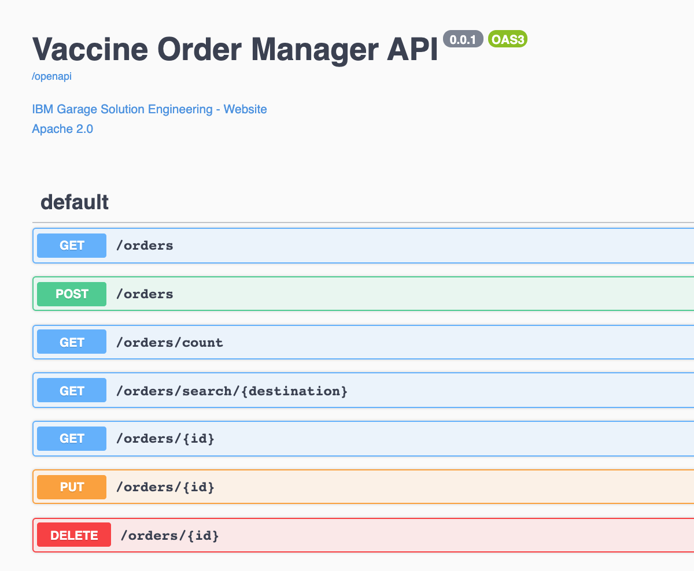

---
title: Order management and optimization demo
description: Order management and optimization demonstration
--- 

The vaccine order fullfilment is a complex problem to address as we need to optimize the shipment plan according to the demand and the constraints. A deep dive to the Operational Research problem is described in [this note](/solution/orderms/voro-solution/). 
In this use case / lab you will learn how to integrate with Kafka using the Outbox pattern, and Debezium to capture change to the postgresql table, how to integrate an Operational Research / advanced analytics component in an event-driven architecture which acts on new order events, to improve the shipment plan, how to deploy those component using GitOps approach, and finally how to use Quarkus and microprofile reactive messaging.

## Target Audiences

You will be greatly interested by the subjects addressed in this use case if you are:

* **an architect,** as you will get a deeper understanding on how all the components work together, and how to adopt event-driven approach to this problem which is mostly seen as a batch processing in traditional It architecture.
* **a developer,** as you will get a broader view of the solution end-to-end, as well as insight into practices to reuse during your future implementations.

## The what 

In this scenario we want to demonstrate the order entry with an event-driven microservice, and the integration with an event driven linear programming stateful function. The scenario addresses the following features:

* Create Order(s) using a simple user interface as an order manager will do after interacting with the country health care request.
* Validate the [transactional outbox pattern](https://ibm-cloud-architecture.github.io/refarch-eda/patterns/intro/#transactional-outbox) works to get OrderCreated, OrderUpdated or OrderCancelled Events created into a dedicated table in Postgresql
* Validate how [Debezium Change Data Capture](https://debezium.io/documentation/reference/1.4/connectors/postgresql.html) for Postgresql as a Kafka connector, produces OrderEvents from the table to Kafka `orders` topic.
* Integrate with the [Shipment plan optimization]() to get the updated shipment plan as events.

### Components involved in this use case

* [Vaccine Order Service](https://github.com/ibm-cloud-architecture/vaccine-order-mgr-pg)
* Postgres DB
* Debezium for change data capture on the outbox table
* Kafka using Strimzi or [event streams](https://ibm.github.io/event-streams/)
* [Vaccine Order Reefer Optimization Service](https://github.com/ibm-cloud-architecture/vaccine-order-optimizer)

 

*The blockchain integration is not done yet*

To have a deeper understanding of the order service read [this overview section](/solution/orderms/#overview). For the Vaccine order reefer optimization service [the design article](/design/voro/) details the optimization approach, while the [solution article](/solution/orderms/voro-solution/#overview) goes over the service implementation details.

## Deploy to OpenShift 

We propose to use gitops to deploy the Kafka, Postgres and the different services of this solution in few `oc` commands.

### Pre-requisites

* You need:
    * docker and docker compose on your laptop to run locally or build image
    * Java 11
    * git client 
    * Get access to an OpenShift cluster with Cloud Pak for integration and event streams installed.

1. [OpenShift CLI](https://cloud.ibm.com/docs/openshift?topic=openshift-openshift-cli) on your local environment.
1. [jq](https://stedolan.github.io/jq/) on your local environment.
1. Use a Terminal and the oc cli. If you want to access the code source you can clone the two main repositories of this solution:

 ```shell
 git clone https://github.com/ibm-cloud-architecture/vaccine-order-mgr-pg
 git clone https://github.com/ibm-cloud-architecture/vaccine-order-optimization
 git clone https://github.com/ibm-cloud-architecture/vaccine-gitops
 ```

### TL;DR  - One Click Deploy

Go to `vaccine-gitops` folder and do the following steps:

* Set your personal deployment parameters within the   `scripts/env.sh` file
* Use the `oc login --token...  --server ....` command to log to the OpenShift cluster. (From the OpenShift admin console, top right menu)
* Start `./scripts/deployOrderOptimWithEventStreams.sh --skip-login`
* The following pods should be up and running:

 ```shell
  NAME                                        READY   STATUS    RESTARTS   AGE
  reefer-monitoring-agent-7dd5f7ccd9-z4cf9    1/1     Running   0          106s
  vaccine-reefer-simulator-669c5f5d8b-7mms4   1/1     Running   0          105s
 ```

### Deploy the solution manually

#### Deploy Kafka Strimzi and Postgresql

If you want to get a deep understanding of how the configuration is done see the different `Kustomization.yaml` files in the `vaccine-gitops` repository, and see the [readme file](https://github.com/ibm-cloud-architecture/vaccine-gitops) to deploy a three broker cluster, with Kafka user using TLS authentication, and the Kafka topics needed by the solution. 

```shell
# login to the OpenShift cluster
oc login ....
# then deploy the solution
./scripts/order-mgr-ocp.sh --skip-login
```

#### Deploy on OpenShift with Event Streams as Kafka 

See [this note](/use-cases/eventstreams) for this type of deployment and the following scripts can be done to automate the steps described in the note:

```shell
# login to the OpenShift cluster
oc login ....
# then deploy the solution
./scripts/order-mgr-es-ocp.sh --skip-login
```

## Scenario script

Once the solution is up and running in your target deployment environment (local or OpenShift) execute the following steps to present an end to end demonstration.

### Validate existing vaccine lot shipment plan

TBD 

### Create an order from the user interface of the Order Service. 

Connect to the order microservice URL, for example it could look like http://vaccineorderms-vaccine.clusternametochangewithyours.containers.appdomain.cloud. You should reach the home page. Then select Orders tab. 

If there is no order created click on `NEW ORDER` button 

 

and fill the following data:

 ```yaml
 organization: Japan Government
 delivery location: Tokyo
 delivery date: 2021-01-24
 quantity: 150
 priority: 2
 vaccine type: covid-19
 ```


* Verify the data in postgresql: 

Once submitted the data are saved into the postgres DB, with the outbox pattern having created new records in the corresponding `OrderEvents` tables. 
We can verify the tables content using different tools, like `psql` directly in the pod, or using `pgadmin4`.

 ```shell
 oc get pods | grep postgres
 oc rsh <postgres pod id>
 # in the shell session within the pod do:
 psql -U postgres
 # in the psql shell, list the table
 \d 
 # Look at the content of the main table:
 select * from public.vaccineorderentity;
 # You should get one new record matching your data
 # Verify outbox pattern works:
 select * from public.orderevents;

 id    |   aggregatetype    | aggregateid | type         | timestamp |payload 
 c80.. | VaccineOrderEntity | 1           | OrderCreated | 2021-01-24 03:44:08.131634 | {"orderID":1,"deliveryLocation":"Tokyo","quantity":150,"priority":2,"deliveryDate":"2021-01-24","askingOrganization":"Japan Government","vaccineType":"COVID-19","status":"OPEN","creationDate":"24-Jan-2021 03:44:08"} | 
 ```

The outbox table of the order events has metadata attributes and then a payload matches the saved record in the orign table.

### Verify the message in the Kafka topic: `vaccine.public.orderevents`

 

  ```json
  {"before":null,"after":
  {"id":"c8050bb4-05d8-4270-833c-083995f27848",
   "aggregatetype":"VaccineOrderEntity",
   "aggregateid":"1",
   "type":"OrderCreated",
   "timestamp":1611459848131634,
   "payload":"{\"orderID\":1,\"deliveryLocation\":\"Paris\",\"quantity\":150,\"priority\":2,\"deliveryDate\":\"2021-01-24\",\"askingOrganization\":\"French Government\",\"vaccineType\":\"COVID-19\",\"status\":\"OPEN\",\"creationDate\":\"24-Jan-2021 03:44:08\"}",
  "tracingspancontext":"#Sun Jan 24 03:44:08 GMT 2021\n"},
  "source":{"version":"1.4.0.Final",
  "connector":"postgresql","name":"vaccine",
  "ts_ms":1611712125168,"snapshot":"last",
  "db":"postgres","schema":"public","table":"orderevents",
  "txId":1371,"lsn":41341808,"xmin":null},"op":"r","ts_ms":1611712125173,"transaction":null}
  ```

### REST APIs

The REST end points this service expose are in the OpenApi doc below, but not all operations are fully implemented yet.

 


### See how the shipment plan is modified

