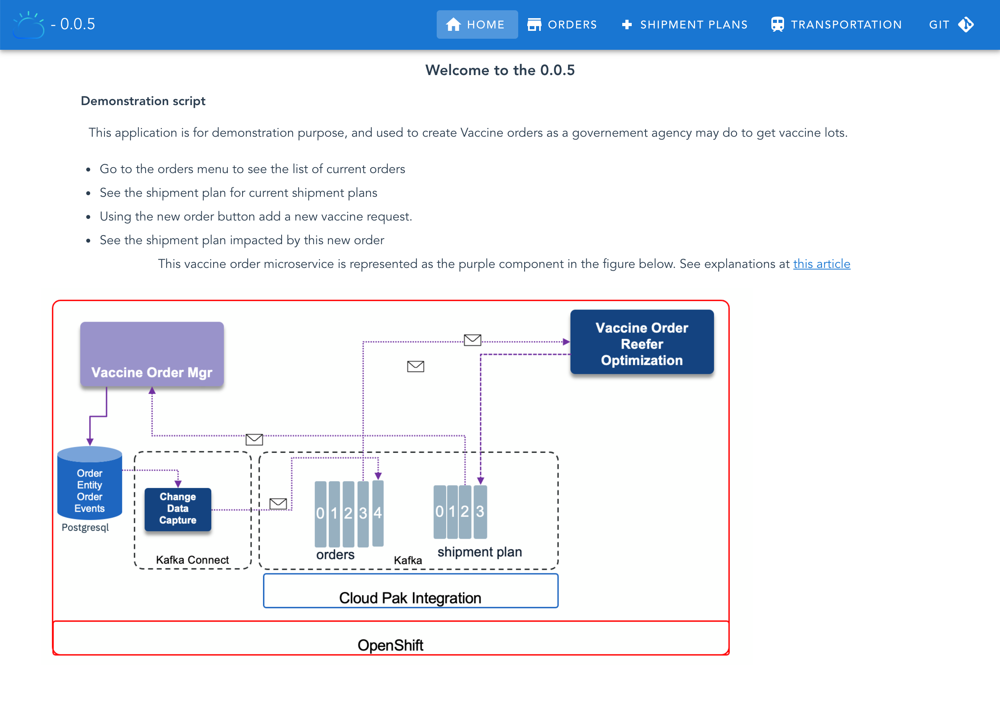
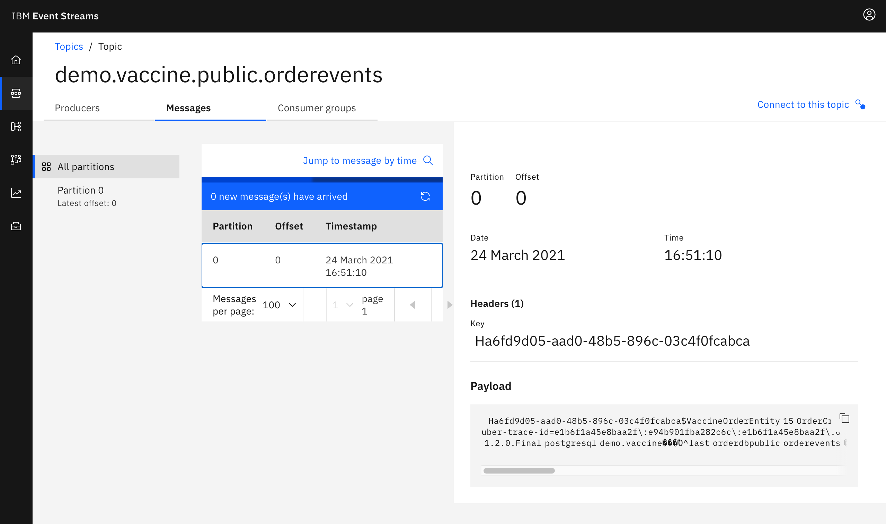

---
title: Order management and optimization demo
description: Order management and optimization demonstration
--- 

The vaccine order fullfilment is a complex problem to address as we need to optimize the shipment plan according to the demand and the constraints. A deep dive to the Operational Research problem is described in [this note](/solution/orderms/voro-solution/). 
In this use case / lab you will learn how to integrate with Kafka using the Outbox pattern, and Debezium to capture change to the postgresql table, how to integrate an Operational Research / advanced analytics component in an event-driven architecture which acts on new order events, to improve the shipment plan, how to deploy those component using GitOps approach, and finally how to use Quarkus and microprofile reactive messaging.

## Target Audiences

You will be greatly interested by the subjects addressed in this use case if you are:

* **an architect,** as you will get a deeper understanding on how all the components work together, and how to adopt event-driven approach to this problem which is mostly seen as a batch processing in traditional It architecture.
* **a developer,** as you will get a broader view of the solution end-to-end, as well as insight into practices to reuse during your future implementations.

## The what 

In this scenario we want to demonstrate the order entry with an event-driven microservice, and the integration with an event driven linear programming stateful function. The scenario addresses the following features:

* Create Order(s) using a simple user interface as an order manager will do after interacting with the country health care request.
* Validate the [transactional outbox pattern](https://ibm-cloud-architecture.github.io/refarch-eda/patterns/intro/#transactional-outbox) works to get OrderCreated, OrderUpdated or OrderCancelled Events created into a dedicated table in Postgresql
* Validate how [Debezium Change Data Capture](https://debezium.io/documentation/reference/1.4/connectors/postgresql.html) for Postgresql as a Kafka connector, produces OrderEvents from the table to Kafka `orders` topic.
* Integrate with the [Shipment plan optimization]() to get the updated shipment plan as events.

### Components involved in this use case

* [Vaccine Order Service](https://github.com/ibm-cloud-architecture/vaccine-order-mgr-pg)
* Postgres DB
* Debezium for change data capture on the outbox table
* Kafka using Strimzi or [event streams](https://ibm.github.io/event-streams/)
* [Vaccine Order Reefer Optimization Service](https://github.com/ibm-cloud-architecture/vaccine-order-optimizer)

 

*The blockchain integration is not done yet*

To have a deeper understanding of the order service read [this overview section](/solution/orderms/#overview). For the Vaccine order reefer optimization service [the design article](/design/voro/) details the optimization approach, while the [solution article](/solution/orderms/voro-solution/#overview) goes over the service implementation details.

## Deploy to OpenShift 

We propose to use gitops to deploy the Kafka, Postgres and the different services of this solution in few `oc` commands.

### Pre-requisites

* You need:
    * docker and docker compose on your laptop to run locally or build image
    * Java 11
    * git client 
    * Get access to an OpenShift cluster with Cloud Pak for integration and event streams installed.

1. [OpenShift CLI](https://cloud.ibm.com/docs/openshift?topic=openshift-openshift-cli) on your local environment.
1. [jq](https://stedolan.github.io/jq/) on your local environment.
1. Use a Terminal and the oc cli. If you want to access the code source you can clone the two main repositories of this solution:

 ```shell
 git clone https://github.com/ibm-cloud-architecture/vaccine-order-mgr-pg
 git clone https://github.com/ibm-cloud-architecture/vaccine-order-optimization
 git clone https://github.com/ibm-cloud-architecture/vaccine-gitops
 ```

### TL;DR  - One Click Deploy

Go to `vaccine-gitops` folder and do the following steps:

* Set your personal deployment parameters within the   `scripts/env.sh` file
* Use the `oc login --token...  --server ....` command to log to the OpenShift cluster. (From the OpenShift admin console, top right menu)
* Start `./scripts/deployOrderOptimWithEventStreams.sh --skip-login`
* The following pods should be up and running:

 ```shell
  NAME                                        READY   STATUS    RESTARTS   AGE
  postgres-db-postgresql-0              1/1     Running   0          106s
  vaccineorderms-5-hb66n                1/1     Running     0          105s
  vaccine-transport-simulator-2-bk69q   1/1     Running  
  vaccine-order-optimizer-2-frge3       1/1     Running  
 ```

### Deploy the solution manually

In this section we are going to see how to deploy all the components of this use case manually on an OpenShift cluster. **IMPORTANT:** We asume IBM Event Streams has been deployed onto this cluster.

This is the summary of activities for deploying the use case manually:

1. [Pull down related GitHub repositories](#pull-down-github-repositories)
1. [Create a new OpenShift project for the use case](#create-new-openshift-project)
1. [Deploy Postgres](#deploy-postgres)
1. [Deploy the Vaccine Order Manager microservice](#deploy-the-vaccine-order-manager-microservice)
1. [Deploy Kafka Connect](#deploy-kafka-connect)
1. [Deploy Debezium CDC Postgres connector](#deploy-debezium-cdc-postgres-connector)
1. [Deploy the Vaccine Order Optimizer microservice](#deploy-the-vaccine-order-optimizer-microservice)

#### Pull down GitHub repositories

We are going to use mainly three GitHub repositories throughout this section of manually deploying the order management and optimization use case. These are:

* Vaccine order manager for postgres component: <https://github.com/ibm-cloud-architecture/vaccine-order-mgr-pg>
* Vaccine order optimizer component: <https://github.com/ibm-cloud-architecture/vaccine-order-optimization>
* Vaccine GitOps: <https://github.com/ibm-cloud-architecture/vaccine-gitops>

To pull down the three GitHub repositories execute in your terminal:

```shell
 git clone https://github.com/ibm-cloud-architecture/vaccine-order-mgr-pg
 git clone https://github.com/ibm-cloud-architecture/vaccine-order-optimization
 git clone https://github.com/ibm-cloud-architecture/vaccine-gitops
 ```

#### Create new OpenShift project

We are going to create a new OpenShift project in which we will deploy everything we need to get this order management and optimization use case working (except IBM Event Streams which we assume that has already been deployed in some other OpenShift project within this OpenShift cluster). Our new OpenShift project will be called `vaccine-omo` (that stands for vaccine order management and optimization) but you can choose any of your likes. To create the project, execute in your terminal (after having logged onto your OpenShift cluster):

```shell
oc new-poject vaccine-omo
```

Also, we are going to create a new service account within our OpenShift project that provides an identity for processes that run in a Pod. The reason for this is that the postgres deployment in the following section requires certain privileges that aren't granted with the default service account when a new OpenShift project is created and which will be used when you deploy anything into it unless you specify otherwise.

For creating the new service account specific for our vaccine order management and optimization use case, execute in the terminal:

```shell
cat <<EOF | oc apply -f -
apiVersion: v1
kind: ServiceAccount
metadata:
  name: vaccine-runtime
EOF
```

Finally, we need to give that service account, that will be used to provide an identity to the processes running in the pods we deploy within this service account of our OpenShift project, the appropriate privileges the postgres processes need in order to successfully carry out the operations to get deployed and functioning in OpenShift. To give those privileges execute:

```shell
oc adm policy add-scc-to-user anyuid -z <SERVICE_ACCOUNT_NAME> -n <NAMESPACE>
```

where

  * `<SERVICE_ACCOUNT_NAME>` is the service account we have created earlier (`vaccine-runtime`)
  * `<NAMESPACE>` is the namespace where the service account is in (`vaccine-omo`)

#### Deploy Postgres

Now, let's deploy the Postgres database the Vaccine Order Manager component will use to back up the creation of new orders, which will then be picked up by the Debezium Change Data Capture Postgres connector that will be running on the Kafka Connect cluster we will deploy too.

For deploying postgres, we are going to make use of the scripts in the Vaccine GitOps GitHub repository we pulled down earlier. Thus, go into the `vaccine-gitops/environments` directory. In there you can see several folders (for the different components we might want to deploy) where there is one for `postgres`. Within that `postgres` folder, you can see several yaml files that describe the postgres deployment as well as the Kustomize files that describe how to apply all these yaml files.

Now, make sure you are within the `vaccine-gitops/environments` folder in the `vaccine-gitops` GitHub repository and execute:

```shell
oc apply -k postgres
```

After a minute or so, you can see all the pieces comprising our Postgres deployment as well as the actual pod running postgres are properly deployed and running:

```shell
$ oc get all
NAME                           READY   STATUS    RESTARTS   AGE
pod/postgres-db-postgresql-0   1/1     Running   0          2m54s

NAME                                      TYPE        CLUSTER-IP       EXTERNAL-IP   PORT(S)    AGE
service/postgres-db-postgresql            ClusterIP   172.21.130.178   <none>        5432/TCP   2m54s
service/postgres-db-postgresql-headless   ClusterIP   None             <none>        5432/TCP   2m54s

NAME                                      READY   AGE
statefulset.apps/postgres-db-postgresql   1/1     2m55s
```

Also, you can check that along those components above, the Kustomize scripts were also meant to deploy a secret called `postgresql-creds` that, as the name suggests, will hold the credential parameters for any other component to be able to connect and use this Postgres instance. You can check this secret out by executing:

```shell
oc describe secret postgresql-creds
```

where you should see:

```shell
Name:         postgresql-creds
Namespace:    vaccine-omo
Labels:       <none>
Annotations:  
Type:         Opaque

Data
====
url:       48 bytes
username:  8 bytes
password:  11 bytes
```

#### Deploy the Vaccine Order Manager microservice

In order to deploy the Vaccine Order Manager microservice for this use case, we first need to set up a couple of Kubernetes secrets and configmaps it will make use of.

1. **SSL certificate**

  This is the server-side public TLS certificate of your IBM Event Streams instance to establish secure connection. This is provided by IBM Event streams in a Kubernetes secret we are going to copy from the OpenShift project where your IBM Event Streams instance is deployed in to our vaccine order management and optimization project, with a renaming to match the name our vaccine order manager microservice deployment scripts expect which is `kafka-cluster-ca-cert`.

  In order to create the `kafka-cluster-ca-cert` secret containing the server-side public TLS certificate of your IBM Event Streams instance, execute the following command:

  ```shell
  oc get secret <CLUSTER_NAME>-cluster-ca-cert -n <EVENTSTREAMS_NS> -o json | jq -r '.metadata.name="kafka-cluster-ca-cert"' | jq --arg project_name "<PROJECT_NAME>" -r '.metadata.namespace=$project_name' | oc apply -f -
  ```

  where

    * `<CLUSTER_NAME>` is the name of your IBM Event Streams instance. If you don't remember your IBM Event Streams instance name you can find it out executing:
    ```shell
    oc get EventStreams -n <EVENTSTREAMS_NS>
    ```
    * `<EVENTSTREAMS_NS>` is the name of the OpenShift project/namespace were your IBM Event Streams is deployed in.
    * `<PROJECT_NAME>` is the name of the OpenShift project where you are deploying this vaccine order management and optimization use case into.

  You can verify that a new secret called `kafka-cluster-ca-cert` exists in the OpenShift project where you are deploying the vaccine order management and optimization use case by executing:

  ```shell
  oc get secrets
  ```

1. **Mutual TLS certificate**

  IBM Event Streams has both [internal and external configurable Kafka listeners](https://ibm.github.io/event-streams/installing/configuring/#kafka-access). For this tutorial we assume the internal Kafka listener has been configured to require mutual TLS authentication. In order to be able to connect to IBM Event Streams through the internal Kafka listener, we first need to create a Kafka User and its TLS credentials. To do so,

    1. Go to your IBM Event Streams user intergace dashboard. You can find where it is by executing:
    ```shell
    oc get routes -n <EVENTSTREAMS_NS> | grep ui
    ```
    1. Click on the `Connect to this cluster` option
    
    1. A panel will slide from the right hand side of your screen. Under the `Kafka listener and credentials` section, click on `Generate TLS credentials` button.
    
    By the way, you can already see to the left of the `Generate TLS credentials` the Kafka bootstrap address for the internal listener we will be referencing to later on.
    1. A multiple step wizard to generate credentials for your application will pop up. For the `Credential name` you can choose any name you want. For the rest of the otpions, try to provide the most premissive in each step for easeness.
    1. Once you have finished, you will be presented with the option to download the TLS certificates for your newly created Kafka User credentials as well as with a link to the instructions for retrieving these later. 
    
    These instructions will consist of finding out that a new secret with the same name you gave to your credentials (and Kafka User as a result) has been creating in the OpenShift project your IBM Event Streams instance is installed in. You can double check it by running:
    ```shell
    oc get secrets -n <EVENTSTREAMS_NS> | grep <YOUR_CREDENTIALS_NAME>
    ```
  
  Now that we have created a Kafka User with its corresponding TLS credentials to work with the internal Kafka listener and we know these TLS credentials are stored in a secret with the same name, we only need to copy that secret from the OpenShift project where it is (i.e. the OpenShift project where your IBM Event Streams instance has been deployed into) to the OpenShift project where we are deploying our vaccine order and optimization use case so that our applications can make use of it and be able to work with IBM Event Streams. To do so, execute:

  ```shell
  oc get secret <CREDENTIALS_NAME> -n <EVENTSTREAMS_NS> -o json | jq -r '.metadata.name="tls-user"' | jq --arg project_name "<PROJECT_NAME>" -r '.metadata.namespace=$project_name' | oc apply -f -
  ```
  where
    * `<CREDENTIALS_NAME>` is the name you gave to the TLS Credentials you created above.
    * `<EVENTSTREAMS_NS>` is the OpenShift project where your IBM Event Streams instance is deployed into and where the secret holding the TLS Credentials you created above ends up into as well as a result.
    * `<PROJECT_NAME>` is the OpenShift project where you are deploying the vaccine order management and optimization use case into.

  You can see from the command above that we are renaming the secret from whatever your `<CREDENTIALS_NAME>` was to `tls-user` since this is the name of the secrets for the TLS credentials the deployment scripts to be executed next expect.

  You can verify that a new secret called `tls-user` exists in the OpenShift project where you are deploying the vaccine order management and optimization use case by executing:

  ```shell
  oc get secrets
  ```

1. **Kafka topics configmap**

  The last step before being able to deploy the Vaccine Order Manager microservice is to configure the configmap that will hold the values for the different Kafka topics as well as the Kafka bootstrap url this and other components of the use case will make use of. The configmap we refer to is called `kafka-topics-configmap.yaml` and can be found in the vaccine order manager for postgres GitHub repository you pulled down earlier under the `src/main/kubernetes` folder.

  Open up that yaml file and provide a unique identifier where it says `<UNIQUE_ID>` (this is needed when your IBM Event Streams instance is shared and other people may be deploying this scenario as well) and provide the Kafka bootstrap address for the internal Kafka listener where it says `<KAFKA_BOOTSTRAP_URL>`. You can get this Kafka bootstrap address as we saw before when Generating the internal TLS credentials:

  

  Once you have set those two parameters, you can create the configmap by executing:

  ```shell
  oc apply -f kafka-topics-configmap.yaml
  ```

  within the `src/main/kubernetes` folder of the vaccine order manager for postgres GitHub repository. You can checkout it has been properly created by executing"

  ```shell
  oc describe configmap kafka-topics-cm
  ```

Only now that we have created the secrets containing the SSL certificates for establishing secure communication with IBM Event Streams and the mutual TLS certificates and credentials to authenticate and authorize against it too plus the configmap that holds the different Kafka topic names and the Kafka bootstrap url for our applications to produce to/consume from and establish communication with the Kafka brokers, we can proceed to deploy the Vaccine Order Manager for postgres component of our use case.

For doing so, we need to be, again, within the `src/main/kubernetes` folder in the Vaccine Order Manager for postgres repository. Once there, you can execute the following commands:

```shell
oc apply -f configmap.yaml
```

that will create the `vaccine-order-ms-cm` configmap that holds some configuration info for the application

```shell
oc apply -f rolebinding.yaml
```

that will create the `vaccineorderms-view` role binding that will provide view ClusterRole role to the `vaccine-runtime` service account we created before that is responsible for providing an identity to the processes running in the pods we deploy. 

```shell
oc apply -f deployconfig.yaml
```

that will, finally, deploy the Vaccine Order Manager for postgres component (which is actually a pod). You can check out the status of the `vaccineorderms-1-xxxxx` is `Running` after a min or so by executing:

```shell
oc get pods
```

Finally, we need to make our newly deployed Vaccine Order Manager for postgres component available to be accessed and we do so by creating a Kubernetes service (makes a pod internally discoverable and accessible) and an OpenShift route (makes a service externally accessible) for the deployment we carried out in the previous step. For creating the Kubernetes service and the OpenShift route execute respectively:

```shell
oc apply -f service.yaml
```

and

```shell
oc apply -f route.yaml
```

You can now access your Vaccine Order Manager for Postgres component of the use case by pointing your web browser to the route you just created. You can execute the following command to find out the route:

```shell
oc get routes
```



**Test the application**

Let's see if we are able to create a new order and if this order gets stored in the postgres database we deployed earlier in this tutorial.

Click on the `ORDERS` tab on the top bar menu. You should see that there are three orders already pre-created.


Still, click on the `NEW ORDER` button on the top right corner of the `Orders` table, fill in the form with any `Organization` name and `Delivery Location` you want and click `SAVE`.


You should right away see the `Orders` table have got update with the new order.


However, this does not assure us the order has been committed to the database. In order to make sure of this, we are going to exec into the postgres container and manually check the order has been created in the table we are expecting it to be created. So, in order to exec into the postgres container, execute the following command:

```shell
oc rsh postgres-db-postgresql-0
```

You should now have a shell running in the postgres container. Now, to check that our new order has been effectively committed into the database, execute the following commands:

```shell
psql -U postgres
```

which will launch the Postgres interpreter for the user `postgres` (remember that was the user we configured our Postgres deployment with)

```shell
\l
```

to list all the databases in the Postgres deployment.

```shell
\c orderdb
```

to connect to the `orderdb` database (this is the database we had our postgres deployment to create for the Vaccine Order Manager for Postgres component)

```shell
\dt
```

to display all the relations in the `orderdb` database. You should see here the different tables the Vaccine Order Manager for Postgres component will work with.

```shell
select * from public.vaccineorderentity;
```

to see all the orders that the Vaccine Order Manager for Postgres component is aware of. We can see here that our newly created order has been effectively committed into the database.

However, this is not all. That was one piece of the puzzle since we are not only interested on the new orders being created and stored in the database but, in fact, that these new orders are reflected on a different table in the format that the Debezium CDC for Postgres connector can then understand and use for sending these as events to IBM Event Streams ([Outbox pattern](https://ibm-cloud-architecture.github.io/refarch-eda/patterns/intro#transactional-outbox)). In order to figure out where the [Quarkus Outbox Extension](https://debezium.io/documentation/reference/integrations/outbox.html) is creating those records ready to be sent into Kafka from a source table, we can checkout the application properties for the Vaccine Order Manager for Postgres component that you can find in its GitHub repository under `src/main/resources`. In there, you should see the `application.properties` file and within it you can see the configuration for the Quarkus Outbox Extension:

```properties
quarkus.index-dependency.outbox.group-id=io.debezium
quarkus.index-dependency.outbox.artifact-id=debezium-quarkus-outbox
quarkus.debezium-outbox.table-name=orderevents
quarkus.debezium-outbox.remove-after-insert=false
```

and this tells us that we should see our new orders creating a new record in the `orderevents` table of our `orderdb` database in our Postgres deployment. To check it out, execute:

```shell
select * from public.orderevents;
```

Below is the kind of output you should see for the Postgres verification steps above:

```shell
oc rsh postgres-db-postgresql-0 

# psql -U postgres
psql (11.11 (Debian 11.11-1.pgdg90+1))
Type "help" for help.

postgres=# \l
                                 List of databases
   Name    |  Owner   | Encoding |  Collate   |   Ctype    |   Access privileges   
-----------+----------+----------+------------+------------+-----------------------
 orderdb   | postgres | UTF8     | en_US.utf8 | en_US.utf8 | 
 postgres  | postgres | UTF8     | en_US.utf8 | en_US.utf8 | 
 template0 | postgres | UTF8     | en_US.utf8 | en_US.utf8 | =c/postgres          +
           |          |          |            |            | postgres=CTc/postgres
 template1 | postgres | UTF8     | en_US.utf8 | en_US.utf8 | =c/postgres          +
           |          |          |            |            | postgres=CTc/postgres
(4 rows)

postgres=# \c orderdb
You are now connected to database "orderdb" as user "postgres".

orderdb=# \dt
               List of relations
 Schema |        Name        | Type  |  Owner   
--------+--------------------+-------+----------
 public | ordercreatedevent  | table | postgres
 public | orderevents        | table | postgres
 public | orderupdatedevent  | table | postgres
 public | vaccineorderentity | table | postgres
(4 rows)

orderdb=# select * from public.vaccineorderentity;
 id | askingorganization |     creationdate     | deliverydate | deliverylocation | priority | quantity | status | vaccinetype 
----+--------------------+----------------------+--------------+------------------+----------+----------+--------+-------------
  1 | Spain Government   | 10-Nov-2020 02:02:40 | 2021-02-24   | Madrid           |        1 |      200 |      0 | COVID-19
  2 | French Government  | 15-Nov-2020 02:02:40 | 2021-01-10   | Paris            |        1 |      300 |      0 | COVID-19
  3 | Italy Government   | 15-Nov-2020 02:02:40 | 2021-01-12   | Roma             |        1 |      400 |      0 | COVID-19
 15 | Some organization  | 23-Mar-2021 15:50:16 | 2021-03-23   | Some place       |        2 |      150 |      0 | COVID-19
(4 rows)

orderdb=# select * from public.orderevents;
                  id                  |   aggregatetype    | aggregateid |     type     |         timestamp          |                                                            
                                                payload                                                                                                             |             
             tracingspancontext                           
--------------------------------------+--------------------+-------------+--------------+----------------------------+------------------------------------------------------------
--------------------------------------------------------------------------------------------------------------------------------------------------------------------+-------------
----------------------------------------------------------
 a6fd9d05-aad0-48b5-896c-03c4f0fcabca | VaccineOrderEntity | 15          | OrderCreated | 2021-03-23 15:50:16.432121 | {"orderID":15,"deliveryLocation":"Some place","quantity":15
0,"priority":2,"deliveryDate":"2021-03-23","askingOrganization":"Some organization","vaccineType":"COVID-19","status":"OPEN","creationDate":"23-Mar-2021 15:50:16"} | #Tue Mar 23 
15:50:16 GMT 2021                                        +
                                      |                    |             |              |                            |                                                            
                                                                                                                                                                    | uber-trace-i
d=e1b6f1a45e8baa2f\:e94b901fba282c6c\:e1b6f1a45e8baa2f\:0+
                                      |                    |             |              |                            |                                                            
                                                                                                                                                                    | 
(1 row)

orderdb=# 
```

#### Deploy Kafka Connect

Now that we have one part of the puzzle working, which is the Vaccine Order Manager for Postgres deployed and running where we have made sure new orders get created and properly stored in the Postgres database and the Quarkus Outbox Extension does it job preparing those records in the place and form the Debezium CDC for Postges connector can look for and understand, we can proceed to actually get that Debezium CDC for Postges connector to work.

However, for doing so we need a framework for it to run on. And this framework is [Kafka Connect](https://kafka.apache.org/documentation/#connect). Kafka Connect is a tool for scalably and reliably streaming data between Apache Kafka and other systems. It makes it simple to quickly define connectors that move large collections of data into and out of Kafka.

**IMPORTANT:** We assume you have deployed your IBM Event Streams instance with an **internal TLS secured Kafka listener** which your Kafka Connect cluster will use to connect. For more detail about listeners, check the IBM Event Streams documentation [here](https://ibm.github.io/event-streams/installing/configuring/#kafka-access). 

Now, follow the next steps in order to get your Kafka Connect cluster deployed:

1. Go to you IBM Event Streams dashboard, click on the `Find more on the toolbox` option.

  

1. Click on the `Set up` button for the `Set up a Kafka Connect environment` option.

  

1. Click on `Download Kafka Connect ZIP` button.

  

1. The above downloads a zip file which contains a `kafka-connect-s2i.yaml` file. Open that yaml file and take note of the `productID` and `cloudpakId` values as you will need these in the following step.

  

However, instead of using that `kafka-connect-s2i.yaml` we are going to use the one provided within the `environment/cdc` folder of the Vaccine Order Manager for Postgres GitHub repository. If you open up that file you will see the following placeholders:

* `<UNIQUE_ID>` which you should replace for a unique identifier in the case that your IBM Event Streams instance is shared. We have previously used `demo` as the unique id for the Kafka topic names in the configmap we created ahead of deploying the Vaccine Order Manager for Postgres component so we will use that one again for grouping resources being deployed for this use case.
* `<GET_IT_FROM_EVENTSTREAMS>` which should be replaced with the `productID` and `cloudpakId` values you obtained in the previous step.
* `<KAFKA_BOOTSTRAP_URL>` which is the internal Kafka listener bootstrap address. You can check the previous section where we deployed the Vaccine Order Manager for Postgres microservice where we created a configmap with the kafka topics names and the IBM Event Streams internal Kafka listener bootstrap address in order to see how to find out this value.

If we carefully inspect this yaml that would get a Kafka Connect cluster deployed, we should realise that we still have to create a secret called `postgres-connector` ahead of time that will be loaded as external configuration. This `postgres-connect` secret will hold the configuration that, later, the Debezium CDC for Postgres connector will need to function. In order to create that secret, we provide a file called `connector.properties` also under the `environment/cdc` folder of the Vaccine Order Manager for Postgres GitHub repository.

Again, if you open up that file you will see the following placeholders:

* `<UNIQUE_ID>` which you should replace for a unique identifier in the case that your IBM Event Streams instance is shared. We have previously used `demo` as the unique id for the Kafka topic names in the configmap we created ahead of deploying the Vaccine Order Manager for Postgres component so we will use that one again. In fact, it is **IMPERATIVE** that we use the same unique identifier as the one we used for the Kafka topics names. The reason for this is that the Debezium CDC for Postgres connector will be watching out for new records on the tables of our Postgres deployment that are specified in its `table-whitelist` configuration variable. And will send those new records as events to a Kafka topic named the same as the table name specified in the `table-whitelist` configuration variable prefixed with the value of its `database-server-name` configuration variable. If you work that out, you see that the `ORDER_TOPIC` value we define in the configmap holding the Kafka topic names was and must be `<UNIQUE_ID>.vaccine.public.orderevents`, as this is where the events will end up based on the Debezium CDC for Postgres connector configuration properties file.
* `<SCRAM_USERNAME>` and `<SCRAM_PASSWORD>` are the credentials for the IBM Event Streams external Kafka listener. We said earlier that We assume you have deployed your IBM Event Streams instance with an internal TLS secured Kafka listener and we are, indeed, using that internal Kafka listener for the communication between the Kafka Connect cluster we are about to deploy and your IBM Event Streams cluster. You can see so by looking at the `<KAFKA_BOOTSTRAP_URL>` explanation in the paragraph above for the placeholders of the `kafka-connect-s2i.yaml` provided within the `environment/cdc` folder of the Vaccine Order Manager for Postgres GitHub repository. Now, why do we then need a new set of credentials (this time for the external Kafka listener that IBM Event Streams is expected to be deployed with) as well? The reason for this is that it is possible for a schema registry to be hosted somewhere completely different from Kafka & doesn’t have to use Kafka for storage either but you would still want that https traffic coming into your schema registry to be authenticated and authorised. In order for IBM Event Streams to authenticate and authorize that incoming https traffic against an IBM Event Streams Kafka User, it needs to be proxied and that is the reason for any communication with the IBM Event Streams Schema Registry to go through the external Kafka listener on port 9443 (if using the internal Kubernetes service) or 443 (if using the OpenShift route). To create a set of SCRAM credentials (which creates a new Kafka User behind the scenes) see this post [here](https://ibm-cloud-architecture.github.io/refarch-eda/use-cases/overview/pre-requisites#generate-scram-service-credentials).
* `<SCHEMA_REGISTRY_URL>` is the IBM Event Streams Schema Registry url that you can find executing the following command:
  ```shell
  oc get routes -n <EVENTSTREAMS_NS> | grep ac-reg-external
  ```

In order to create that `postgres-connector` secret that holds the Debezium CDC for Postgres connector configuration out of the `connector.properties` file we have just adjusted to our environment, we only need to run the following command:

```shell
oc create secret generic postgres-connector --from-file=./connector.properties
```

One last thing to do before deploying our Kafka Connect cluster is the need to copy the secret that holds your IBM Entitlement Key over from the OpenShift project where you have IBM Event Streams deployed into. This IBM Entitlement Key is needed to download any IBM product Docker image from IBM's private Docker registry in Quay. This is something you must have present in all your OpenShift projects where you want IBM software to be deployed into. In order to copy that IBM Entitlement Key secret from the OpenShift project where you have your IBM Event Streams instance deployed into, execute the following command:

```shell
oc get secret ibm-entitlement-key -n <EVENTSTREAMS_NS> -o json | jq --arg project_name "<PROJECT_NAME>" -r '.metadata.namespace=$project_name' | oc apply -f -
```

where

  * `<EVENTSTREAMS_NS>` is the OpenShift project where your IBM Event Streams instance is deployed into (`eventstreams` in this tutorial).
  * `<PROJECT_NAME>` is the OpenShift project where you are deploying your Kafka Connect cluster into (`vaccine-omo` in this tutorial).

Finally, we are all set to deploy our Kafka Connect cluster. In order to do so, we only need to execute the following command:

```shell
oc apply -f kafka-connect-s2i.yaml
```

You can watch all the resources being created as a result and their progress by executing:

```shell
watch -n 5 oc get all
```

after a couple of minutes or so you should see something like this:

```shell
NAME                                         READY   STATUS      RESTARTS   AGE
pod/connect-cluster-demo-connect-1-5d7f9     1/1     Running     0          65s
pod/connect-cluster-demo-connect-1-build     0/1     Completed   0          102s
pod/connect-cluster-demo-connect-1-deploy    0/1     Completed   0          66s
pod/postgres-db-postgresql-0                 1/1     Running     0          46h
pod/vaccineorderms-1-deploy                  0/1     Completed   0          19h
pod/vaccineorderms-1-jsx8n                   1/1     Running     0          19h

NAME                                                    DESIRED   CURRENT   READY   AGE
replicationcontroller/connect-cluster-demo-connect-1    1         1         0       67s
replicationcontroller/vaccineorderms-1                  1         1         1       19h

NAME                                        TYPE        CLUSTER-IP       EXTERNAL-IP   PORT(S)    AGE
service/connect-cluster-demo-connect-api    ClusterIP   172.21.173.130   <none>        8083/TCP   105s
service/postgres-db-postgresql              ClusterIP   172.21.130.178   <none>        5432/TCP   46h
service/postgres-db-postgresql-headless     ClusterIP   None             <none>        5432/TCP   46h
service/vaccineorderms                      ClusterIP   172.21.157.216   <none>        8080/TCP   19h

NAME                                      READY   AGE
statefulset.apps/postgres-db-postgresql   1/1     46h

NAME                                                               REVISION   DESIRED   CURRENT   TRIGGERED BY
deploymentconfig.apps.openshift.io/connect-cluster-demo-connect    1          1         1         config,image(connect-cluster-demo-connect:latest)
deploymentconfig.apps.openshift.io/vaccineorderms                  1          1         1         config

NAME                                                           TYPE     FROM     LATEST
buildconfig.build.openshift.io/connect-cluster-demo-connect    Source   Binary   1

NAME                                                       TYPE     FROM   STATUS     STARTED              DURATION
build.build.openshift.io/connect-cluster-demo-connect-1    Source          Complete   About a minute ago   36s

NAME                                                                  IMAGE REPOSITORY                                                                                    TAGS
                                                           UPDATED
imagestream.image.openshift.io/connect-cluster-demo-connect           image-registry.openshift-image-registry.svc:5000/vaccine-omo/connect-cluster-demo-connect           latest
                                                           About a minute ago
imagestream.image.openshift.io/connect-cluster-demo-connect-source    image-registry.openshift-image-registry.svc:5000/vaccine-omo/connect-cluster-demo-connect-source    4c6aa063
ae06dbae9acdd3ad0200e89205d86fc4b93b07f835817a7bee929c2a   About a minute ago

NAME                                      HOST/PORT                                                                                                             PATH   SERVICES
      PORT   TERMINATION   WILDCARD
route.route.openshift.io/vaccineorderms   vaccineorderms-vaccine-omo.assets-arch-eda-6ccd7f378ae819553d37d5f2ee142bd6-0000.us-east.containers.appdomain.cloud   /      vaccineorde
rms   8080                 None
```

where we can see the pod `connect-cluster-demo-connect-1-xxxxx` is running. This means your Kafka Connect cluster is running. However, we can see some other resources have been created as a result of telling OpenShift to deploy a Kafka Connect cluster. Amongst these you can see a couple of Image Streams (to build a Docker image from source code), a Build Config, a Build, a Deployment Config, etc. It is not the goal of this tutorial to explain what goes on behind the scenes when deploying a Kafka Connect cluster using the KafkaConnectS2I (kafka connect source to image) construct but it is something we highly recommend students investigating.

Now that we have our Kafka Connect cluster running, one thing we can check out is whether there is any connector configured in it that may be running. In order to do so, we are going to poke the `/connectors` API that the Kafka Connect Framework exposes. In order to do so, execute the following command:

```shell
oc exec -it <KAFKA_CONNECT_POD_NAME> -- curl localhost:8083/connectors
```

where

* `<KAFKA_CONNECT_POD_NAME>` is the pod name of your Kafka Connect cluster (in this tutorial is `connect-cluster-demo-connect-1-5d7f9`).

You should see `[]` as the output for the command above since there should not be any connector configured and running yet in your Kafka Connect cluster. This is something we are going to see in the next section.

Another thing we can check out is the connector plugins registered in our Kafka Connect cluster. That is the available plugins to create/instantiate a connector from. In order to see a list of the connector plugins in our Kafka Connect cluster, execute the following command:

```shell
oc exec -it <KAFKA_CONNECT_POD_NAME> -- curl localhost:8083/connector-plugins
```

and you should see an output like:

```shell
[
  {
    "class": "org.apache.kafka.connect.file.FileStreamSinkConnector",
    "type": "sink",
    "version": "2.6.0"
  },
  {
    "class": "org.apache.kafka.connect.file.FileStreamSourceConnector",
    "type": "source",
    "version": "2.6.0"
  },
  {
    "class": "org.apache.kafka.connect.mirror.MirrorCheckpointConnector",
    "type": "source",
    "version": "1"
  },
  {
    "class": "org.apache.kafka.connect.mirror.MirrorHeartbeatConnector",
    "type": "source",
    "version": "1"
  },
  {
    "class": "org.apache.kafka.connect.mirror.MirrorSourceConnector",
    "type": "source",
    "version": "1"
  }
]
```

where there is no Debezium CDC for Postgres connector plugin.

#### Deploy Debezium CDC Postgres connector

We have seen in the previous section that the Kafka Connect cluster we have just deployed does not contain any connector configured and running yet. And this makes sense since we have only deployed the Kafka Connect Cluster, with the configuration we will need for the Debezium CDC for Postgres connector that we plan to execute afterwards but we yet need to do two things for that:

1. Provide the actual Debezium CDC for Postgres connector binaries. That is, the binaries our Kafka Connect cluster will use when instantiating a Debezium CDC for Postgres connector.
1. Register, that is instantiate, a Debezium CDC for Postgres connector for our use case so that we get the records stored by the Vaccine Order Manager for Postgres microservice in our Postgres deployment in the `public.orderevents` table of its `orderdb` database as events in the `demo.vaccine.public.orderevents` Kafka topic as we saw, explained and configured earlier in this tutorial.


1. **Debezium CDC Postgres connector binaries**

  You can find the latest Debezium CDC for Postgres connector binaries [here](https://repo1.maven.org/maven2/io/debezium/debezium-connector-postgres/). Go into the folder for the latest version which should be called `X.Y.Z.Final`. Within that folder find the file called `debezium-connector-postgres-X.Y.Z.Final-plugin.tar.gz` and download it. Once downloaded, untar the file. You will see several jar files. Something like:

  ```shell
  debezium-api-1.4.0.Final.jar
  debezium-connector-postgres-1.4.0.Final.jar
  debezium-core-1.4.0.Final.jar
  failureaccess-1.0.1.jar
  guava-30.0-jre.jar
  postgresql-42.2.14.jar
  protobuf-java-3.8.0.jar
  ```

  They all are needed and what is more important is that we need to provide any connector to our Kafka Connect cluster **within the following structure**:

  ```shell
   - /connectors
     |
       - /connector1
         |
           - jar1
           ...
           - jarN
         ...
       - /connectorN
  ```

  However, if you pay a close look at the jar files within the Debezium CDC for Postgres connector tar file we have downloaded, you will not see any jar file around Apicurio which is the schema registry IBM Event Streams deploys which we want to interact with. That is, we want the Debezium CDC for Postgres connector to automatically interact with IBM Event Streams Schema Registry for the events to be sent to comply with a schema and are serialized using the [Apache Avro protocol](http://avro.apache.org/). For doing this, we need to provide more binaries for our Debezium CDC for Postgres connector (see this [Debezium post](https://debezium.io/blog/2020/04/09/using-debezium-with-apicurio-api-schema-registry/) and this [Debezium post](https://debezium.io/documentation/reference/configuration/avro.html) for further detail).

  To get all the extra binaries we need for our Debezium CDC for Postgres connector to automatically interact with the IBM Event Streams Apicurio Schema Registry and the Avro protocol, download the `Apicurio Registry Distro Connect Converter` package from the Maven Central repository [here](https://mvnrepository.com/artifact/io.apicurio/apicurio-registry-distro-connect-converter). Click on the latest `X.Y.Z.Final` version and then click on the `View All` link displayed in the `Files` row within the table displayed under the title of the package. This will drive you to a the location where you should find a file called `apicurio-registry-distro-connect-converter-X.Y.Z.Final-converter.tar.gz`. Download this file and untar it. Then, copy all the `jar` files with the other Debezium CDC for Postgres connector jar files in the connectors folder structure explained above.

  You should now have a list of jar files like the following (at the time of writting this tutorial March 2021):

  ```shell
  annotations-13.0.jar
  apicurio-registry-common-1.3.2.Final.jar
  apicurio-registry-rest-client-1.3.2.Final.jar
  apicurio-registry-utils-converter-1.3.2.Final.jar
  apicurio-registry-utils-serde-1.3.2.Final.jar
  avro-1.10.0.jar
  commons-compress-1.20.jar
  connect-json-2.4.0.jar
  converter-jackson-2.9.0.jar
  debezium-api-1.2.0.Final.jar
  debezium-connector-postgres-1.2.0.Final.jar
  debezium-core-1.2.0.Final.jar
  jackson-annotations-2.11.3.jar
  jackson-core-2.11.3.jar
  jackson-databind-2.11.3.jar
  jackson-datatype-jdk8-2.11.3.jar
  kotlin-reflect-1.3.72.jar
  kotlin-stdlib-1.3.72.jar
  kotlin-stdlib-common-1.3.72.jar
  medeia-validator-core-1.1.1.jar
  medeia-validator-jackson-1.1.1.jar
  okhttp-3.14.9.jar
  okio-1.17.2.jar
  postgresql-42.2.12.jar
  protobuf-java-3.13.0.jar
  retrofit-2.9.0.jar
  ```

  We are finally ready to upload the Debezium CDC for Postgres connector binaries to our Kafka Connect cluster. To do so, we need to start a new build of our build resource created as a result of having created a KafkaConnectS2I resource when we deployed the Kafka Connect cluster. This will build the source code for Kafka Connect once again but this time we are going to provide Debezium CDC for Postgres connector binaries to the build process so that these are then processed by the Kafka Connect Framework and the Debezium CDC for Postgres connector plugin is available as a result to be instantiated and used. In order to kick off a new build of Kafka Connect with the Debezium CDC for Postgres connector binaries execute the following command:

  ```shell
  oc start-build <BUILD> --from-dir <CONNECTORS_DIR> --follow
  ```

  where
  
    * `<BUILD>` is the build resource name created as a result of having created a KafkaConnectS2I resource when deploying a Kafka Connect cluster. You can find the name of your Kafka Connect build by executing the following command:
    ```shell
    oc get build
    ```
    where the name should be like `connect-cluster-<UNIQUE_ID>-connect`
    * `<CONNECTORS_DIR>` is the path to the directory containing the different connectors' binaries we want to build our Kafka Connect cluster with which we created above containing all the Debezium CDC for Postgres connector binaries. **IMPORTANT:** the path should point to the outter folder containing a folder per connector. That is, something like `./connectors` if we were to execute the command from the folder where we have the `connectors` folder rather than `./connectors/connector1`.
  
  After executing this command, you should see in your terminal the output of the build process with the binaries upload, the docker image creation, etc.

  If you watch all the resources in your OpenShift project with `watch -n oc get all`, you should see a new build resource, the desired replicas for the replica controller resource for the first Kafka Connect cluster down to 0 while the desired replicas for the replica controller resource for the second Kafka Connect cluster is set to 1, etc... Finally, you should see a new `build` and `deploy` pods for this second iteration of the Kafka Connect cluster and the most important pod, the pod where our Kafka Connect cluster runs into that should be called `connect-cluster-demo-connect-2-xxxxx`, with `STATUS` equal to `Running`.

  If we now poke the `/connector-plugins` API endpoint of our Kafka Connect cluster by executing:

  ```shell
  oc exec -it <KAFKA_CONNECT_POD_NAME> -- curl localhost:8083/connector-plugins
  ```

  where

    * `<KAFKA_CONNECT_POD_NAME>` is the name of the pod running our Kafka Connect cluster (`connect-cluster-demo-connect-2-xxxxx`)

  we should see that the Debezium CDC for Postgres connector plugin is now listed:

  ```shell
  [
  {
    "class": "io.debezium.connector.postgresql.PostgresConnector",
    "type": "source",
    "version": "1.2.0.Final"
  },
  {
    "class": "org.apache.kafka.connect.file.FileStreamSinkConnector",
    "type": "sink",
    "version": "2.6.0"
  },
  {
    "class": "org.apache.kafka.connect.file.FileStreamSourceConnector",
    "type": "source",
    "version": "2.6.0"
  },
  {
    "class": "org.apache.kafka.connect.mirror.MirrorCheckpointConnector",
    "type": "source",
    "version": "1"
  },
  {
    "class": "org.apache.kafka.connect.mirror.MirrorHeartbeatConnector",
    "type": "source",
    "version": "1"
  },
  {
    "class": "org.apache.kafka.connect.mirror.MirrorSourceConnector",
    "type": "source",
    "version": "1"
  }
  ]
  ```
  1. **Register a Debezium CDC for Postgres connector**

  The last piece of the Outbox pattern is to get a Debezium CDC for Postgres connector instantiated in our Kafka Connect cluster now that we have both the Kafka Connect cluster running with the Debezium CDC for Postgres connector binaries in it and the resulting connector plugin available as a result. For getting a Debezium CDC for Postgres connector instantiated, we provide, within the `environment/cdc` folder of the Vaccine Order Manager for Postgres GitHub repository, a file called `pg-connector.yaml` which is nothing but the definition of a KafkaConnect resource. The Debezium CDC for Postgres connector specification within that KafkaConnect resource has been parametrized so that all its configuration is taken from the environment it runs on. That is, it will take its configuration from the `postgres-connector` secret we load as external configuration when we deployed our Kafka Connect cluster if you remember the `kafka-connect-s2i.yaml` file. And, if you remember, the configuration from that secret comes from the `connector.properties`. However, as in with practically all the resources we've created so far for this use case, we would still need to provide a unique identifier (`demo` in this tutorial) for the `<UNIQUE_ID>` placeholder you can find for that KafkaConnect resource in the `pg-connector.yaml` file. Provide that unique identifier and then execute the following command to get that KafkaConnect resource created and a Debezium CDC for Postgres connector instantiated within your Kafka Connect cluster as a result:

  ```shell
  oc apply -f pg-connector.yaml
  ```

  After a minute or so, you can check the logs for the `connect-cluster-demo-connect-2-xxxxx` pod to see some output refering to the newly created Debezium CDC for Postgress connector instance whose name is `pg-connector-apicurio`. You can also execute `oc describe kafkaconnector pg-connector-apicurio` to see the details of that newly created Kafka Connector. These two validations are kind of in depth validations. For something easier, we can poke the `/connectors` API of our Kafka Connect cluster to see if a new connector has been registered and instantiated. To do so execute:

  ```shell
  oc exec -it <KAFKA_CONNECT_POD_NAME> -- curl localhost:8083/connectors
  ```
  where

     * `<KAFKA_CONNECT_POD_NAME>` is the pod name of your Kafka Connect cluster (in this tutorial is `connect-cluster-demo-connect-2-xxxxx`).

  You should see the following output:

  ```shell
  ["pg-connector-apicurio"]
  ```

  Also, if you go to the topics section in your IBM Event Streams User Interface and filter for `demo`, you should see the following topics at least:

  

  If you now go into your `<UNIQUE_ID>.vaccine.public.orderevents` you should see one event in it containing the new order we created back when we deployed the Vaccine Order Manager for Postgres microservice:
  
  

  That new order we created got stored in the `public.vaccineorderentity` table of the `orderdb` database of our Postgres deployment. Thanks to the Quarkus Outbox Extension, that new record got copied over to the `public.orderevents` table of the same database in the form and shape that the Debezium CDC for Postgres connector understands and expects it to be so that it is able to then send such record as an event into the desired Kafka topic. And that is what just happened here with the new event we are seeing in the `<UNIQUE_ID>.vaccine.public.orderevents`. By the way, that event complies with the schemas defined for the key and value of the event that are stored in the IBM Event Streams Schema Registry:

  

  You could also see in the IBM Event Streams User Interface that the payload of the the event we have in the `<UNIQUE_ID>.vaccine.public.orderevents` Kafka topic isn't fully readable because it has been Avro-serialized.

#### Deploy the Vaccine Order Optimizer microservice

Finally, the last piece of this use case to have the entire end to end flow is to deploy the Vaccine Order Optimizer microservice. This microservice will be responsible for producing an optimized shipment plan for the new orders received from the users as events in the `<UNIQUE_ID>.vaccine.public.orderevents` Kafka topic taking into account the transportation, inventory and Reefer containers information available at that point.

In order to get the Vaccine Order Optimizer microservice deployed, go into the `kubernetes` folder of its GitHub repository you pulled down at the beginning of this tutorial. You should see in there a bunch of yaml files which we will work with in order to get the Vaccine Order Optimizer microservice deployed on your OpenShift project along with a Kubernetes service and an OpenShift route to make it accessible.

If we look at the `deployment.yaml` file, which is the yaml file that will eventually deploy the Vaccine Order Optimizer microservice, we'll find that we need two configmaps (`kafka-topics-cm` and `vaccine-oro-cm`) and two secrets (`vaccine-oro-secret` and `scram-user`) present in our OpenShift project beforehand to load the configuration for the Vaccine Order Optimizer microservice from.

1. `kafka-topics-cm` is the configmap that holds the information about the Kafka topic names and it is **already** present in the OpenShift project where we are going to deploy the Vaccine Order Optimizer microservice.
1. `vaccine-oro-cm` is the configmap defined in the `configmap.yaml` file. In order to create it, execute the following command:
  ```shell
  oc apply -f configmap.yaml
  ```
1. `vaccine-oro-secret` this secret is defined in the `secret.yaml` file and will hold two variables:
   1. The IBM Event Streams Schema Registry url in the same form we already provided in the `connector.properties` file when we deployed the Kafka Connect cluster. That is, `https://<SCRAM_USERNAME>:<SCRAM_PASSWORD>@<SCHEMA_REGISTRY_URL>`. For more details about how to find out these values, review the previous sections where how to deploy the Kafka Connect cluster was explained.
   1. The `KAFKA_BROKERS` which should take the value of the Kafka bootstrap address of, this time, the external Kafka listener. The Vaccine Order Optimization microservice will communicate with IBM Event Streams through the external Kafka listener. Hence, the need to provide the scram user credentials below. You can find the Kafka bootstrap address for the IBM Event Streams external Kafka listener in the `Connect to this cluster` option in the IBM Event Streams User Interface (for more info, read the instructions [here](https://ibm-cloud-architecture.github.io/refarch-eda/use-cases/overview/pre-requisites#get-kafka-bootstrap-url)):
   
   
   Once you have properly configued the two variables above, you can create the secret by executing:
   ```shell
   oc apply -f secret.yaml
   ```
1. `scram-user` is the secret that will hold the Kafka User scram credentials for authentication and authorization of the communications going through the IBM Event Streams external Kafka listener. You should already have these (username and password) as these were provided to the Kafka Connect deployment in the previous section as well as in the secret you create just above this one. However, we need to store these in a secret. For doing so, execute the following command:
  ```shell
  oc create secret generic scram-user --from-literal=username=<SCRAM_USERNAME> --from-literal=password=<SCRAM_PASSWORD>
  ```
where you would replace `<SCRAM_USERNAME>` and `<SCRAM_PASSWORD>` with the values of your Kafka User scram credentials.

Once you have the above configmaps and secrets created in your OpenShift project with the appropriate configuration for your environment, there is yet one configuration-like step more to be done before kicking off the deployment of the Vaccine Order Optimization microservice. And it is to create the Inventory, Transportation and Reefer Kafka topics in your IBM Event Streams instance that the Vaccine Order Optimization microservice will we listening to for new events to consume from. The actual name of those Kafka topics **must** match what you specified in the `kafka-topics-cm` configmap earlier in this tutorial. If you don't remember well, you can always execute `oc describe configmap kafka-topics-cm` to see such values. These should anyway be `<UNIQUE_ID>.vaccine.inventory`, `<UNIQUE_ID>.vaccine.transportation` and `<UNIQUE_ID>.vaccine.reefer` respectively. If you don't know how to create new Kafka topics in IBM Event Streams, follow the instructions [here](https://ibm-cloud-architecture.github.io/refarch-eda/use-cases/overview/pre-requisites#create-event-streams-topics).

Ok, we can now, finally, deploy the Vaccine Order Optimization microservice. To do so, execute the following command:

```shell
oc apply -f deployment.yaml
```

If you list the pods in your OpenShift project using the command `oc get pods` you should a new pod called `vaccine-order-optimizer-xxxxxxxxx-xxxxx`. After a minute or so, you should see that the `STATUS` for that pod is `Running`. At that point, if you get the logs for the pod with the command `oc get logs -f vaccine-order-optimizer-xxxxxxxxx-xxxxx` you should see that the Order Consumer of the Vaccine Order Optimizer microservice has consumed the event the Debezium CDC for Postgres connector sent to the `<UNIQUE_ID>.vaccine.public.orderevents` Kafka topic. You should see an output similar to:

```shell
[OrderConsumer][KafkaAvroCDCConsumer] - New event received
	Topic: demo.vaccine.public.orderevents
	Partition: 0
	Offset: 0
	key: {'id': 'a6fd9d05-aad0-48b5-896c-03c4f0fcabca'}
	value: {'before': None, 'after': {'id': 'a6fd9d05-aad0-48b5-896c-03c4f0fcabca', 'aggregatetype': 'VaccineOrderEntity', 'aggregateid': '15', 'type': 'OrderCreated', 'timestamp': 1616514616432121, 'payload': '{"orderID":15,"deliveryLocation":"Some place","quantity":150,"priority":2,"deliveryDate":"2021-03-23","askingOrganization":"Some organization","vaccineType":"COVID-19","status":"OPEN","creationDate":"23-Mar-2021 15:50:16"}', 'tracingspancontext': '#Tue Mar 23 15:50:16 GMT 2021\nuber-trace-id=e1b6f1a45e8baa2f\\:e94b901fba282c6c\\:e1b6f1a45e8baa2f\\:0\n'}, 'source': {'version': '1.2.0.Final', 'connector': 'postgresql', 'name': 'demo.vaccine', 'ts_ms': 1616601067665, 'snapshot': 'last', 'db': 'orderdb', 'schema': 'public', 'table': 'orderevents', 'txId': 582, 'lsn': 24712096, 'xmin': None}, 'op': 'r', 'ts_ms': 1616601067668, 'transaction': None}

[OrderConsumer] - New Order: {"orderID": 15, "deliveryLocation": "Some place", "quantity": 150, "priority": 2, "deliveryDate": "2021-03-23", "askingOrganization": "Some organization", "vaccineType": "COVID-19", "status": "OPEN", "creationDate": "23-Mar-2021 15:50:16"}
```
which, of course, should correspond with the new order you created at the beginning of this tutorial when you deployed the Vaccine Order Manager for Postgres microservice. Also notice that we are able to perfectly read the event as it has been Avro-deserialized by using the corresponding schema for the `<UNIQUE_ID>.vaccine.public.orderevents` Kafka topic that is stored in the IBM Event Streams Schema Registry.

Last step is to make this application accessible by creating a Kubernetes service and an OpenShift route for it. To do so, execute the following commands:

```shell
oc apply -f service.yaml
oc apply -f route.yaml
```

To access the application, point your browser to the route you have just created that you can check by executing `oc get routes | grep optimizer`.


#### Deploy Kafka Strimzi and Postgresql

If you want to get a deep understanding of how the configuration is done see the different `Kustomization.yaml` files in the `vaccine-gitops` repository, and see the [readme file](https://github.com/ibm-cloud-architecture/vaccine-gitops) to deploy a three broker cluster, with Kafka user using TLS authentication, and the Kafka topics needed by the solution. 

```shell
# login to the OpenShift cluster
oc login ....
# then deploy the solution
./scripts/order-mgr-ocp.sh --skip-login
```

#### Deploy on OpenShift with Event Streams as Kafka 

See [this note](/use-cases/eventstreams) for this type of deployment and the following scripts can be done to automate the steps described in the note:

```shell
# login to the OpenShift cluster
oc login ....
# then deploy the solution
./scripts/order-mgr-es-ocp.sh --skip-login
```

## Scenario script

Once the solution is up and running in your target deployment environment (local or OpenShift) execute the following steps to present an end to end demonstration.

### Validate existing vaccine lot shipment plan

TBD 

### Create an order from the user interface of the Order Service. 

Connect to the order microservice URL, for example it could look like http://vaccineorderms-vaccine.clusternametochangewithyours.containers.appdomain.cloud. You should reach the home page. Then select Orders tab. 

If there is no order created click on `NEW ORDER` button 

 

and fill the following data:

 ```yaml
 organization: Japan Government
 delivery location: Tokyo
 delivery date: 2021-01-24
 quantity: 150
 priority: 2
 vaccine type: covid-19
 ```


* Verify the data in postgresql: 

Once submitted the data are saved into the postgres DB, with the outbox pattern having created new records in the corresponding `OrderEvents` tables. 
We can verify the tables content using different tools, like `psql` directly in the pod, or using `pgadmin4`.

 ```shell
 oc get pods | grep postgres
 oc rsh <postgres pod id>
 # in the shell session within the pod do:
 psql -U postgres
 # in the psql shell, list the table
 \d 
 # Look at the content of the main table:
 select * from public.vaccineorderentity;
 # You should get one new record matching your data
 # Verify outbox pattern works:
 select * from public.orderevents;

 id    |   aggregatetype    | aggregateid | type         | timestamp |payload 
 c80.. | VaccineOrderEntity | 1           | OrderCreated | 2021-01-24 03:44:08.131634 | {"orderID":1,"deliveryLocation":"Tokyo","quantity":150,"priority":2,"deliveryDate":"2021-01-24","askingOrganization":"Japan Government","vaccineType":"COVID-19","status":"OPEN","creationDate":"24-Jan-2021 03:44:08"} | 
 ```

The outbox table of the order events has metadata attributes and then a payload matches the saved record in the orign table.

### Verify the message in the Kafka topic: `vaccine.public.orderevents`

 

  ```json
  {"before":null,"after":
  {"id":"c8050bb4-05d8-4270-833c-083995f27848",
   "aggregatetype":"VaccineOrderEntity",
   "aggregateid":"1",
   "type":"OrderCreated",
   "timestamp":1611459848131634,
   "payload":"{\"orderID\":1,\"deliveryLocation\":\"Paris\",\"quantity\":150,\"priority\":2,\"deliveryDate\":\"2021-01-24\",\"askingOrganization\":\"French Government\",\"vaccineType\":\"COVID-19\",\"status\":\"OPEN\",\"creationDate\":\"24-Jan-2021 03:44:08\"}",
  "tracingspancontext":"#Sun Jan 24 03:44:08 GMT 2021\n"},
  "source":{"version":"1.4.0.Final",
  "connector":"postgresql","name":"vaccine",
  "ts_ms":1611712125168,"snapshot":"last",
  "db":"postgres","schema":"public","table":"orderevents",
  "txId":1371,"lsn":41341808,"xmin":null},"op":"r","ts_ms":1611712125173,"transaction":null}
  ```

### REST APIs

The REST end points this service expose are in the OpenApi doc below, but not all operations are fully implemented yet.

 


### See how the shipment plan is modified

