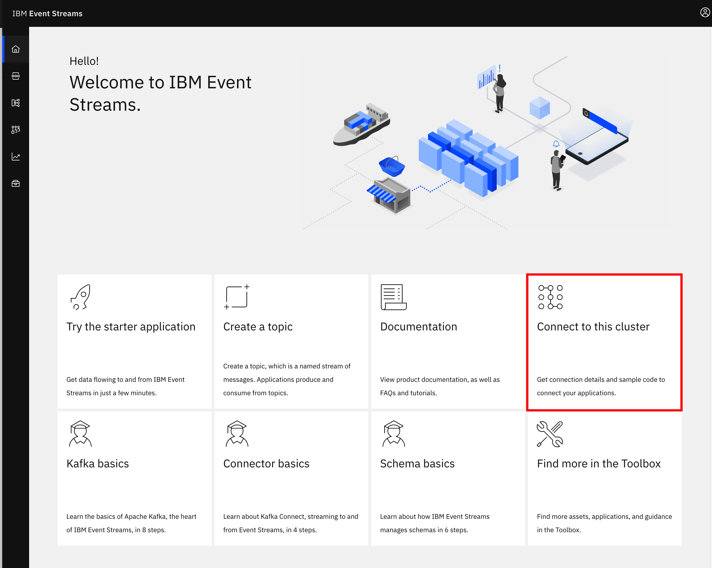
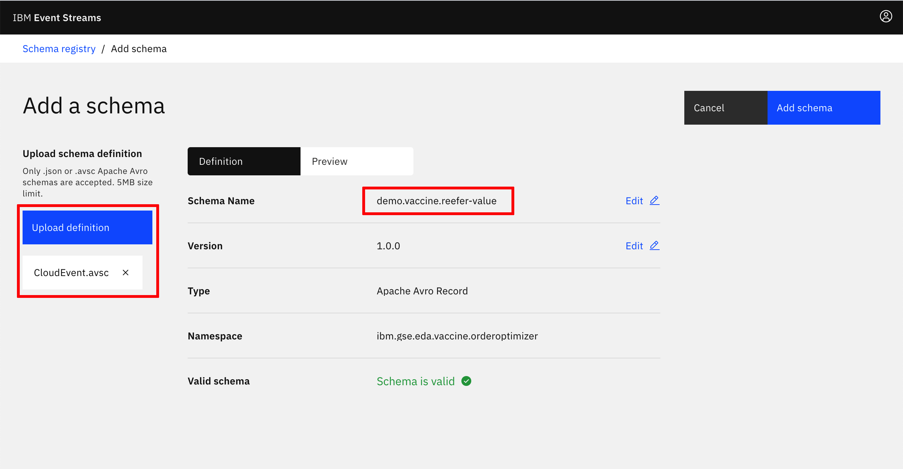
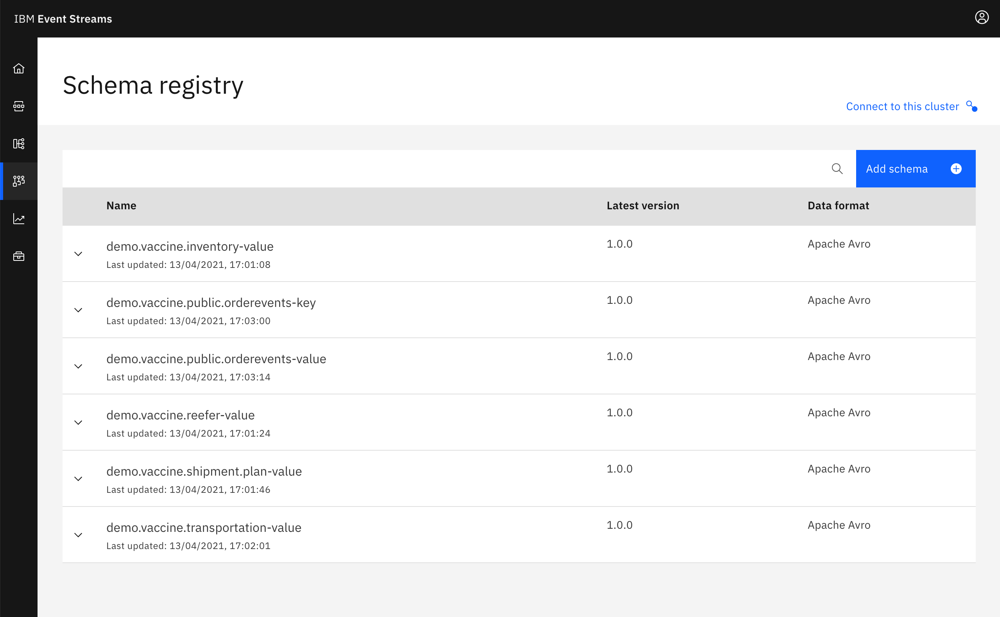
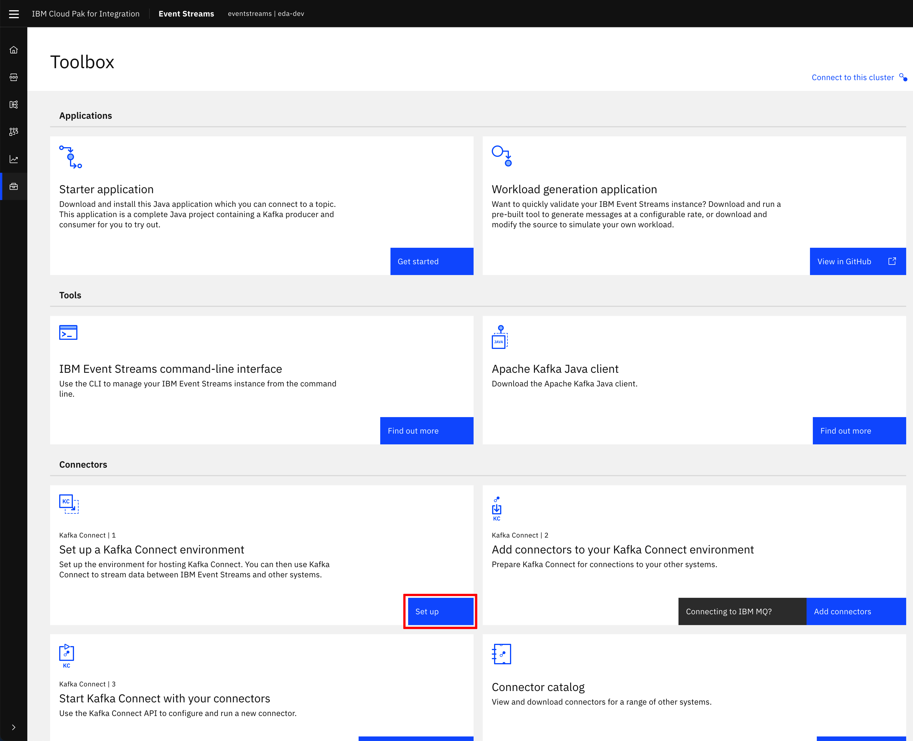

---
title: Order management and optimization demo
description: Order management and optimization demonstration
--- 

The vaccine order fullfilment is a complex problem to address as we need to optimize the shipment plan according to the demand and the constraints. A deep dive to the Operational Research problem is described in [this note](/solution/orderms/voro-solution/). 
In this use case / lab you will learn how to integrate with Kafka using the Outbox pattern, and Debezium to capture change to the postgresql table, how to integrate an Operational Research / advanced analytics component in an event-driven architecture which acts on new order events, to improve the shipment plan, how to deploy those component using GitOps approach, and finally how to use Quarkus and microprofile reactive messaging.

## Target Audiences

You will be greatly interested by the subjects addressed in this use case if you are:

* **an architect,** as you will get a deeper understanding on how all the components work together, and how to adopt event-driven approach to this problem which is mostly seen as a batch processing in traditional It architecture.
* **a developer,** as you will get a broader view of the solution end-to-end, as well as insight into practices to reuse during your future implementations.

## The what 

In this scenario we want to demonstrate the order entry with an event-driven microservice, and the integration with an event driven linear programming stateful function. The scenario addresses the following features:

* Create Order(s) using a simple user interface as an order manager will do after interacting with the country health care request.
* Validate the [transactional outbox pattern](https://ibm-cloud-architecture.github.io/refarch-eda/patterns/intro/#transactional-outbox) works to get OrderCreated, OrderUpdated or OrderCancelled Events created into a dedicated table in Postgresql
* Validate how [Debezium Change Data Capture](https://debezium.io/documentation/reference/1.4/connectors/postgresql.html) for Postgresql as a Kafka connector, produces OrderEvents from the table to Kafka `orders` topic.
* Integrate with the [Shipment plan optimization]() to get the updated shipment plan as events.

## Components involved in this use case

* [Vaccine Order Service](https://github.com/ibm-cloud-architecture/vaccine-order-mgr-pg)
* Postgres DB
* Debezium for change data capture on the outbox table
* Kafka using Strimzi or [event streams](https://ibm.github.io/event-streams/)
* [Vaccine Order Reefer Optimization Service](https://github.com/ibm-cloud-architecture/vaccine-order-optimizer)

 

*The blockchain integration is not done yet*

To have a deeper understanding of the order service read [this overview section](/solution/orderms/#overview). For the Vaccine order reefer optimization service [the design article](/design/voro/) details the optimization approach, while the [solution article](/solution/orderms/voro-solution/#overview) goes over the service implementation details.

## Deploy to OpenShift 

We propose to use gitops to deploy the Kafka, Postgres and the different services of this solution in few `oc` commands.

### Pre-requisites

* You need:
    * docker and docker compose on your laptop to run locally or build image
    * Java 11
    * git client 
    * Get access to an OpenShift cluster with Cloud Pak for integration and event streams installed.

1. [OpenShift CLI](https://cloud.ibm.com/docs/openshift?topic=openshift-openshift-cli) on your local environment.
1. [jq](https://stedolan.github.io/jq/) on your local environment.
1. Use a Terminal and the oc cli. If you want to access the code source you can clone the two main repositories of this solution:

 ```shell
 git clone https://github.com/ibm-cloud-architecture/vaccine-order-mgr-pg
 git clone https://github.com/ibm-cloud-architecture/vaccine-order-optimizer
 git clone https://github.com/ibm-cloud-architecture/vaccine-gitops
 ```

### TL;DR  - One Click Deploy

Go to `vaccine-gitops` folder and do the following steps:

* Set your personal deployment parameters within the   `scripts/env.sh` file
* Use the `oc login --token...  --server ....` command to log to the OpenShift cluster. (From the OpenShift admin console, top right menu)
* Start `./scripts/deployOrderOptimWithEventStreams.sh --skip-login`
* The following pods should be up and running:

 ```shell
  NAME                                        READY   STATUS    RESTARTS   AGE
  postgres-db-postgresql-0              1/1     Running   0          106s
  vaccineorderms-5-hb66n                1/1     Running     0          105s
  vaccine-transport-simulator-2-bk69q   1/1     Running  
  vaccine-order-optimizer-2-frge3       1/1     Running  
 ```

## Deploy the solution manually

In this section we are going to see how to deploy all the components of this use case manually on an OpenShift cluster. **IMPORTANT:** We asume IBM Event Streams has been deployed onto this cluster.

This is the summary of activities for deploying the use case manually:

1. [Pull down related GitHub repositories](#pull-down-github-repositories)
1. [Prepare your OpenShift and Kafka environments](#prepare-your-openshift-and-kafka-environments)
1. [Deploy Postgres](#deploy-postgres)
1. [Deploy the Vaccine Order Manager microservice](#deploy-the-vaccine-order-manager-microservice)
1. [Deploy Kafka Connect](#deploy-kafka-connect)
1. [Deploy Debezium CDC Postgres connector](#deploy-debezium-cdc-postgres-connector)
1. [Deploy the Vaccine Order Optimizer microservice](#deploy-the-vaccine-order-optimizer-microservice)

### Pull down GitHub repositories

We are going to use three GitHub repositories for manually deploying the Order Management and Optimization use case. These are:

* Vaccine Order Manager for Postgres component:
  * <https://github.com/ibm-cloud-architecture/vaccine-order-mgr-pg>
* Vaccine Order Optimizer component:
  * <https://github.com/ibm-cloud-architecture/vaccine-order-optimization>
* Vaccine GitOps:
  * <https://github.com/ibm-cloud-architecture/vaccine-gitops>

To pull down the three GitHub repositories execute in your terminal:

```shell
 git clone https://github.com/ibm-cloud-architecture/vaccine-order-mgr-pg
 git clone https://github.com/ibm-cloud-architecture/vaccine-order-optimization
 git clone https://github.com/ibm-cloud-architecture/vaccine-gitops
 ```

### Prepare your OpenShift and Kafka Environments

In this section we are going to prepare our OpenShift and Kafka environments with all the pre-requisites needed for successfully deploying the following components that make up the Vaccine Order and Optimization use case:

* Vaccine Order Manager for Postgres component.
* Vaccine Order Optimizer component.
* Kafka Connect.
* The Debezium CDC for Postgres connector.
* Postgres.

This preparation will consist of creating configmaps and secrets that will hold infrastructure configuration required by the above components for their well functioning as well as creating the needed resources within our Kafka environment.

1. **OpenShift project and service account**

  We are going to create a new OpenShift project in which we will deploy everything we need to get this order management and optimization use case working (except IBM Event Streams which we assume that has already been deployed in some other OpenShift project within this OpenShift cluster). Our new OpenShift project will be called `vaccine-omo` (that stands for vaccine order management and optimization) but you can choose any of your likes. To create the project, execute in your terminal (after having logged onto your OpenShift cluster):

  ```shell
  oc new-poject vaccine-omo
  ```

  Also, we are going to create a new service account within our OpenShift project that provides an identity for processes that run in a Pod. The reason for this is that the postgres deployment in the following section requires certain privileges that aren't granted with the default service account when a new OpenShift project is created and which will be used when you deploy anything into it unless you specify otherwise.

  For creating the new service account specific for our vaccine order management and optimization use case, execute in the terminal:

  ```shell
  cat <<EOF | oc apply -f -
  apiVersion: v1
  kind: ServiceAccount
  metadata:
    name: vaccine-runtime
  EOF
  ```

  Finally, we need to give that service account, that will be used to provide an identity to the processes running in the pods we deploy within this service account of our OpenShift project, the appropriate privileges the postgres processes need in order to successfully carry out the operations to get deployed and functioning in OpenShift. To give those privileges execute:

  ```shell
  oc adm policy add-scc-to-user anyuid -z <SERVICE_ACCOUNT_NAME> -n <NAMESPACE>
  ```

  where

    * `<SERVICE_ACCOUNT_NAME>` is the service account we have created earlier (`vaccine-runtime`)
    * `<NAMESPACE>` is the namespace where the service account is in (`vaccine-omo`)

1. **Kafka TLS Certificate**

  This is the required server-side public TLS certificate of your IBM Event Streams instance to establish secure communication. This is provided by IBM Event streams in a Kubernetes secret we are going to copy from the OpenShift project where your IBM Event Streams instance is deployed into our Vaccine Order Management and Optimization project. We are also going to rename that secret to what the deployment scripts for the components in this Vaccine Order Management and Optmitization use case expect which is `kafka-cluster-ca-cert`.

  In order to create the `kafka-cluster-ca-cert` secret containing the server-side public TLS certificate of your IBM Event Streams instance, execute the following command:

  ```shell
  oc get secret <CLUSTER_NAME>-cluster-ca-cert -n <EVENTSTREAMS_NS> -o json | jq -r '.metadata.name="kafka-cluster-ca-cert"' | jq --arg project_name "<PROJECT_NAME>" -r '.metadata.namespace=$project_name' | oc apply -f -
  ```

  where

    * `<CLUSTER_NAME>` is the name of your IBM Event Streams instance. If you don't remember your IBM Event Streams instance name you can find it out executing:
    ```shell
    oc get EventStreams -n <EVENTSTREAMS_NS>
    ```
    * `<EVENTSTREAMS_NS>` is the name of the OpenShift project/namespace were your IBM Event Streams is deployed in.
    * `<PROJECT_NAME>` is the name of the OpenShift project where you are deploying this vaccine order management and optimization use case into.

  You can verify that a new secret called `kafka-cluster-ca-cert` exists in the OpenShift project where you are deploying the vaccine order management and optimization use case by executing:

  ```shell
  oc get secrets
  ```

1. **Kafka Authentication**

  IBM Event Streams has both [internal and external configurable Kafka listeners](https://ibm.github.io/event-streams/installing/configuring/#kafka-access). Both require the server-side public TLS certificate to establish secure communication. These listeners can also be configured to enforce SCRAM-SHA-512 (username and password) or Mutual TLS (user certificates) Kafka credentials for authentication. In this tutorial, we expect your IBM Event Streams to be deployed with the _external_ kafka listener to enforce SCRAM-SHA-512 authentication and the internal _tls_ kafka listener to enforce Mutual TLS authentication. You can check whether your IBM Event Streams is configured in such a way by executing:

  ```shell
  oc get EventStreams <CLUSTER_NAME> -n <EVENTSTREAMS_NS> -o json | jq .spec.strimziOverrides.kafka.listeners
  ```
  
  where

    * `<CLUSTER_NAME>` is the name of your IBM Event Streams instance. If you don't remember your IBM Event Streams instance name you can find it out executing:
    ```shell
    oc get EventStreams -n <EVENTSTREAMS_NS>
    ```
    * `<EVENTSTREAMS_NS>` is the name of the OpenShift project/namespace were your IBM Event Streams is deployed in.
  
  The output you should get would be:

  ```json
  {
    "external": {
      "authentication": {
        "type": "scram-sha-512"
      },
      "type": "route"
    },
    "tls": {
      "authentication": {
        "type": "tls"
      }
    }
  }
  ```
  
  If you don't have your IBM Event Streams instance configured in such a way, review the documentation [here](https://ibm.github.io/event-streams/installing/configuring/#kafka-access).

  We are now going to create the corresponding SCRAM-SHA-512 and Mutual TLS authentication Kafka credentials that will be needed by the different components of this Vaccine Order Management and Optimization use case.

  **Mutual TLS certificate**

  In order to generate a set of TLS credentials to authenticate against the internal _tls_ Kafka listener (which will create a Kafka User resource behind the scenes)

    1. Go to your IBM Event Streams user interface dashboard. You can find where it is by executing:
    ```shell
    oc get routes -n <EVENTSTREAMS_NS> | grep ui
    ```
    1. Click on the `Connect to this cluster` option
    
    1. A panel will slide from the right hand side of your screen. Under the `Kafka listener and credentials` section, click on the `Internal` tab and then on the `Generate TLS credentials` button.
    
    By the way, you can already see to the left of the `Generate TLS credentials` the Kafka bootstrap address for the internal listener we will be referencing to later on.
    1. A multiple step wizard to generate credentials for your application will pop up. For the `Credential name` you can choose any name you want. For the rest of the options, try to provide the most permissive in each step for easeness.
    1. Once you have finished, you will be presented with the option to download the TLS certificates for your newly created Kafka User credentials as well as with a link to the instructions for retrieving these later. 
    
    These instructions will consist of finding out that a new secret with the same name you gave to your TLS credentials (and Kafka User as a result) has been created in the OpenShift project your IBM Event Streams instance is installed in. You can double check it by running:
    ```shell
    oc get secrets -n <EVENTSTREAMS_NS> | grep <YOUR_CREDENTIALS_NAME>
    ```
  
  Now that we have created a Kafka User with its corresponding TLS credentials to work with the internal _tls_ Kafka listener and we know these TLS credentials are stored in a secret with the same name as the Kafka User, we only need to copy that secret from the OpenShift project where it is (i.e. the OpenShift project where your IBM Event Streams instance has been deployed into) to the OpenShift project where we are deploying our vaccine order and optimization use case so that our applications can make use of it and be able to work with IBM Event Streams. To do so, execute:

  ```shell
  oc get secret <CREDENTIALS_NAME> -n <EVENTSTREAMS_NS> -o json | jq -r '.metadata.name="tls-user"' | jq --arg project_name "<PROJECT_NAME>" -r '.metadata.namespace=$project_name' | oc apply -f -
  ```
  where
    * `<CREDENTIALS_NAME>` is the name you gave to the TLS Credentials you created above.
    * `<EVENTSTREAMS_NS>` is the OpenShift project where your IBM Event Streams instance is deployed into and where the secret holding the TLS Credentials you created above ends up into as well as a result.
    * `<PROJECT_NAME>` is the OpenShift project where you are deploying the vaccine order management and optimization use case into.

  You can see from the command above that we are renaming the secret from whatever your `<CREDENTIALS_NAME>` was to `tls-user` since this is the name for the secret that holds the TLS credentials that the deployment scripts of the components for this Vaccine Order Management and Optimization use case expect.

  You can verify that a new secret called `tls-user` exists in the OpenShift project where you are deploying the vaccine order management and optimization use case by executing:

  ```shell
  oc get secrets
  ```

  **SCRAM Credentials**

  In order to generate a set of SCRAM-SHA-512 credentials for to authenticate with the _external_ Kafka listener:

    1. Go to your IBM Event Streams user intergace dashboard. You can find where it is by executing:
    ```shell
    oc get routes -n <EVENTSTREAMS_NS> | grep ui
    ```
    1. Click on the `Connect to this cluster` option
    
    1. A panel will slide from the right hand side of your screen. Under the `Kafka listener and credentials` section, click on the `External` tab and then on the `Generate SCRAM credentials` button.
    
    By the way, you can already see to the left of the `Generate SCRAM credentials` the Kafka bootstrap address for the external listener we will be referencing to later on.
    1. A multiple step wizard to generate credentials for your application will pop up. For the `Credential name` you can choose any name you want. For the rest of the otpions, try to provide the most premissive in each step for easeness.
    1. Once you have finished, you will be presented with SCRAM username and password as well as with a link to the instructions for retrieving these later. 
    
    These instructions will consist of finding out that a new secret with the same name you gave to your SCRAM credentials (and Kafka User as a result) has been created in the OpenShift project your IBM Event Streams instance is installed in. You can double check it by running:
    ```shell
    oc get secrets -n <EVENTSTREAMS_NS> | grep <YOUR_CREDENTIALS_NAME>
    ```

  For more information about the different Kafka listeners that a Strimzi Kafka cluster (which IBM Event Streams is based on) can expose and its configuration, read [this link](https://strimzi.io/docs/operators/latest/using.html#assembly-securing-access-str). For more information about how to configure secutiry options in IBM Event Streams read [this link](https://ibm.github.io/event-streams/installing/planning/#kafka-listeners).

1. **Kafka Topics**

  We need to create the following Kafka topics in our IBM Event Streams instance that the different components in our Event-Driven Vaccine Order Management and Optimization solution will use:

    - `<UNIQUE_ID>.vaccine.inventory` - This topic will contain the events related with the vaccine lots by the different suppliers that will make up the inventory of the vaccine. The events in this topic will be consumed by the Vaccine Order Optimization component for the CPLEX computations that will optimize the shipment plans to carry out.
    - `<UNIQUE_ID>.vaccine.reefer` - This topic will contain the events related with the reefer containers that will carry vaccines. Where they are, what status are they in, when they will be available, etc. The events in this topic will be consumed by the Vaccine Order Optimization component for the CPLEX computations that will optimize the shipment plans to carry out.
    - `<UNIQUE_ID>.vaccine.transportation` - This topic will contain the events related with the routes or lanes available between different locations that will be then used in the CPLEX computations to optimize the shipment plans to carry out vaccine from the supplier to where the order of it is expected to be delivered. The events in this topic will be consumed by the Vaccine Order Optimization component for the CPLEX computations that will optimize the shipment plans to carry out.
    - `<UNIQUE_ID>.vaccine.public.orderevents` - This topic will contain the events related to the new (or updated) orders managed by the Vaccine Order Management component. The events in this topic will be produced by the Debezium Change Data Capture (CDC) for Postgres connector that will be monitoring the `orderevents` table under the `public` schema of the postgres database the Vaccine Order Management component uses to store the state of the orders. The events in this topic will be consumed by the Vaccine Order Optimization component and will trigger the optimization process.
    - `<UNIQUE_ID>.vaccine.shipment.plan` - This topic will contain the events related to the shipments plans resulting of the order optimization CPLEX computation carried out by the Vaccine Order Optmimization component. Hence, the producer of these events is the Vaccine Order Optimization component while the Vaccine Order Management component will consume these and display them in the user interface.

  where
    - `<UNIQUE_ID>` is a unique identifier of your choice to be used for all the resouces created within the deployment of this Vaccine Order Management and Optimization solution so that they do not collide with any other user of the OpenShift or Kafka environments. We have chosen `demo` as our unique identifier for the rest of this tutorial.
  
  If you don't know how to create topics in your IBM Event Streams instance, see [this link](https://ibm-cloud-architecture.github.io/refarch-eda/use-cases/overview/pre-requisites/#create-event-streams-topics).

1. **Kafka Topics Configmap**

  This step configures the configmap that will hold the values for the different Kafka topics as well as the Kafka internal and external bootstrap urls the components of the Vaccine Order Management and Optimization use case will make use of.
  
  The yaml file containing the definition of the configmap we refer to is called `kafka-topics-configmap.yaml` and can be found in the Vaccine Order Manager for Postgres GitHub repository you pulled down earlier under the `src/main/kubernetes` folder. Open up that yaml file and provide a value for:
  
   - `<UNIQUE_IDENTIFIER>` which is the unique identifier you chose before to be used for all the resouces created within the deployment of this Vaccine Order Management and Optimization use case.
   - `<KAFKA_BOOTSTRAP_URL>` which is the the Kafka **internal** bootstrap address of your IBM Event Streams instance.
   - `<EXTERNAL_KAFKA_BOOTSTRAP_URL>` which is the the Kafka **external** bootstrap address of your IBM Event Streams instance.

  You can find your Kafka **internal** bootstrap address by executing:

  ```shell
  oc get EventStreams <CLUSTER_NAME> -n <EVENTSTREAMS_NS> -o json | jq '.status.kafkaListeners[] | select(.type=="tls") | .bootstrapServers'
  ```
  You can find your Kafka **external** bootstrap address by executing:

  ```shell
  oc get EventStreams <CLUSTER_NAME> -n <EVENTSTREAMS_NS> -o json | jq '.status.kafkaListeners[] | select(.type=="external") | .bootstrapServers'
  ```

  where

   * `<CLUSTER_NAME>` is the name of your IBM Event Streams instance. If you don't remember your IBM Event Streams instance name you can find it out executing:
    ```shell
    oc get EventStreams -n <EVENTSTREAMS_NS>
    ```
   * `<EVENTSTREAMS_NS>` is the name of the OpenShift project/namespace were your IBM Event Streams is deployed in.

  Once you have set those two parameters, you can create the configmap by executing:

  ```shell
  oc apply -f kafka-topics-configmap.yaml
  ```

  within the `src/main/kubernetes` folder of the vaccine order manager for postgres GitHub repository. You can checkout it has been properly created by executing:

  ```shell
  oc describe configmap kafka-topics-cm
  ```

1. **Events Data Schemas**
  
  We are also integrating data schemas for the events involved in this Vaccine Order Management and Optimization use case. Enforcing the events in any of the topics of this use case comply with their data schemas will provide robustness to our solution. These data schemas also comply with the [Cloud Events specification](https://cloudevents.io/) and we will use Apache Avro as the data serialization system. As a result, we need to create the appropriate data schemas in the IBM Event Stream Schema Registry for each of the topics involved in this solution that are listed above. In order to register a schema:

    1. Go to the Schema Registry in your IBM Event Stream user interface and click Add Schema.
      
    1. Click Upload definition and select the **CloudEvent.avsc** file you will find in the **Vaccine GitOps GitHub repository** you pulled down at the beginning of this tutorial under the **data** folder.
    1. Change the Schema Name to the name of your Kafka topic appended with `-key` or `-value`, depending on whether you want this data schema to apply to the event's key or value, that you want it to be enforced to. That is, if we wanted this data schema to be enforced to the event's value of our `demo.vaccine.reefer` topic, we would fill in the Schema name as follows:
      
    1. Finally click on Add Schema.
    1. Repeat the steps a-d in order to create the data schema for the event's value of your `<UNIQUE_ID>.vaccine.reefer`, `<UNIQUE_ID>.vaccine.inventory`, `<UNIQUE_ID>.vaccine.transportation` and `<UNIQUE_ID>.vaccine.shipment.plan` topics. That is, you should have the following data schemas (using the `CloudEvent.avsc` file to create each of the data schemas from) in your schema registry:
       - `<UNIQUE_ID>.vaccine.reefer-value`
       - `<UNIQUE_ID>.vaccine.inventory-value`
       - `<UNIQUE_ID>.vaccine.transportation-value`
       - `<UNIQUE_ID>.vaccine.shipment.plan-value`
    1. Repeat the steps a-d to create the data schema for the `<UNIQUE_ID>.vaccine.public.orderevents` topic. However, the **key** and **value** data schemas for this topic will be created from their specfific avsc files you can also find under the **data** folder of the **Vaccine GitOps GitHub repository**. That is, use the `OrderEventKey.avsc` and `OrderEventValue.avsc` files to create the `<UNIQUE_ID>.vaccine.public.orderevents-key` and `<UNIQUE_ID>.vaccine.public.orderevents-value` respectively.

  After creating the data schemas explained abobe, your Schema Registry should present the following data schemas:
    

  More information about Apache Avro, Data Schemas and Schema Registry can be found [here](https://ibm-cloud-architecture.github.io/refarch-eda/technology/avro-schemas/)

1. **Schema Registry Secret**

  The last step in this environment preparation section is to create the secret that will hold the IBM Event Streams Schema Registry url for the consumers and producers of the different components of this Vaccine Order Management and Optimization use case to be able to retrieve the data schemas to both serialize and deseralize the events against. 
  
  The yaml file containing the definition of the the secret we refer to is called `kafka-schema-registry-secret.yaml` and can be found in the Vaccine Order Manager for Postgres GitHub repository you pulled down earlier under the `src/main/kubernetes` folder. Open up that yaml file and provide a value for:

    * `<SCRAM_USERNAME>` and `<SCRAM_PASSWORD>` which are the SCRAM-SHA-512 credentials to get authenticated against the Kafka external listener of our IBM Event Streams instance that we have generated earlier in the **Scram Credentials** step within this environment preparation section.
    * `<SCHEMA_REGISTRY_URL>` is the IBM Event Streams Schema Registry url that you can find executing the following command:
    ```shell
    oc get routes -n <EVENTSTREAMS_NS> | grep ac-reg-external
    ```

  Once you have set those two parameters, you can create the secret by executing:

  ```shell
  oc apply -f kafka-schema-registry-secret.yaml
  ```

  within the `src/main/kubernetes` folder of the Vaccine Order Manager for Postgres GitHub repository. You can checkout it has been properly created by executing:

  ```shell
  oc describe secret kafka-schema-registry
  ```

### Deploy Postgres

Now, let's deploy the Postgres database the Vaccine Order Manager for Postgres component will use to back up the creation of new orders, which will then be picked up by the Debezium Change Data Capture for Postgres connector that will be running on the Kafka Connect cluster we will deploy too.

For deploying postgres, we are going to make use of the scripts in the Vaccine GitOps GitHub repository we pulled down earlier. Thus, go into the `vaccine-gitops/environments` directory. In there you can see several folders (for the different components we might want to deploy) where there is one for `postgres`. Within that `postgres` folder, you can see several yaml files that describe the postgres deployment as well as the Kustomize files that describe how to apply all these yaml files.

Now, make sure you are within the `vaccine-gitops/environments` folder in the `vaccine-gitops` GitHub repository and execute:

```shell
oc apply -k postgres
```

After a minute or so, you can see all the pieces comprising our Postgres deployment as well as the actual pod running postgres are properly deployed and running:

```shell
$ oc get all
NAME                           READY   STATUS    RESTARTS   AGE
pod/postgres-db-postgresql-0   1/1     Running   0          2m54s

NAME                                      TYPE        CLUSTER-IP       EXTERNAL-IP   PORT(S)    AGE
service/postgres-db-postgresql            ClusterIP   172.21.130.178   <none>        5432/TCP   2m54s
service/postgres-db-postgresql-headless   ClusterIP   None             <none>        5432/TCP   2m54s

NAME                                      READY   AGE
statefulset.apps/postgres-db-postgresql   1/1     2m55s
```

Also, you can check that along those components above, the Kustomize scripts were also meant to deploy a secret called `postgresql-creds` that, as the name suggests, will hold the credential parameters for any other component to be able to connect and use this Postgres instance. You can check this secret out by executing:

```shell
oc describe secret postgresql-creds
```

where you should see:

```shell
Name:         postgresql-creds
Namespace:    vaccine-omo
Labels:       <none>
Annotations:  
Type:         Opaque

Data
====
url:       48 bytes
username:  8 bytes
password:  11 bytes
```

### Deploy the Vaccine Order Manager microservice

In order to deploy the Vaccine Order Manager for Postgres microservice for this use case, we need to be, again, within the `src/main/kubernetes` folder in the Vaccine Order Manager for Postgres repository. Once there, you can execute the following commands:

```shell
oc apply -f configmap.yaml
```

that will create the `vaccine-order-ms-cm` configmap that holds some configuration info for the application

```shell
oc apply -f rolebinding.yaml
```

that will create the `vaccineorderms-view` role binding that will provide view ClusterRole role to the `vaccine-runtime` service account we created before that is responsible for providing an identity to the processes running in the pods we deploy. 

```shell
oc apply -f deployconfig.yaml
```

that will, finally, deploy the Vaccine Order Manager for Postgres component (which is actually a pod). You can check out the status of the `vaccineorderms-1-xxxxx` is `Running` after a min or so by executing:

```shell
oc get pods
```

Finally, we need to make our newly deployed Vaccine Order Manager for Postgres component available to be accessed and we do so by creating a Kubernetes service (makes a pod internally discoverable and accessible) and an OpenShift route (makes a service externally accessible) for the deployment we carried out in the previous step. For creating the Kubernetes service and the OpenShift route execute respectively:

```shell
oc apply -f service.yaml
```

and

```shell
oc apply -f route.yaml
```

You can now access your Vaccine Order Manager for Postgres component of the use case by pointing your web browser to the route you just created. You can execute the following command to find out the route:

```shell
oc get route vaccineorderms -o json | jq '.status.ingress[0] | .host'
```


### Deploy Kafka Connect

Now that we have one part of the puzzle working, which is the Vaccine Order Manager for Postgres deployed and running, we can proceed to get the Debezium CDC for Postges connector deployed so that it translates any change to our postgres database made by the Vaccine Order Manager for Postgres component into an event in our event backbone (Kafka) so that we can make the rest of our ecosystem aware without adding any extra load to our Postgres database.

However, for doing so we need a framework for the Debezium CDC for Postgres connector to run on. And this framework is [Kafka Connect](https://kafka.apache.org/documentation/#connect). Kafka Connect is a tool for scalably and reliably streaming data between Apache Kafka and other systems. It makes it simple to quickly define connectors that move large collections of data into and out of Kafka.

**IMPORTANT:** We assume you have deployed your IBM Event Streams instance with an internal TLS secured Kafka listener that uses Mutual TLS for authentication as described in the earlier [Prepare your OpenShift and Kafka Environments](#prepare-your-openshift-and-kafka-environments) section in this tutorial.

Now, follow the next steps in order to get your Kafka Connect cluster deployed:

1. Go to you IBM Event Streams dashboard, click on the `Find more on the toolbox` option.

  

1. Click on the `Set up` button for the `Set up a Kafka Connect environment` option.

  

1. Click on `Download Kafka Connect ZIP` button.

  

1. The above downloads a zip file which contains a `kafka-connect-s2i.yaml` file. Open that yaml file and take note of the `productID` and `cloudpakId` values as you will need these in the following step.

  

However, instead of using that `kafka-connect-s2i.yaml` we are going to use the one provided within the `environment/cdc` folder of the Vaccine Order Manager for Postgres GitHub repository. If you open up that file you will see the following placeholders:

* `<UNIQUE_ID>` which you should replace for the unique identifier you chose before to be used for all the resouces created within the deployment of this Vaccine Order Management and Optimization use case.
* `<GET_IT_FROM_EVENTSTREAMS>` which should be replaced with the `productID` and `cloudpakId` values you obtained in the previous step.
* `<KAFKA_BOOTSTRAP_URL>` which is the **internal Kafka listener bootstrap url**. You can review how to find this url in the _Kafka Topics Configmap_ subsection within the [Prepare your OpenShift and Kafka Environments](#prepare-your-openshift-and-kafka-environments) section.

If we carefully inspect this yaml that would get a Kafka Connect cluster deployed, we should realise that we still have to create a secret called `postgres-connector` ahead of time that will be loaded as external configuration. This `postgres-connect` secret will hold the configuration that, later, the Debezium CDC for Postgres connector will need to function. In order to create that secret, we provide a file called `connector.properties` also under the `environment/cdc` folder of the Vaccine Order Manager for Postgres GitHub repository.

Again, if you open up that file you will see the following placeholders:

* `<UNIQUE_ID>` which you should replace for the unique identifier you chose before to be used for all the resouces created within the deployment of this Vaccine Order Management and Optimization use case. In fact, it is **IMPERATIVE** that we use the same unique identifier. The reason for this is that the Debezium CDC for Postgres connector will be watching out for new records (which will be the result of any change in any of the tables of our Postgres database) on the tables of our Postgres deployment that are specified in its `table-whitelist` configuration property. It will send those new records as events to a Kafka topic named the same as the table name specified in the `table-whitelist` configuration property prefixed with the value of its `database-server-name` configuration property. If you work that out, you see that the `ORDER_TOPIC` value we defined in the configmap holding the Kafka topic names was and must be `<UNIQUE_ID>.vaccine.public.orderevents`, as this is where the events will end up based on the Debezium CDC for Postgres connector configuration properties file.
* `<SCRAM_USERNAME>`, `<SCRAM_PASSWORD>` and `<SCHEMA_REGISTRY_URL>` are the SCRAM credentials for authentication against your IBM Event Streams instance and the Schema Registry url of it respectively that the Debezium CDC for Postgres connector will need in order to access the data schema it will need to AVRO serialize the events to be sent to Kafka. You can review how to find these values in the _Schema Registry Secret_ subsection within the [Prepare your OpenShift and Kafka Environments](#prepare-your-openshift-and-kafka-environments) section.

In order to create that `postgres-connector` secret that holds the Debezium CDC for Postgres connector configuration out of the `connector.properties` file we have just tailored to our environment, we only need to run the following command:

```shell
oc create secret generic postgres-connector --from-file=./connector.properties
```

One last thing to do before deploying our Kafka Connect cluster is the need to copy the secret that holds your IBM Entitlement Key over from the OpenShift project where you have IBM Event Streams deployed into. This IBM Entitlement Key is needed to download any IBM product Docker image from IBM's private Docker registry in Quay. This is something you must have present in all your OpenShift projects where you want IBM software to be deployed into. In order to copy that IBM Entitlement Key secret from the OpenShift project where you have your IBM Event Streams instance deployed into, execute the following command:

```shell
oc get secret ibm-entitlement-key -n <EVENTSTREAMS_NS> -o json | jq --arg project_name "<PROJECT_NAME>" -r '.metadata.namespace=$project_name' | oc apply -f -
```

where

  * `<EVENTSTREAMS_NS>` is the OpenShift project where your IBM Event Streams instance is deployed into (`eventstreams` in this tutorial).
  * `<PROJECT_NAME>` is the OpenShift project where you are deploying your Kafka Connect cluster into (`vaccine-omo` in this tutorial).

Finally, we are all set to deploy our Kafka Connect cluster. In order to do so, we only need to execute the following command:

```shell
oc apply -f kafka-connect-s2i.yaml
```

You can watch all the resources being created as a result and their progress by executing:

```shell
watch -n 5 oc get all
```

after a couple of minutes or so you should see something like this:

```shell
NAME                                         READY   STATUS      RESTARTS   AGE
pod/connect-cluster-demo-connect-1-5d7f9     1/1     Running     0          65s
pod/connect-cluster-demo-connect-1-build     0/1     Completed   0          102s
pod/connect-cluster-demo-connect-1-deploy    0/1     Completed   0          66s
pod/postgres-db-postgresql-0                 1/1     Running     0          46h
pod/vaccineorderms-1-deploy                  0/1     Completed   0          19h
pod/vaccineorderms-1-jsx8n                   1/1     Running     0          19h

NAME                                                    DESIRED   CURRENT   READY   AGE
replicationcontroller/connect-cluster-demo-connect-1    1         1         0       67s
replicationcontroller/vaccineorderms-1                  1         1         1       19h

NAME                                        TYPE        CLUSTER-IP       EXTERNAL-IP   PORT(S)    AGE
service/connect-cluster-demo-connect-api    ClusterIP   172.21.173.130   <none>        8083/TCP   105s
service/postgres-db-postgresql              ClusterIP   172.21.130.178   <none>        5432/TCP   46h
service/postgres-db-postgresql-headless     ClusterIP   None             <none>        5432/TCP   46h
service/vaccineorderms                      ClusterIP   172.21.157.216   <none>        8080/TCP   19h

NAME                                      READY   AGE
statefulset.apps/postgres-db-postgresql   1/1     46h

NAME                                                               REVISION   DESIRED   CURRENT   TRIGGERED BY
deploymentconfig.apps.openshift.io/connect-cluster-demo-connect    1          1         1         config,image(connect-cluster-demo-connect:latest)
deploymentconfig.apps.openshift.io/vaccineorderms                  1          1         1         config

NAME                                                           TYPE     FROM     LATEST
buildconfig.build.openshift.io/connect-cluster-demo-connect    Source   Binary   1

NAME                                                       TYPE     FROM   STATUS     STARTED              DURATION
build.build.openshift.io/connect-cluster-demo-connect-1    Source          Complete   About a minute ago   36s

NAME                                                                  IMAGE REPOSITORY                                                                                    TAGS
                                                           UPDATED
imagestream.image.openshift.io/connect-cluster-demo-connect           image-registry.openshift-image-registry.svc:5000/vaccine-omo/connect-cluster-demo-connect           latest
                                                           About a minute ago
imagestream.image.openshift.io/connect-cluster-demo-connect-source    image-registry.openshift-image-registry.svc:5000/vaccine-omo/connect-cluster-demo-connect-source    4c6aa063
ae06dbae9acdd3ad0200e89205d86fc4b93b07f835817a7bee929c2a   About a minute ago

NAME                                      HOST/PORT                                                                                                             PATH   SERVICES
      PORT   TERMINATION   WILDCARD
route.route.openshift.io/vaccineorderms   vaccineorderms-vaccine-omo.assets-arch-eda-6ccd7f378ae819553d37d5f2ee142bd6-0000.us-east.containers.appdomain.cloud   /      vaccineorde
rms   8080                 None
```

where we can see the pod `connect-cluster-demo-connect-1-xxxxx` is running. This means your Kafka Connect cluster is running. However, we can see some other resources have been created as a result of telling OpenShift to deploy a Kafka Connect cluster. Amongst these you can see a couple of Image Streams (to build a Docker image from source code), a Build Config, a Build, a Deployment Config, etc. It is not the goal of this tutorial to explain what goes on behind the scenes when deploying a Kafka Connect cluster using the KafkaConnectS2I (kafka connect source to image) construct but it is something we highly recommend students investigating.

Now that we have our Kafka Connect cluster running, one thing we can check out is whether there is any connector configured in it that may be running. In order to do so, we are going to poke the `/connectors` API that the Kafka Connect Framework exposes. In order to do so, execute the following command:

```shell
oc exec -it <KAFKA_CONNECT_POD_NAME> -- curl localhost:8083/connectors
```

where

* `<KAFKA_CONNECT_POD_NAME>` is the pod name of your Kafka Connect cluster (in this tutorial is `connect-cluster-demo-connect-1-5d7f9`).

You should see `[]` as the output for the command above since there should not be any connector configured and running yet in your Kafka Connect cluster. This is something we are going to see in the next section.

Another thing we can check out is the connector plugins registered in our Kafka Connect cluster. That is the available plugins to create/instantiate a connector from. In order to see a list of the connector plugins in our Kafka Connect cluster, execute the following command:

```shell
oc exec -it <KAFKA_CONNECT_POD_NAME> -- curl localhost:8083/connector-plugins
```

and you should see an output like:

```shell
[
  {
    "class": "org.apache.kafka.connect.file.FileStreamSinkConnector",
    "type": "sink",
    "version": "2.6.0"
  },
  {
    "class": "org.apache.kafka.connect.file.FileStreamSourceConnector",
    "type": "source",
    "version": "2.6.0"
  },
  {
    "class": "org.apache.kafka.connect.mirror.MirrorCheckpointConnector",
    "type": "source",
    "version": "1"
  },
  {
    "class": "org.apache.kafka.connect.mirror.MirrorHeartbeatConnector",
    "type": "source",
    "version": "1"
  },
  {
    "class": "org.apache.kafka.connect.mirror.MirrorSourceConnector",
    "type": "source",
    "version": "1"
  }
]
```

where there is no Debezium CDC for Postgres connector plugin.

### Deploy Debezium CDC Postgres connector

We have seen in the previous section that the Kafka Connect cluster we have just deployed does not contain any connector configured and running yet. And this makes sense since we have only deployed the Kafka Connect Cluster, with the configuration we will need for the Debezium CDC for Postgres connector that we plan to execute afterwards but we yet need to do two things for that:

1. Provide the actual Debezium CDC for Postgres connector binaries. That is, the binaries our Kafka Connect cluster will use when instantiating a Debezium CDC for Postgres connector.
1. Register, that is instantiate, a Debezium CDC for Postgres connector for our use case so that we get the records stored by the Vaccine Order Manager for Postgres microservice in our Postgres deployment in the `public.orderevents` table of its `orderdb` database as events in the `<UNIQUE_ID>.vaccine.public.orderevents` Kafka topic as we saw, explained and configured earlier in this tutorial.


1. **Debezium CDC Postgres connector binaries**

  You can find the latest Debezium CDC for Postgres connector binaries [here](https://repo1.maven.org/maven2/io/debezium/debezium-connector-postgres/). Go into the folder for the latest version which should be called `X.Y.Z.Final`. Within that folder find the file called `debezium-connector-postgres-X.Y.Z.Final-plugin.tar.gz` and download it. Once downloaded, untar the file. You will see several jar files. Something like:

  ```shell
  debezium-api-1.4.0.Final.jar
  debezium-connector-postgres-1.4.0.Final.jar
  debezium-core-1.4.0.Final.jar
  failureaccess-1.0.1.jar
  guava-30.0-jre.jar
  postgresql-42.2.14.jar
  protobuf-java-3.8.0.jar
  ```

  They all are needed and what is more important is that we need to provide any connector to our Kafka Connect cluster **within the following structure**:

  ```shell
   - /connectors
     |
       - /connector1
         |
           - jar1
           ...
           - jarN
         ...
       - /connectorN
  ```

  However, if you pay a close look at the jar files within the Debezium CDC for Postgres connector tar file we have downloaded, you will not see any jar file around Apicurio which is the schema registry IBM Event Streams deploys which we want to interact with. That is, we want the Debezium CDC for Postgres connector to automatically interact with IBM Event Streams Schema Registry for the events to be sent to comply with a schema and are serialized using the [Apache Avro protocol](http://avro.apache.org/). For doing this, we need to provide more binaries for our Debezium CDC for Postgres connector (see this [Debezium post](https://debezium.io/blog/2020/04/09/using-debezium-with-apicurio-api-schema-registry/) and this [Debezium post](https://debezium.io/documentation/reference/configuration/avro.html) for further detail).

  To get all the extra binaries we need for our Debezium CDC for Postgres connector to automatically interact with the IBM Event Streams Apicurio Schema Registry and the Avro protocol, download the `Apicurio Registry Distro Connect Converter` package from the Maven Central repository [here](https://mvnrepository.com/artifact/io.apicurio/apicurio-registry-distro-connect-converter). Click on the latest `X.Y.Z.Final` version and then click on the `View All` link displayed in the `Files` row within the table displayed under the title of the package. This will drive you to a the location where you should find a file called `apicurio-registry-distro-connect-converter-X.Y.Z.Final-converter.tar.gz`. Download this file and untar it. Then, copy all the `jar` files with the other Debezium CDC for Postgres connector jar files in the connectors folder structure explained above.

  You should now have a list of jar files like the following (at the time of writting this tutorial March 2021):

  ```shell
  annotations-13.0.jar
  apicurio-registry-common-1.3.2.Final.jar
  apicurio-registry-rest-client-1.3.2.Final.jar
  apicurio-registry-utils-converter-1.3.2.Final.jar
  apicurio-registry-utils-serde-1.3.2.Final.jar
  avro-1.10.0.jar
  commons-compress-1.20.jar
  connect-json-2.4.0.jar
  converter-jackson-2.9.0.jar
  debezium-api-1.2.0.Final.jar
  debezium-connector-postgres-1.2.0.Final.jar
  debezium-core-1.2.0.Final.jar
  jackson-annotations-2.11.3.jar
  jackson-core-2.11.3.jar
  jackson-databind-2.11.3.jar
  jackson-datatype-jdk8-2.11.3.jar
  kotlin-reflect-1.3.72.jar
  kotlin-stdlib-1.3.72.jar
  kotlin-stdlib-common-1.3.72.jar
  medeia-validator-core-1.1.1.jar
  medeia-validator-jackson-1.1.1.jar
  okhttp-3.14.9.jar
  okio-1.17.2.jar
  postgresql-42.2.12.jar
  protobuf-java-3.13.0.jar
  retrofit-2.9.0.jar
  ```

  We are finally ready to upload the Debezium CDC for Postgres connector binaries to our Kafka Connect cluster. To do so, we need to start a new build of our build resource created as a result of having created a KafkaConnectS2I resource when we deployed the Kafka Connect cluster. This will build the source code for Kafka Connect once again but this time we are going to provide Debezium CDC for Postgres connector binaries to the build process so that these are then processed by the Kafka Connect Framework and the Debezium CDC for Postgres connector plugin is available as a result to be instantiated and used. In order to kick off a new build of Kafka Connect with the Debezium CDC for Postgres connector binaries execute the following command:

  ```shell
  oc start-build <BUILD> --from-dir <CONNECTORS_DIR> --follow
  ```

  where
  
    * `<BUILD>` is the build resource name created as a result of having created a KafkaConnectS2I resource when deploying a Kafka Connect cluster. You can find the name of your Kafka Connect build by executing the following command:
    ```shell
    oc get build
    ```
    where the name should be like `connect-cluster-<UNIQUE_ID>-connect`
    * `<CONNECTORS_DIR>` is the path to the directory containing the different connectors' binaries we want to build our Kafka Connect cluster with which we created above containing all the Debezium CDC for Postgres connector binaries. **IMPORTANT:** the path should point to the outter folder containing a folder per connector. That is, something like `./connectors` if we were to execute the command from the folder where we have the `connectors` folder rather than `./connectors/connector1`.
  
  After executing this command, you should see in your terminal the output of the build process with the binaries upload, the docker image creation, etc.

  If you watch all the resources in your OpenShift project with `watch -n oc get all`, you should see a new build resource, the desired replicas for the replica controller resource for the first Kafka Connect cluster down to 0 while the desired replicas for the replica controller resource for the second Kafka Connect cluster is set to 1, etc... Finally, you should see a new `build` and `deploy` pods for this second iteration of the Kafka Connect cluster and the most important pod, the pod where our Kafka Connect cluster runs into that should be called `connect-cluster-demo-connect-2-xxxxx`, with `STATUS` equal to `Running`.

  If we now poke the `/connector-plugins` API endpoint of our Kafka Connect cluster by executing:

  ```shell
  oc exec -it <KAFKA_CONNECT_POD_NAME> -- curl localhost:8083/connector-plugins
  ```

  where

    * `<KAFKA_CONNECT_POD_NAME>` is the name of the pod running our Kafka Connect cluster (`connect-cluster-demo-connect-2-xxxxx`)

  we should see that the Debezium CDC for Postgres connector plugin is now listed:

  ```shell
  [
  {
    "class": "io.debezium.connector.postgresql.PostgresConnector",
    "type": "source",
    "version": "1.2.0.Final"
  },
  {
    "class": "org.apache.kafka.connect.file.FileStreamSinkConnector",
    "type": "sink",
    "version": "2.6.0"
  },
  {
    "class": "org.apache.kafka.connect.file.FileStreamSourceConnector",
    "type": "source",
    "version": "2.6.0"
  },
  {
    "class": "org.apache.kafka.connect.mirror.MirrorCheckpointConnector",
    "type": "source",
    "version": "1"
  },
  {
    "class": "org.apache.kafka.connect.mirror.MirrorHeartbeatConnector",
    "type": "source",
    "version": "1"
  },
  {
    "class": "org.apache.kafka.connect.mirror.MirrorSourceConnector",
    "type": "source",
    "version": "1"
  }
  ]
  ```
  1. **Register a Debezium CDC for Postgres connector**

  The last piece of the Outbox pattern is to get a Debezium CDC for Postgres connector instantiated in our Kafka Connect cluster now that we have both the Kafka Connect cluster running with the Debezium CDC for Postgres connector binaries in it and the resulting connector plugin available as a result.
  
  For getting a Debezium CDC for Postgres connector instantiated, we provide, within the `environment/cdc` folder of the Vaccine Order Manager for Postgres GitHub repository, a file called `pg-connector.yaml` which is nothing but the definition of a KafkaConnect resource. The Debezium CDC for Postgres connector specification within that KafkaConnect resource has been parametrized so that all its configuration is taken from the environment it runs on. That is, it will take its configuration from the `postgres-connector` secret we load as external configuration when we deployed our Kafka Connect cluster if you remember the `kafka-connect-s2i.yaml` file. And, if you remember, the configuration from that secret comes from the `connector.properties` file in turn. However, as in with practically all the resources we've created so far for this use case, we would still need to provide a unique identifier (`demo` in this tutorial) for the `<UNIQUE_ID>` placeholder in the `pg-connector.yaml` file. Provide that unique identifier and then execute the following command to get that KafkaConnect resource created and a Debezium CDC for Postgres connector instantiated within your Kafka Connect cluster as a result:

  ```shell
  oc apply -f pg-connector.yaml
  ```

  After a minute or so, you can check the logs for the `connect-cluster-demo-connect-2-xxxxx` pod to see some output refering to the newly created Debezium CDC for Postgress connector instance whose name is `pg-connector-apicurio`. You can also execute `oc describe kafkaconnector pg-connector-apicurio` to see the details of that newly created Kafka Connector. These two validations are kind of in depth validations. For something easier, we can poke the `/connectors` API of our Kafka Connect cluster to see if a new connector has been registered and instantiated. To do so execute:

  ```shell
  oc exec -it <KAFKA_CONNECT_POD_NAME> -- curl localhost:8083/connectors
  ```
  where

     * `<KAFKA_CONNECT_POD_NAME>` is the pod name of your Kafka Connect cluster (in this tutorial is `connect-cluster-demo-connect-2-xxxxx`).

  You should see the following output:

  ```shell
  ["pg-connector-apicurio"]
  ```

### Deploy the Vaccine Order Optimizer microservice

Finally, the last piece of this use case to have the entire end to end flow is to deploy the Vaccine Order Optimizer microservice. This microservice will be responsible for producing an optimized shipment plan for the new orders received as events in the `<UNIQUE_ID>.vaccine.public.orderevents` Kafka topic taking into account the transportation, inventory and Reefer containers information available at that point (which comes also as events from the `<UNIQUE_ID>.vaccine.inventory`, `<UNIQUE_ID>.vaccine.reefer` and `<UNIQUE_ID>.vaccine.transportation` Kafka topics).

In order to get the Vaccine Order Optimizer microservice deployed, go into the `kubernetes` folder of its GitHub repository you pulled down at the beginning of this tutorial. You should see in there a bunch of yaml files which we will work with in order to get the Vaccine Order Optimizer microservice deployed on your OpenShift project along with a Kubernetes service and an OpenShift route to make it accessible.

If we look at the `deployment.yaml` file, which is the yaml file that will eventually deploy the Vaccine Order Optimizer microservice, we'll find that we need two configmaps (`kafka-topics-cm` and `vaccine-oro-cm`) and two secrets (`kafka-schema-registry` and `scram-user`) present in our OpenShift project beforehand to load the configuration for the Vaccine Order Optimizer microservice from.

1. `kafka-topics-cm` is the configmap that holds the information about the Kafka topic names and it should **already** be present in the OpenShift project where we are going to deploy the Vaccine Order Optimizer microservice if you followed the [Prepare your OpenShift and Kafka Environments](#prepare-your-openshift-and-kafka-environments) section.
1. `vaccine-oro-cm` is the configmap defined in the `configmap.yaml` file. In order to create it, execute the following command:
  ```shell
  oc apply -f configmap.yaml
  ```
1. `kafka-schema-registry` is the secret that holds the Schema Registry url for consumers and producers to be able to retrieve the data schemas to both serialize and deseralize the events against and it should **already** be present in the OpenShift project where we are going to deploy the Vaccine Order Optimizer microservice if you followed the [Prepare your OpenShift and Kafka Environments](#prepare-your-openshift-and-kafka-environments) section.
1. `scram-user` is the secret that will hold the Kafka User SCRAM-SHA-512 credentials for authentication and authorization of the communications going through the IBM Event Streams external Kafka listener. You should already have these (username and password) if you followed the [Prepare your OpenShift and Kafka Environments](#prepare-your-openshift-and-kafka-environments) section. However, we need to store these in a secret. For doing so, execute the following command:
  ```shell
  oc create secret generic scram-user --from-literal=username=<SCRAM_USERNAME> --from-literal=password=<SCRAM_PASSWORD>
  ```
where you would replace `<SCRAM_USERNAME>` and `<SCRAM_PASSWORD>` with the values of your Kafka User SCRAM-SHA-512 credentials.

Once you have the above configmaps and secrets created in your OpenShift project with the appropriate configuration for your environment, we can now, finally, deploy the Vaccine Order Optimization microservice. To do so, execute the following command:

```shell
oc apply -f deployment.yaml
```

If you list the pods in your OpenShift project using the command `oc get pods` you should a new pod called `vaccine-order-optimizer-xxxxxxxxx-xxxxx`. After a minute or so, you should see that the `STATUS` for that pod is `Running`. If you get the logs for the pod with the command `oc get logs -f vaccine-order-optimizer-xxxxxxxxx-xxxxx` you should see the following output that means your Vaccine Order Optimization microservice is ready to consume events and start the corresponding computations:

```shell
[ReeferConsumer] - Starting to consume events
[TransportationConsumer] - Starting to consume events
[InventoryConsumer] - Starting to consume events
[OrderConsumer] - Starting to consume events
```

Last step is to make this application accessible by creating a Kubernetes service and an OpenShift route for it. To do so, execute the following commands:

```shell
oc apply -f service.yaml
oc apply -f route.yaml
```

To access the application, point your browser to the Vaccine Order Optimizer OpenShift route associated to it. You can find the url by executing

```shell
oc get route vaccine-order-optimizer -o json | jq '.status.ingress[0] | .host'
```


**CONGRATULATIONS!!!** you have now deployed all the components that make up this Vaccine Order Management and Optimization use case. Let's now see it in action!

## Demo

Ok, so we should have all of the Vaccine Order Management and Optimization use case components deployed and Running by now. That means that if we executed

```shell
oc get pods
```

we should see the following pods running in our OpenShift project:

```shell
NAME                                       READY   STATUS    RESTARTS   AGE
connect-cluster-demo-connect-2-snffv       1/1     Running   0          22h
postgres-db-postgresql-0                   1/1     Running   0          4d20h
vaccine-order-optimizer-6799bcf78c-dl6dq   1/1     Running   0          93m
vaccineorderms-68ff4dd44-g5vkd             1/1     Running   0          24h
```

where

* `connect-cluster-demo-connect-2-xxxxx` is the Kafka Connect cluster running the Debezium CDC for Postgres connector in it, which would monitor the `orderevents` table under the `public` schema of the Postgres database that our Vaccine Order Manager for Postgres component uses for storing the state the orders in the system. The Debezium CDC for Postgres connector will then produce as an event any new record in that `orderevents` table. Records on the `orderevents` table represent any change to our database log.
* `postgres-db-postgresql-0` is the Postgres database that our Vaccine Order Manager for Postgres component uses for storing the state the orders in the system.
* `vaccine-order-optimizer-xxxxxxxxxx-yyyyy` is the Vaccine Order Optimizer component of the solution responsible for optimizing the shipment plans based on the vaccine orders in the system.
* `vaccineorderms-xxxxxxxxxx-yyyyy` is the Vaccine Order Manager for Postgres component of the solution responsible for managing the orders in the system.

**Load Inventory, Reefer and Transportation data**

The first thing we need to do is to load inventory, reefer (containers) and transportation data into the Vaccine Order Optimization component so that the shipment plan optimization CPLEX algorithm has proper data when we create new vaccine delivery order to produce a meaningful shipment plan.

Ideally, the inventory, reefer and transportation data will be live data provided by other components in the ecosystem of the Vaccine Order Management and Optimization use case that would be taking care of those entities and making the system aware of any changes through events accordingly. However, we are simulating those entities for now and just providing mockup data for the Vaccine Order Optimizer component.

To load the inventory, reefer and transportation mockup data

1. Open up the Vaccine Order Optimizer application in your web browser. Point your browser to the Vaccine Order Optimizer OpenShift route associated to it. You can find the url by executing

  ```shell
  oc get route vaccine-order-optimizer -o json | jq '.status.ingress[0] | .host'
  ```

  

1. In there you should see a POST API called `/api/v1/optimize/loadData` that will load the inventory, reefer and transportation data if you execute. Therefore, click on that API to expand it

  

1. Click on Try it out and then in Execute.
1. After some time, you should see the message _loaded_ in the Response body. That means the inventory, reefer and transporation mockup data has been properly loaded.

  

1. If you inspect the Vaccine Order Optimizer component's log messages

  ```shell
  oc logs vaccine-order-optimizer-xxxxxxxxxx-yyyyy
  ```
  you should see messages in the logs of the type
  ```shell
  [DataProducer] - Producing inventory events
  [KafkaAvroProducer] - Message delivered to demo.vaccine.inventory [0]
  [InventoryConsumer][KafkaAvroConsumer] - New event received
    Topic: demo.vaccine.inventory
    Partition: 0
    Offset: 36
    key: L0001
    value: {'type': 'ibm.gse.eda.vaccine.orderoptimizer.VaccineOrderCloudEvent', 'specversion': '1.0', 'source': 'Vaccine Order Optimizer producer endpoint', 'id': '41927bd6-6c5f-4fb4-8804-bc2c3c553679', 'time': '2021-04-14T16:45:26.920195+00:00', 'dataschema': 'https://raw.githubusercontent.com/ibm-cloud-architecture/vaccine-order-optimizer/master/data/avro/schemas/inventory.avsc', 'datacontenttype': 'application/json', 'data': {'lot_id': 'L0001', 'qty': 200, 'location': 'Beerse, Belgium', 'date_available': ''}}

  [InventoryDataStore] - addInventory L0001 {'lot_id': 'L0001', 'qty': 200, 'location': 'Beerse, Belgium', 'date_available': ''}
  ```
  for inventory, reefer and transportation.

  1. You can also execute any of the other GET APIs in the user interface that would return you the inventory, reefer and transportation data in json format or as a pandas object.

**Create a new vaccine delivery order**

After providing the Vaccine Order Optimizer component the inventory, reefer and transporation data its shipment plan optimization CPLEX algorithm needs to produce meaningful output, we are ready to create a new vaccine delivery order and get a shipment plan back as a result. To do so,

1. Open the Vaccine Order Manager for Postgres component's user interface by pointing your browser to that component's OpenShift route. You can find that url by executing:

  ```shell
  oc get route vaccineorderms -o json | jq '.status.ingress[0] | .host'
  ```
  

1. Open the Vaccine Order Manager for Postgres component's user interface in two different web browser windows and open the ORDERS page in one and the SHIPMENT PLANS page in the other. The reason for this is that we want to see how the order is created in one window while the shipment plan arrives to the other as a result. The SHIPMENT PLANS page implements a server side event stream, meaning that the web page must be open when the event arrives to the topic it creates the event stream to in order to pick it up and display it and not miss it.

  

1. In the ORDERS page we can see there are aleready three orders created out of the box. Please, disregard these orders as they don't have any effect on the system at all. Instead, let's create a new order. Click on NEW ORDER, give a name of your choice to the _Organization_ and set the _Delivery Location_ to **London, England** (the reason to provide such a _Delivery Location_ is to match the mockup data we loaded in the Vaccine Order Optimizer component earlier).

  

1. Click SAVE and watch the SHIPMENT PLANS page for a new shipment plan to arrive and get displayed as a result of the optimization algorithm for the new order.

  


### Behind The Scenes

The demo above looks great. We have seen how the creation of a new order results in a new optimized shipment plan for the orders to be delivered in the system. However, we have not paid the close look at each of the different pieces and patterns deployed for this Vaccine Order Management and Optimization use case that this use case really deserve. The most interesting part of this use case isn't in the actual shipment plan output but in the different pieces, technologies and patterns that allow for it. Hence, the deep dive we are doing in this section.

So far we know that, after the Vaccine Order Manager for Postgres component has created a new order, which is considered to be a successfully finished action once that new order gets stored in the Postgres database, that new fact needs to be delivered as an event into Kafka since that is what Event Driven Architectures are about. That is, the system is made aware of any new fact that has happened so that all the components of that system can react to it if needed. For doing so, we have decided to use the **Outbox pattern**, which consists of monitoring the database log for any changes on specifics tables and translate those changes into events to Kafka. More on the Outbox pattern [here](https://ibm-cloud-architecture.github.io/refarch-eda/patterns/intro#transactional-outbox). 

To implement the Outbox pattern for this use case, we have decided to implement the Vaccine Order Manager for Postgres component using Quarkus not only because it is one of the best Java stacks for cloud native applications due to its Java stack tailored to work best in containers in Kubernetes but also to take advantage of its [Outbox extension](https://debezium.io/documentation/reference/integrations/outbox.html). This extension will leverage the database transactional nature to translate in a transactional manner any change on its tables to a specific table with a tailored format best suited to be delivered as an event to Kafka. Then, Kafka Connector in charge of monitoring database changes and translating these into events to Kafka only needs to focus on one table with the addition of having the records in that table in a much appriate shape and form to be sent as events into Kafka.

You can we are using the Debezium Quarkus Outbox extension for the Vaccine Order Manager for Postgres component by looking at its `pom.xml` file where you should find the following dependency:

```xml
<dependency>
  <groupId>io.debezium</groupId>
  <artifactId>debezium-quarkus-outbox</artifactId>
  <version>1.4.0.Final</version>
</dependency>
```

Then, the outbox pattern is configured in the `application.properties` file under `src/main/resources` where you can find:

```properties
#################################
# Outbox setting for Quarkus Debezium plugin
quarkus.debezium-outbox.id.name=id
quarkus.index-dependency.outbox.group-id=io.debezium
quarkus.index-dependency.outbox.artifact-id=debezium-quarkus-outbox
quarkus.debezium-outbox.table-name=orderevents
# change to true in prod
quarkus.debezium-outbox.remove-after-insert=false
```

which tells the Debezium Quarkus Outbox extension to transactionally translate any change in any of the tables in the database as a new record into the `orderevents` table. That means that our new order should have produced a new record on that `orderevents` table. Let's check it out:

1. Exec into the postgres container:

  ```shell
  oc rsh postgres-db-postgresql-0
  ```
  
  You should now have a shell running in the postgres container. 
  
1. Start the psql client using the `postgres` user which our Postgres deployment was configued with:

  ```shell
  psql -U postgres
  ```

1. List all the databases in the Postgres deployment:

  ```shell
  \l
  ```
  
  which should give you the following output:
  
  ```shell
                                  List of databases
    Name    |  Owner   | Encoding |  Collate   |   Ctype    |   Access privileges   
  -----------+----------+----------+------------+------------+-----------------------
  orderdb   | postgres | UTF8     | en_US.utf8 | en_US.utf8 | 
  postgres  | postgres | UTF8     | en_US.utf8 | en_US.utf8 | 
  template0 | postgres | UTF8     | en_US.utf8 | en_US.utf8 | =c/postgres          +
            |          |          |            |            | postgres=CTc/postgres
  template1 | postgres | UTF8     | en_US.utf8 | en_US.utf8 | =c/postgres          +
            |          |          |            |            | postgres=CTc/postgres
  (4 rows)
  ```

1. Connect to the `orderdb` database (this is the database we had our postgres deployment configured to create and the Vaccine Order Manager for Postgres component to use):

  ```shell
  \c orderdb
  ```

1. Display all the relations in the `orderdb` database.

  ```shell
  \dt
  ```
  
  which should output all the different tables the Vaccine Order Manager for Postgres component will work with including the `orderevents` table that the Debezium Quarkus Outbox extension has created and will use to help us implement the Outbox pattern:

  ```shell
                List of relations
  Schema |        Name        | Type  |  Owner   
  --------+--------------------+-------+----------
  public | ordercreatedevent  | table | postgres
  public | orderevents        | table | postgres
  public | orderupdatedevent  | table | postgres
  public | vaccineorderentity | table | postgres
  (4 rows)
  ```

1. List the orders in the `vaccineorderentity` table which is the table used by the Vaccine Order Manager for Postgres component to store the state of any vaccine order object.

  ```shell
  select * from public.vaccineorderentity;
  ```
  
  where we should see our newly created order:

  ```shell
  id | askingorganization |     creationdate     | deliverydate | deliverylocation | priority | quantity | status | vaccinetype 
  ----+--------------------+----------------------+--------------+------------------+----------+----------+--------+-------------
    1 | Spain Government   | 10-Nov-2020 02:02:40 | 2021-02-24   | Madrid           |        1 |      200 |      0 | COVID-19
    2 | French Government  | 15-Nov-2020 02:02:40 | 2021-01-10   | Paris            |        1 |      300 |      0 | COVID-19
    3 | Italy Government   | 15-Nov-2020 02:02:40 | 2021-01-12   | Roma             |        1 |      400 |      0 | COVID-19
  15 | test_org           | 14-Apr-2021 18:38:43 | 2021-04-14   | London, England  |        2 |      150 |      0 | COVID-19
  (4 rows)
  ```

1. Now, let's see if the Debezium Quarkus Outbox extension has done its job by looking at the `orderevents` table:

  ```shell
  select * from public.orderevents;
  ```

  where we should, indeed, see how the Debezium Quarkus Outbox extension has transactionally created a new record with the data from the new record in the `vaccineorderentity` but in a better form and shape to be sent as a Kafka event:

  ```shell
                    id                 |   aggregatetype    | aggregateid |     type     |         timestamp          |                                                                                                          payload                                                                                                           |                          tracingspancontext                           
  -------------------------------------+--------------------+-------------+--------------+----------------------------+----------------------------------------------------------------------------------------------------------------------------------------------------------------------------------------------------------------------------+-----------------------------------------------------------------------
  33e99eb0-55b8-4660-b7c9-d7cdddcdf4aa | VaccineOrderEntity | 15          | OrderCreated | 2021-04-14 18:38:43.476686 | {"orderID":15,"deliveryLocation":"London, England","quantity":150,"priority":2,"deliveryDate":"2021-04-14","askingOrganization":"test_org","vaccineType":"COVID-19","status":"OPEN","creationDate":"14-Apr-2021 18:38:43"} | #Wed Apr 14 18:38:43 GMT 2021                                        +
                                       |                    |             |              |                            |                                                                                                                                                                                                                            | uber-trace-id=471009333509d7ba\:721aed36f54c2294\:471009333509d7ba\:0+
                                       |                    |             |              |                            |                                                                                                                                                                                                                            | 
  (1 row)
  ```

We have just verified that the first step in the Outbox pattern provided by the Debezium Quarkus Outbox extension works fine and that now we have our new order in a table with the shape and form we want it to be sent as an event to Kafka. We can also look at the logs of the Vaccine Order Manager for Postgres component to see what is in there:

1. Get the logs of the Vaccine Order Manager for Postgres component:

  ```shell
  oc logs vaccineorderms-xxxxxxxxx-yyyyy
  ```

  where we should spot the following:

  ```shell
  18:38:43 INFO  [ib.gs.ed.va.do.OrderService] (executor-thread-2) saveNewOrder for test_org null
  Hibernate: 
      select
          nextval ('hibernate_sequence')
  Hibernate: 
      insert 
      into
          VaccineOrderEntity
          (askingOrganization, creationDate, deliveryDate, deliveryLocation, priority, quantity, status, vaccineType, id) 
      values
          (?, ?, ?, ?, ?, ?, ?, ?, ?)
  Hibernate: 
      insert 
      into
          orderevents
          (aggregatetype, aggregateid, type, timestamp, payload, tracingspancontext, id) 
      values
          (?, ?, ?, ?, ?, ?, ?)
  ```

  which are the instructions to transactionally store the new order in both `vaccineorderentity` and `orderevents` table that will result in the what we've checked above in the Postgres database.

Ok, so we have a new record in the `orderevents` table in the form and shape we like to be sent as an event to Kafka. Now, we need to make sure that happened. That is, that our Kafka Connect cluster which is running the Debezium CDC for Postgres connector has actually monitored such table and transalate new records of this into events in Kafka. This is as simple as opening your IBM Event Streams user interface, go to the topics section on the left hand side menu and select the `<UNIQUE_ID>.vaccine.public.orderevents` topic. In there, click on the Messages tab at the top:


And, as expected, the message is there. You can also see strange character in the message payload. This is the result of having our events Avro serialized as explained earlier in this tutorial.

However, how did it actually happen? How did we configure the Debezium CDC for Postgres connector to make this happen? If we look at the `pg-connector.yaml` file you can find under `environment/cdc` in the Vaccine Order Manager for Postgres GitHub repository, you will find the configuration for the Debezium CDC for Postgres connector we have instantiated. You can see there two types of configuration. One related to the database the connector needs to monitor and the other related to the Apicurio Registry the connector needs to interact with to get the Avro data schemas to serialize the events it will send with.

For now, we are only interested in the configuration for the database. If you look at the database properties you will find their values are defined as placeholders to some properties file and property name by looking at the end of those placeholders that look like: `connector.properties:property_name`. And that property file containing the properties names and appropriate values for our scenario is the `connector.properties` file you can also find under `environment/cdc` in the Vaccine Order Manager for Postgres GitHub repository. That property file is injected into the Kafka Connect cluster environment, where our Debezium CDC for Posgres connector will run into, from a secret in OpenShift which we have created  out of the `connector.properties` file when we deployed the Kafka Connect cluster. You can go back to the section where we deployed the Kafka Connect cluster for more information. What is important now for us is that in such `connector.properties` files we can see the following property and value: `table-whitelist=public.orderevents` which tells our Debezium CDC for Postgres connector what table to monitor and translate records from into events to Kafka.

Now that we have the new order as an event in Kafka, we should have got the shipment plan CPLEX optimization algorithm in the Vaccine Order Optimization component kicked off as a result. So let's check if that actually happened. 

1. Get your Vaccine Order Optimization component's logs

  ```shell
  oc logs vaccine-order-optimizer-xxxxxxxxxx-yyyyy
  ```
You should spot the following pieces for the vaccine order optimization process:

1. A new event was received by the `[OrderConsumer]` Kafka consumer that is consuming from the `<UNIQUE_ID>.vaccine.public.orderevents` topic:

  ```shell
  [OrderConsumer][KafkaAvroCDCConsumer] - New event received
    Topic: demo.vaccine.public.orderevents
    Partition: 0
    Offset: 0
    key: {'id': '33e99eb0-55b8-4660-b7c9-d7cdddcdf4aa'}
    value: {'before': None, 'after': {'id': '33e99eb0-55b8-4660-b7c9-d7cdddcdf4aa', 'aggregatetype': 'VaccineOrderEntity', 'aggregateid': '15', 'type': 'OrderCreated', 'timestamp': 1618425523476686, 'payload': '{"orderID":15,"deliveryLocation":"London, England","quantity":150,"priority":2,"deliveryDate":"2021-04-14","askingOrganization":"test_org","vaccineType":"COVID-19","status":"OPEN","creationDate":"14-Apr-2021 18:38:43"}', 'tracingspancontext': '#Wed Apr 14 18:38:43 GMT 2021\nuber-trace-id=471009333509d7ba\\:721aed36f54c2294\\:471009333509d7ba\\:0\n'}, 'source': {'version': '1.2.0.Final', 'connector': 'postgresql', 'name': 'demo.vaccine', 'ts_ms': 1618425523877, 'snapshot': 'false', 'db': 'orderdb', 'schema': 'public', 'table': 'orderevents', 'txId': 857, 'lsn': 31482856, 'xmin': None}, 'op': 'c', 'ts_ms': 1618425524300, 'transaction': None}
  ```
Now that the event is Avro deserialized we can read the event and realise it is composed of two main pieces: `before` and `after`, which represents the change in the database for a specific record. As this is a new order, thus a new record, we can see that the `before` piece comes empty.

1. The optimization process gets triggered:

  ```shell
  [OrderConsumer] - calling optimizeOrder
  ```

1. The summary of the optimization process:

  ```shell
  [OrderConsumer] - optimizeOrder summary:
  Planning Horizon: (2021-04-14 - 2021-04-21)
    ------ Data Summary ------
    Customers: 2
    Supplies : 2
    Orders   : 1
    ---- Network Summary -----
    Nodes: 33
    Arcs : 82
    -- Optimization Summary --
    Variables  : 200
    Constrains : 241
    Objective  : 3144.00
    Best Bound : 3144.00
    MIP Rel Gap: 0.00
    Solve Time : 20.19
    Status     : integer optimal solution
  ```

1. The results of the optimization process where we can already see the shipment plan that will be produced, as a fact that happened (a new shipment plan was created), to Kafka so that the rest of the components of our system are aware and react accordingly if needed:

  ```shell
  [OrderConsumer] - optimizeOrder retults:
  {'Orders': '[{"Order ID":15,"DeliveryLocation":"London, England","Order Qty":150,"Order Priority":2,"Order RDD":"2021-04-15T00:00:00.000Z","First Delivery":"2021-04-16T00:00:00.000Z","Last Delivery":"2021-04-16T00:00:00.000Z","Number of Deliveries":1,"Delivered Qty":150,"Remaining Qty":0}]', 'OrderDetails': '[{"Order ID":15,"Supplier":"Beerse, Belgium","Departure Date":"2021-04-14T00:00:00.000Z","Delivery Date":"2021-04-15T00:00:00.000Z","Qty":150,"Cost":42.0}]', 'Shipments': '[{"Type":"Delivery","From":"Beerse, Belgium","Departure Date":"2021-04-14T00:00:00.000Z","To":"London, England","Arrival Date":"2021-04-16T00:00:00.000Z","Qty":150,"Reefers":2,"Cost":42}]'}
  ```

1. Finally, as said above, the shipment plan event is prepared and sent to the `<UNIQUE_ID>.vaccine.shipment.plan` topic:

  ```shell
  [OrderConsumer] - producing shipment plan
  [OrderConsumer] - Shipment Plan event to be produced:
  {'type': 'ibm.gse.eda.vaccine.orderoptimizer.VaccineOrderCloudEvent', 'specversion': '1.0', 'source': 'Vaccine Order Optimizer engine', 'id': '5cf26c04-866b-46a2-886f-8df29c4dff35', 'time': '2021-04-14T18:39:06.880652+00:00', 'dataschema': 'https://raw.githubusercontent.com/ibm-cloud-architecture/vaccine-order-optimizer/master/data/avro/schemas/shipment_plan.avsc', 'datacontenttype': 'application/json', 'data': {'Shipments': [{'Type': 'Delivery', 'From': 'Beerse, Belgium', 'DepartureDate': '2021-04-14T00:00:00.000Z', 'To': 'London, England', 'ArrivalDate': '2021-04-16T00:00:00.000Z', 'Qty': 150, 'Reefers': 2, 'Cost': 42}]}}
  [KafkaAvroProducer] - Message delivered to demo.vaccine.shipment.plan [0]
  ```

The last step into this _Behind the scenes_ deep dive for how the Vaccine Order Management and Optimization use case works is the reception of the shipment plan event produced by the Vaccine Order Optmization component by the Vaccine Order Manager for Postgres component. We can check that out by just getting again the logs for the Vaccine Order Manager for Postgres component:

```shell
oc logs vaccineorderms-xxxxxxxxx-yyyyy
```

where we should spot the following:

```shell
18:39:10 INFO  [ib.gs.ed.va.do.ShipmentPlanProcessor] (vert.x-eventloop-thread-0) {"type": "ibm.gse.eda.vaccine.orderoptimizer.VaccineOrderCloudEvent", "specversion": "1.0", "source": "Vaccine Order Optimizer engine", "id": "5cf26c04-866b-46a2-886f-8df29c4dff35", "time": "2021-04-14T18:39:06.880652+00:00", "dataschema": "https://raw.githubusercontent.com/ibm-cloud-architecture/vaccine-order-optimizer/master/data/avro/schemas/shipment_plan.avsc", "datacontenttype": "application/json", "data": {"Shipments": [{"Type": "Delivery", "From": "Beerse, Belgium", "DepartureDate": "2021-04-14T00:00:00.000Z", "To": "London, England", "ArrivalDate": "2021-04-16T00:00:00.000Z", "Qty": 150, "Reefers": 2, "Cost": 42}]}}
18:39:10 INFO  [ib.gs.ed.va.do.ShipmentPlanProcessor] (vert.x-eventloop-thread-0) ibm.gse.eda.vaccines.domain.ShipmentPlan@2238d6d1
```

that represents the optimized shipment plan for the new vaccine order we created and the event that should get displayed in the SHIPMENT PLANS page of the Vaccine Order Manager for Postgres user interface. And this would close the deep dive on how the entire Vaccine Order Management and Optimization use case works in detail.
